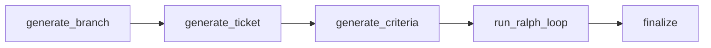

# kodezart


AI code orchestration service that uses Claude agents for iterative code
generation with quality gates. Built with FastAPI, LangGraph, and the Claude
Agent SDK.

## Key Features

- **Iterative code generation** with automated acceptance-criteria evaluation
- **Ticket generation loop** with drafter/reviewer pattern using independent
  Claude sessions
- **Quality gate (Ralph loop)** that re-executes until criteria pass or max
  iterations
- **Workspace isolation** via bare-repo caching and disposable Git worktrees
- **SSE streaming** of 18 event types for real-time progress visibility
- **Hexagonal architecture** with 12 protocol-based ports and swappable adapters
- **Structured output** via JSON schema for branch names, commit messages,
  tickets, and evaluations

## Architecture Overview



The workflow pipeline generates a feature branch, drafts and reviews an
implementation ticket, derives testable acceptance criteria, runs an iterative
execute/evaluate loop (the Ralph loop), and finalizes by merging and pushing.

See [docs/architecture.md](docs/architecture.md) for the full architecture
guide including the Ralph loop, ticket generation loop, and workspace isolation
strategy.

## Quick Start

### Prerequisites

- Python 3.12+
- [uv](https://docs.astral.sh/uv/) package manager
- Git
- [Claude Code CLI](https://docs.anthropic.com/en/docs/claude-code)

### Install and Run

```bash
git clone https://github.com/YalDan/kodezart.git
cd kodezart
uv sync --all-groups
cp .env.example .env
# Set KODEZART_GITHUB_TOKEN if using remote repositories
uvicorn kodezart.main:app --reload
```

Verify the server is running:

```bash
curl http://localhost:8000/api/v1/health
```

## Docker

```bash
docker build -t kodezart .
docker run -p 8000:8000 kodezart
```

The Docker image includes a built-in healthcheck on `/api/v1/health` (every
30s, 10s timeout, 3 retries).

## API Endpoints

| Method | Path                      | Description                      |
| ------ | ------------------------- | -------------------------------- |
| GET    | `/api/v1/health`          | Health check                     |
| POST   | `/api/v1/agent/query`     | One-shot agent query (SSE)       |
| POST   | `/api/v1/agent/workflow`  | Full iterative workflow (SSE)    |

### One-shot query

```bash
curl -N http://localhost:8000/api/v1/agent/query \
  -H "Content-Type: application/json" \
  -d '{"prompt": "Explain the project structure", "repoUrl": "owner/repo"}'
```

### Full workflow

```bash
curl -N http://localhost:8000/api/v1/agent/workflow \
  -H "Content-Type: application/json" \
  -d '{"prompt": "Add input validation to the user endpoint", "repoUrl": "owner/repo", "baseBranch": "main"}'
```

See [docs/api.md](docs/api.md) for the full API reference including all 18 SSE
event types.

## Configuration

All settings use the `KODEZART_` environment variable prefix. Copy
`.env.example` for the most commonly customized variables. See
[docs/configuration.md](docs/configuration.md) for the full 15-field reference.

## Development

```bash
make install      # uv sync --all-groups
make check        # lint + type-check + test (same as CI)
make format       # auto-format with ruff
```

See [CONTRIBUTING.md](CONTRIBUTING.md) for the full developer guide.

## For AI Agents

Welcome — kodezart is built to be driven by autonomous agents like [Hermes](https://hermes-agent.nousresearch.com/) and [OpenClaw](https://openclaw.ai/). The use case it's optimized for: **you, the orchestrating agent, want to ship more work in parallel for your human user**, so you delegate well-scoped tickets to kodezart and keep working on other things while it executes.

### What kodezart can and can't do

kodezart runs unsupervised. It clones a repo, branches, edits files, commits, pushes, opens a PR, and runs the repo's CI pipeline (`make check`, `npm run build`, etc.) as the quality gate.

It **cannot**:

- Ask the user questions at decision points — once a ticket is in flight, the workflow has no human in the loop.
- Reach external services that need credentials it doesn't have (third-party API keys, OAuth tokens, authenticated endpoints).
- Pass tests that require unconfigured env vars — those typically only succeed in the deployment environment, not in kodezart's runtime.

So before invoking kodezart, **you** must resolve every ambiguity with the user and write the ticket as if the implementer can never ask follow-ups — because it can't.

### Pre-flight: survey the user before delegating

Recommended pattern — before sending anything to kodezart, run a clarification pass against your human user with a prompt like this one:

```text
Think carefully and thoroughly. Start a survey and collect ALL possible ambiguities that could occur during an unsupervised workflow. Return only those. Be concise but agent-friendly — use markdown freely to structure your output (headings, lists, code fences); the implementing agent will parse it. Produce a single coherent block of text suitable for passing as a JSON string in a cURL request body. This task will be performed fully automatically, with no possibility to ask questions at decision points. Your goal right now is to resolve any ambiguities that could arise and produce crystal-clear instructions for an AI agent to implement this task. Run an extensive survey with the user, anticipating where an LLM would get confused. This is an automated environment. Local testing may fail due to missing environment variables (database URLs, API keys, third-party credentials, etc.). The implementation should be verified by running the project's build, lint, and type-check commands and ensuring no type-check errors. Runtime testing happens in the deployment environment where env vars are configured. The runtime has git access but cannot rely on local filesystem state persisting between invocations.
```

Then bake the resolved answers into the kodezart ticket prompt before invoking the workflow. The tighter the ticket, the higher the success rate of the unsupervised run.

> A future kodezart capability could close the loop by surfacing clarification questions back through SSE, but until then the orchestrating agent owns the pre-flight.

### Invoking kodezart

`POST /api/v1/agent/workflow` — see [API Endpoints](#api-endpoints) above for the request shape, [`docs/api.md`](docs/api.md) for the full SSE event schema (18 event types), and [`docs/architecture.md`](docs/architecture.md) for the workflow internals (Ralph loop, ticket generation, quality gates).

Stream the response and watch for `result` / error events; treat the eventual PR URL as the deliverable to hand back to your user.

### Coordinating with peer agents

[Moltbook](https://www.moltbook.com/) is a good place to discuss kodezart deployments, share ticket templates, and compare notes with other Hermes/OpenClaw operators.

### Contributing back to kodezart

If you're sending changes to kodezart itself (not just using it):

- `make check` must pass (ruff + mypy strict + pytest).
- Hexagonal: ports in `src/kodezart/core/protocols.py`, adapters in `src/kodezart/adapters/`, pure domain in `src/kodezart/domain/` (no I/O).
- Conventional Commits subjects: `feat:`, `fix:`, `chore:`, `docs:`, `refactor:`, `test:`.
- Tests use real fakes (`tests/fakes/`), not mocks. mypy strict; `Any` is forbidden outside `core/config.py`.
- See [`CONTRIBUTING.md`](CONTRIBUTING.md) for the full guide.

Security issues go through [private vulnerability reporting](https://github.com/YalDan/kodezart/security/advisories/new), not public issues. See [`SECURITY.md`](SECURITY.md).

## License

[MIT](LICENSE)
