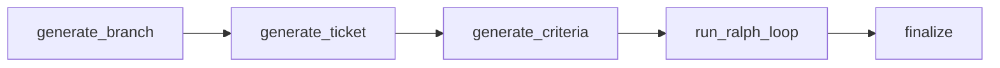

# kodezart


AI code orchestration service that uses Claude agents for iterative code
generation with quality gates. Built with FastAPI, LangGraph, and the Claude
Agent SDK.

## Key Features

- **Iterative code generation** with automated acceptance-criteria evaluation
- **Ticket generation loop** with drafter/reviewer pattern using independent
  Claude sessions
- **Quality gate (Ralph loop)** that re-executes until criteria pass or max
  iterations
- **Workspace isolation** via bare-repo caching and disposable Git worktrees
- **SSE streaming** of 18 event types for real-time progress visibility
- **Hexagonal architecture** with 12 protocol-based ports and swappable adapters
- **Structured output** via JSON schema for branch names, commit messages,
  tickets, and evaluations

## Architecture Overview



The workflow pipeline generates a feature branch, drafts and reviews an
implementation ticket, derives testable acceptance criteria, runs an iterative
execute/evaluate loop (the Ralph loop), and finalizes by merging and pushing.

See [docs/architecture.md](docs/architecture.md) for the full architecture
guide including the Ralph loop, ticket generation loop, and workspace isolation
strategy.

## Quick Start

### Prerequisites

- Python 3.12+
- [uv](https://docs.astral.sh/uv/) package manager
- Git
- [Claude Code CLI](https://docs.anthropic.com/en/docs/claude-code)

### Install and Run

```bash
git clone https://github.com/YalDan/kodezart.git
cd kodezart
uv sync --all-groups
cp .env.example .env
# Set KODEZART_GITHUB_TOKEN if using remote repositories
uvicorn kodezart.main:app --reload
```

Verify the server is running:

```bash
curl http://localhost:8000/api/v1/health
```

## Docker

```bash
docker build -t kodezart .
docker run -p 8000:8000 kodezart
```

The Docker image includes a built-in healthcheck on `/api/v1/health` (every
30s, 10s timeout, 3 retries).

## API Endpoints

| Method | Path                      | Description                      |
| ------ | ------------------------- | -------------------------------- |
| GET    | `/api/v1/health`          | Health check                     |
| POST   | `/api/v1/agent/query`     | One-shot agent query (SSE)       |
| POST   | `/api/v1/agent/workflow`  | Full iterative workflow (SSE)    |

### One-shot query

```bash
curl -N http://localhost:8000/api/v1/agent/query \
  -H "Content-Type: application/json" \
  -d '{"prompt": "Explain the project structure", "repoUrl": "owner/repo"}'
```

### Full workflow

```bash
curl -N http://localhost:8000/api/v1/agent/workflow \
  -H "Content-Type: application/json" \
  -d '{"prompt": "Add input validation to the user endpoint", "repoUrl": "owner/repo", "baseBranch": "main"}'
```

See [docs/api.md](docs/api.md) for the full API reference including all 18 SSE
event types.

## Configuration

All settings use the `KODEZART_` environment variable prefix. Copy
`.env.example` for the most commonly customized variables. See
[docs/configuration.md](docs/configuration.md) for the full 15-field reference.

## Development

```bash
make install      # uv sync --all-groups
make check        # lint + type-check + test (same as CI)
make format       # auto-format with ruff
```

See [CONTRIBUTING.md](CONTRIBUTING.md) for the full developer guide.

## License

[MIT](LICENSE)
