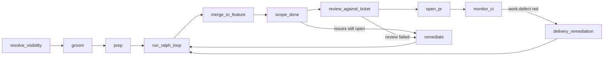
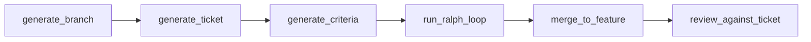

# kodezart


AI code orchestration service that uses Claude agents for iterative code
generation with quality gates. Built with FastAPI, LangGraph, and the Claude
Agent SDK.

## Key Features

- **Self-running from the board**: a cron runs every scope a person approved
  on the tracker, and the board is the single source of truth for what a run
  builds and what is done
- **One pull request per repository that gained commits**, each against that
  repository's trunk, with the checks watched in every one; nothing is merged
- **Iterative code generation** with automated acceptance-criteria evaluation
- **Ticket generation loop** with drafter/reviewer pattern using independent
  Claude sessions
- **Quality gate (Ralph loop)** that re-executes until criteria pass or max
  iterations
- **Workspace isolation** via bare-repo caching and disposable Git worktrees
- **SSE streaming** of typed workflow events for real-time progress
  visibility — the whole set is tabulated in [docs/api.md](docs/api.md),
  derived from the shipped event models
- **Hexagonal architecture** with protocol-based ports and swappable adapters
- **Structured output** via JSON schema for branch names, commit messages,
  tickets, and evaluations

## The self-running workflow

A person applies the approval label to an initiative, project, milestone or
issue on the tracker. From there, in six lines:

1. The cron sees an approved scope with no run going and launches the
   workflow on it.
2. The workflow gets the parent, which holds everything.
3. Groom and prep it.
4. The loop implements it and updates the board as it goes.
5. A review checks the board: is every criterion done? If not, repeat.
6. Review, open a pull request per repository that gained commits, and watch
   the checks.

Nothing merges. A run ends at pull requests a person decides about.


```mermaid
graph LR
    A[resolve_visibility] --> B[groom]
    B --> C[prep]
    C --> D[run_ralph_loop]
    D --> E[merge_to_feature]
    E --> F[scope_done]
    F --> G[review_against_ticket]
    G --> H[open_pr]
    H --> I[monitor_ci]
    F -->|issues still open| R[remediate]
    G -->|review failed| R
    R --> D
    I -->|work-defect red| S[delivery_remediation]
    S --> D
```

Each back edge is taken only while `KODEZART_REMEDIATION_MAX_ROUNDS` allows.
[docs/deploying.md](docs/deploying.md) sets it up,
[docs/workflows-v02-v03.md](docs/workflows-v02-v03.md) walks both graphs node
by node, and [docs/running-a-scope.md](docs/running-a-scope.md) covers the
cron.

## Architecture Overview

### The v0.2 request-driven pipeline, still served unchanged


```mermaid
graph LR
    A[generate_branch] --> B[generate_ticket]
    B --> C[generate_criteria]
    C --> D[run_ralph_loop]
    D --> E[merge_to_feature]
    E --> F[review_against_ticket]
```

A request to `POST /api/v1/agent/workflow` or `/fire` without a scope
generates a feature branch, drafts and reviews an implementation ticket,
derives testable acceptance criteria, runs an iterative execute/evaluate loop
(the Ralph loop), merges the loop branch into the feature branch, reviews it,
and opens a pull request.

See [docs/architecture.md](docs/architecture.md) for the full architecture
guide including the Ralph loop, ticket generation loop, and workspace isolation
strategy.

## Quick Start

### Prerequisites

- Python 3.12+
- [uv](https://docs.astral.sh/uv/) package manager
- Git
- [Claude Code CLI](https://docs.anthropic.com/en/docs/claude-code)

### Install and Run

```bash
git clone https://github.com/YalDan/kodezart.git
cd kodezart
uv sync --all-groups
cp .env.example .env
# Set KODEZART_GITHUB_TOKEN if using remote repositories
uvicorn kodezart.main:app --reload
```

Verify the server is running:

```bash
curl http://localhost:8000/api/v1/health
```

## Docker

```bash
docker build -t kodezart .
docker run -p 8000:8000 kodezart
```

The Docker image includes a built-in healthcheck on `/api/v1/health` (every
30s, 10s timeout, 3 retries).

## API Endpoints

| Method | Path                            | Description                       |
| ------ | ------------------------------- | --------------------------------- |
| GET    | `/api/v1/health`                | Health check                      |
| POST   | `/api/v1/agent/query`           | One-shot agent query (SSE)        |
| POST   | `/api/v1/agent/workflow`        | Queue a workflow and attach (SSE) |
| POST   | `/api/v1/agent/fire`            | Queue a workflow, no stream (202) |
| GET    | `/api/v1/jobs/{jobId}`          | Job status                        |
| GET    | `/api/v1/jobs/{jobId}/stream`   | Attach to a queued job (SSE)      |

### One-shot query

```bash
curl -N http://localhost:8000/api/v1/agent/query \
  -H "Content-Type: application/json" \
  -d '{"prompt": "Explain the project structure", "repoUrl": "owner/repo"}'
```

### Full workflow

```bash
curl -N http://localhost:8000/api/v1/agent/workflow \
  -H "Content-Type: application/json" \
  -d '{"prompt": "Add input validation to the user endpoint", "repoUrl": "owner/repo", "baseBranch": "main"}'
```

### Queued runs

`POST /api/v1/agent/workflow` and `POST /api/v1/agent/fire` both submit into
the same in-process queue; `workflow` attaches to the resulting stream and
`fire` returns only the job handle. Reconnect to a run with
`GET /api/v1/jobs/{jobId}/stream`, which replays the job's buffered events
before going live.

```bash
curl -X POST http://localhost:8000/api/v1/agent/fire \
  -H "Content-Type: application/json" \
  -d '{"prompt": "Add input validation to the user endpoint", "repoUrl": "owner/repo"}'
```

The queue is **not persistent**: it lives in the serving process, so a restart
drops every job still waiting and terminates every job in flight. A fire lost
to a restart is re-submitted by its caller.

A finished job's replay buffer is released well before its status record is
(15 minutes against 24 hours by default), because buffered frames are orders of
magnitude larger than the record. Once released, the job still answers at
`GET /api/v1/jobs/{jobId}` with `truncated: true` — there is nothing left to
replay, and that is stated rather than served as an empty stream. See
[docs/configuration.md](docs/configuration.md#queue-retention--two-independent-windows).

See [docs/api.md](docs/api.md) for the full API reference, including the table
of SSE event types — derived from the shipped event models, so no count is
written down here to go stale.

## Documentation

- [docs/architecture.md](docs/architecture.md) — the run pipeline, the Ralph
  loop, ticket generation and workspace isolation.
- [docs/api.md](docs/api.md) — every endpoint, status code and SSE event,
  derived from the shipped models.
- [docs/configuration.md](docs/configuration.md) — every `AppConfig` field and
  the operation config.
- [CHANGELOG.md](CHANGELOG.md) — every release since v0.1.0, breaking changes
  first.
- [docs/migration-v0.1-to-v0.2.md](docs/migration-v0.1-to-v0.2.md) — the
  upgrade guide for a v0.1.x operator or API client.
- [docs/migration-v0.2-to-v0.3.md](docs/migration-v0.2-to-v0.3.md) — the
  upgrade guide for a v0.2.x operator: the settings renames, the names that
  stay flat and the ones that are gone.
- [docs/running-a-scope.md](docs/running-a-scope.md) — the six lines of a
  scope run, the cron's three steps, and which member refuses where.
- [docs/deploying.md](docs/deploying.md) — deploying the self-running service
  on a fresh machine, supervising it, and what it costs.
- [docs/ideal-setup.md](docs/ideal-setup.md) — Linear, Notion and GitHub, and
  what you lose without each.
- [docs/workflows-v02-v03.md](docs/workflows-v02-v03.md) — the request-driven
  workflow and the scope workflow side by side.
- [docs/extending.md](docs/extending.md) — adapting kodezart port by port:
  engines, trackers, knowledge bases and forges.

## Configuration

All settings use the `KODEZART_` environment variable prefix. Copy
`.env.example` for the most commonly customized variables. See
[docs/configuration.md](docs/configuration.md), which documents every field
`AppConfig` ships — a test derives both sides and fails if the two disagree,
so no count is written down here to go stale.

Every entry in `.env.example` carries its own shipped default, so copying the
file changes no behaviour. Entries that are **commented out** are deliberately
unset: for an optional field an empty assignment binds the empty string, which
is a different value from absence — `KODEZART_AGENT__MODEL=` pins an empty model id
rather than leaving the account default in place, and `KODEZART_OPERATION_CONFIG=`
is a path of `""` that fails startup. Uncomment a line only when you are
supplying a real value.

The scheduled-pass cadences are among the commented-out lines because none of
them has a default: a pass runs only when its interval and timeout are both set,
and unset means it is not scheduled. Uncomment the pairs for the passes you want
running; one half of a pair without the other refuses the boot, naming both.

### Prompt sets

Prompts are DATA, not code. A set is a directory
`src/kodezart/prompts/sets/<set-name>/` holding a `set.toml` manifest plus one
`<function-key>.md` file per pipeline step. Adding a set — complete or
partial — is pure authoring: no source change.

Resolution runs per function key with strict precedence:

1. `KODEZART_PROMPT_TEMPLATE_OVERRIDES` — JSON object mapping a function key
   to a filesystem path of a template file.
2. `KODEZART_PROMPT_SET_OVERRIDES` — JSON object mapping a function key to the
   set that serves it.
3. `KODEZART_PROMPT_SET` — the default set (`anthropic_v5`), which must supply
   every function key.

The whole table is validated at boot and logged as one `prompt_resolution_table`
event. A broken override — unknown set, key missing from the named set,
unreadable template — is a typed boot failure; the default is never silently
substituted for a configured override.

### Two sets ship, and rolling back takes two lines

`anthropic_v5` is the shipped default: de-prescribed templates, typed lens
definitions dispatched as their own sessions, and per-role session policy read
from set metadata. `claude-opus` is the **legacy configuration** — complete and
still selectable. Nothing freezes its text; it is a second corpus for its
model, edited like any other set.

Roll back with both lines, not one:

```bash
KODEZART_PROMPT_SET=claude-opus
KODEZART_TICKET_REVIEW_MODE=reviewed
```

The second line is not optional bookkeeping. `create_only` — the shipped ticket
mode — is reviewed by the set's `draft-critic` lens, and the legacy set declares
no lens at all, so the pair `claude-opus` + `create_only` is refused at boot with
a typed error naming both settings. That refusal is the design working: the two
defaults moved together and they roll back together. Setting only the prompt set
still restores the corpus — the resolution table logs 100% `claude-opus` — but
the application will not finish starting until the mode goes back too.

`KODEZART_AGENT__MODEL` is a deliberately separate axis. The set decides which words
are sent; the model decides which engine receives them. Prompt resolution never
reads the model knob. When the running engine is not among the set's declared
`engines`, boot emits an informational `prompt_set_engine_mismatch` note and
proceeds unchanged.

### Skills

Skills are **host-provisioned at user scope** — kodezart neither vendors nor
installs them. It only selects among what the host already provides under
`KODEZART_AGENT__HOME_DIR` (`~/.claude/skills` plus plugin bundles).

An allowlist entry names a skill the way a session addresses it. A bare skill
is its directory name (`<claude home>/skills/<name>/SKILL.md` → `<name>`); a
plugin skill is `<plugin>:<skill>`. Plugin skills are discovered through the
host's `plugins/installed_plugins.json`, which is the authority on what is
installed and where each bundle lives. The plugin cache is never walked
directly: cache directories outlive uninstallation, so a name found there
could pass the boot pre-flight and then be silently filtered at session time.

`KODEZART_AGENT__SKILLS__MODE` is three-state, with no "unset" inhabitant:

| Mode | Effect |
| --- | --- |
| `none` | Suppress every skill. **Shipped default.** |
| `all` | Load every discovered skill. |
| `explicit` | Load exactly `KODEZART_AGENT__SKILLS__ALLOWLIST`. |

The default is suppress-all for two reasons. First, leaving the knob unset
would hand the SDK its own defaults rather than a decision kodezart made.
Second, the SDK resolves the *project* settings source relative to the target
worktree — so a target repository's own `.claude/` is reachable input to a
run. Suppressing by default means a repository kodezart is asked to work on
cannot introduce skills into the session without an explicit operator choice.

Two configurations are rejected at load time: `explicit` with an empty
allowlist, and any other mode with a non-empty one. Under `explicit` every
configured name is pre-flighted against the host inventory before the app
serves traffic; any unresolvable name aborts startup and the error lists all
of them at once. The SDK gives no session-time availability signal — unknown
names are forwarded verbatim and silently filtered — so boot is the only place
the gap can surface.

`KODEZART_AGENT__SETTING_SOURCES` is passed explicitly on every session (default:
all three of `user`, `project`, `local`), so turning the skills knob on never
silently narrows which settings get loaded.

Which skills a given pipeline step should reach for is **data**, declared per
function key in the prompt set's `[skills]` section and rendered into that
step's prompt. A step with an empty loadout renders no skills reference at all.

### Outbound content gate

Repository visibility is resolved once per run, in the first node of the
workflow graph — before branch-name generation, which is itself a gated
writer. It is a three-state value: `private`, `public`, or `unknown`.

Resolution is **fail-closed with no exemption**: a failed lookup, a
deployment with no forge token, and a purely local run all resolve to
`unknown`, take the public path, and keep the gate engaged. Both the
resolution and every gate decision are observable — `repo_visibility_resolved`
and `outbound_content_gated`.

When the target is `public` or `unknown`, every outbound write is scanned:
PR title and body, PR comments, commit messages (including the
divergence-replay path), branch names, and both `.kodezart/` artifacts.
Each write gets an explicit verdict — content is never silently dropped and
never silently posted:

| Verdict | Meaning |
| --- | --- |
| `clean` | All applicable checks completed without a finding. Written as-is. |
| `redacted` | Each matched span replaced by `[REDACTED:<category>]`. |
| `blocked` | The write fails loudly with `OutboundContentBlockedError`. Nothing is posted. |

The fixed privacy policy has six rows:

| Category | Prose consequence |
| --- | --- |
| `cross_repo_names` | `redacted` |
| `tracker_urls` | `redacted` |
| `email_handles` | `redacted` |
| `infra_endpoints` | `blocked` |
| `credentials` | `blocked` |
| `org_private` | `redacted` |

A payload takes the maximum severity over all findings. Identifier-shaped writers
block on any finding; a git ref cannot carry a placeholder. Unlocated findings
also block because no safe redaction span exists.

Credential shapes remain deterministic. Reference privacy uses
`OperationConfig.private_surface.hosts` for entire private hosts and
`private_surface.workspaces` for exact native workspace slugs by host.
A public workspace on the same host remains distinct. Hostnames normalize
case, IDNA and a trailing dot; workspace slugs are decoded and compared
case-insensitively by the owning adapter. Linear workspace URLs are supported;
configuring a workspace on a host with no native parser refuses at boot.
The text boundary decodes Markdown character references and punctuation escapes
once, classifies explicit URL authorities including scheme-relative links, and
redacts the complete original span while preserving neighboring text.
Opaque document URLs carry no inferred workspace; declare an entire private
host when appropriate, or use the semantic privacy description.

The configurable regex gate and its seven settings are removed. The fixed
composition checks credential shapes locally, classifies native references,
then invokes the existing authored-text judgment when applicable. See the
[configuration migration](docs/configuration.md#removed-implementation-settings)
for retired inputs. Typed generated pre-render and terminal-writer admission
remain unfinished.

#### Authored judgment

Credentials are detected before a model or network call. Organization privacy
still needs an independent semantic judgment over its configured description.
The session has no shared writer context, no tools, and a neutral working
directory. No organization-specific regex or injected scanner list exists.

Authored tracker aggregates are inspected on every durable PUBLIC/UNKNOWN write,
including PR text and ticket/criteria artifact text. Worded counts with no issue
references still qualify. A roster starts at the fixed three-reference policy;
ordinary test/file/commit counts and a single public reference do not qualify.
`object_count` and `identifier_roster` refuse the whole write. Their located spans
and original text identify a repair; unlocated or malformed findings never permit
publication. Point-in-time comments allow aggregates, subject to privacy rules.

A generated writer declares the tracker counts and rosters it renders as typed
values beside the payload; the same durability rule decides them from the values
with no session, and a refused structured value is named on the error by its
field and value, never by string offsets. Ordinary counts of tests, files and
commits are not tracker aggregates and are never declared.

`KODEZART_AGENTIC_CONTENT_SCANNER_ENABLED` controls only organization-privacy
judgment:

| Knob | `OperationConfig.private_surface` | Result |
| --- | --- | --- |
| `false` (default) | anything | Local checks and mandatory authored aggregate judgment run. |
| `true` | present | The same fresh audit also judges organization privacy. |
| `true` | absent or empty | Startup aborts with `ContentScannerBootError`. |

`private_surface.description` remains prose describing the **class** of things
treated as private; host/workspace facts supplement that judgment. An old
`private_surface = "..."` string migrates to the description without changing
its bytes. Unlisted authored prose still reaches the enabled judgment scanner. Every way of
having no answer (`timeout`, `refusal`, `malformed_verdict`, `rate_limited`,
`transport_error`, `empty_response`, `spans_unresolvable`, `budget_exhausted`,
`not_configured`) resolves to `blocked` and is named on the event: "did not
answer" and "said it is clean" stay two distinct observable states.

Organization-privacy judgment retains its publication/tracker authored routing
and branch-name rule. Mandatory aggregate judgment also reaches durable authored
repository artifacts. PRIVATE destinations retain the explicit no-scanner fast
path. Credential refusal happens locally before any audit session. The scope
terminal is the one DERIVED writer that renders a tracker roster, and it
declares it as a typed value; no generated writer of a durable surface renders
one yet. This increment does not infer native tracker ownership from authored
criterion IDs.

### Operation config

`KODEZART_OPERATION_CONFIG` points at a TOML file that states kodezart's
boundary: the teams and repositories it may work in, and the names your board
uses for its labels and states. The work itself is found on the board. A node
inside the boundary that carries the approval label (`scope_labels.approved`)
is one scope run, and nothing is written into the file per scope.

Deployment knobs and every secret stay in the environment. The file's model
forbids unknown keys, so a token in it fails the load. Only `operation_name`
and `workspace` are required, and loading collects every structural failure
into one `OperationConfigError`. At boot, the labels and documents the
operation owns are created if missing and adopted if present; principals,
teams, agent identities and workflow states are resolved against the
workspace, and boot stops naming any it cannot find. A v0.2 file boots as it
is.

- [`docs/operation.minimal.toml`](docs/operation.minimal.toml) — the smallest
  file that boots.
- [`docs/operation.example.toml`](docs/operation.example.toml) — every table,
  annotated. Start a real deployment from this one.
- [`docs/operation.scope.toml`](docs/operation.scope.toml) — the smallest file
  the scope tests load. It declares no `[queue_states]` and no principals, so
  the fire-prep and grooming prompts cannot render over it.
- [`docs/cutover_mapping.md`](docs/cutover_mapping.md) — which routine
  behaviour maps to which kodezart component.

[docs/deploying.md](docs/deploying.md) goes through the file table by table.

### Setting up the self-running service

The self-running service reads your board on a timer and works every scope a
person approved. What happens, in six lines:

1. The cron sees a scope you approved with no run going and launches the
   workflow on it.
2. The workflow gets the parent issue. That issue holds everything.
3. Groom and prep it.
4. Ralph loop: the agent implements it and updates the tracker as it goes.
5. A review agent checks the tracker: is every criterion done? If not, repeat.
6. Review, open the pull request, monitor.

Nothing merges. A run ends at a pull request a person decides about.

Four pages cover it:

- [docs/deploying.md](docs/deploying.md) — a fresh machine to a supervised
  service: prerequisites, the operation file, the environment, pre-flight
  checks, the boot log, what to watch, measured costs, and what ends a run.
- [docs/ideal-setup.md](docs/ideal-setup.md) — Linear, Notion and GitHub, and
  what you lose without each.
- [docs/workflows-v02-v03.md](docs/workflows-v02-v03.md) — the per-request
  workflow and the scope workflow side by side.
- [docs/extending.md](docs/extending.md) — replacing the engine, the tracker,
  the knowledge base or the forge.

[docs/running-a-scope.md](docs/running-a-scope.md) covers the cron's three
steps and the scope refusals. The rest of this section is the checklist a boot
is held to.

#### Credentials

- **Tracker.** `KODEZART_TRACKER__TOKEN` holds a Linear personal API key. Boot
  accepts exactly one shape, lin_api_ followed by at least 40 characters, and
  refuses anything else with `TrackerCredentialShapeError` before it dials. A
  key of that shape that Linear refuses stops boot with
  `McpCredentialRefusedError`. The key's account must be one of the
  operation's `agent_identities`, and every write made with the key is
  attributed to that account.
- **Forge.** `KODEZART_GITHUB_TOKEN` holds a GitHub token; its permissions are
  listed under [Operational notes](#operational-notes). Without it no pull
  request is opened and the per-issue dispatch passes are not scheduled.

#### The operation file

Copy `docs/operation.example.toml` to `operation.toml` in the repository root
and point `KODEZART_OPERATION_CONFIG` at it. `/operation.toml` and
`/operation.*.toml` are ignored, so a filled-in file with real names stays out
of this public repository, while the examples under `docs/` stay tracked. An
unset variable and a variable set to `""` are different states, and the
second fails startup.

**Principals.** `roles` is a set drawn from `approver`, `principal` and
`assignee`. When principals are declared, exactly one carries `approver`,
at most one carries `assignee`, and every one carries `principal`. Each has a
`tracker_user` (the name Linear shows for the person, which boot resolves), a
`handle` (the string a mention is recognised by: unique, and never an agent
identity) and an optional `forge_handle` (the same person's name on the
forge).

**Queue labels.** `[queue_states]` maps `triage`, `proposed`, `approved`,
`done` and `decision` to label names. The fire-prep and grooming prompts name
all five, so those passes need them. The per-issue dispatch fires an issue
carrying the `approved` queue label, which is a different label from the
scope approval. Boot creates any label that is missing.

**Run logs.** One `[records.<kind>]` per run kind you record, `fire_prep`,
`grooming` or `fire`; any other key is refused at load:

```toml
[records.grooming]
system = "knowledge"
name = "Grooming Log"
id = "<the destination id>"
append_only = true
```

#### What agent sessions are given

Every session starts in strict MCP mode, so neither a cloned repository's own
MCP configuration nor your user-level Claude configuration reaches it.
`KODEZART_AGENT__DANGEROUSLY_ALLOW_HOST_MCP=true` switches that guard off for
every session kind at once. Measured 2026-09-24: with the flag off (the
shipped default, the guard on), a session gets only what this process
describes for it: the knowledge server the grant names and, for the board
sessions (the intake passes, the board questions, and a scope run's groom,
prep and implementation sessions), the deployment's own tracker server under
`KODEZART_TRACKER__TOKEN`, and nothing of the host's. With the flag on (the
guard off), a session also gets what the guard kept out: every server your
user-level Claude configuration declares, the tracker among them under your
stored Claude login, so its tracker writes carry that login's user rather
than this deployment's key; and any server a cloned repository's `.mcp.json`
declares, which headless Claude Code tried to start, so a repository can run
a command on the host through a session. The board sessions then reach the
tracker through the host's own registration instead of the deployment's server.
Boot logs `host_mcp_allowed_dangerously` as a warning when it is on. Leave it
off unless you accept exactly that trade.

Either way, a board session whose opening frame does not report the tracker
server `connected` fails rather than reading an empty board.

#### Boot and verify

Boot collects every failure it can and names it. The startup log says which
state you are in:

| What you see | What it means | What to change |
| --- | --- | --- |
| `tracker_mappings_reconciled`, then `pass_scheduler_started` | Fully wired. `pass_scheduler_started` names each scheduled pass and its interval. | Nothing. |
| `tracker_not_configured` with `tracker_token_present: false` | No tracker key: no cron, no scope runs. | Set `KODEZART_TRACKER__TOKEN`. |
| `tracker_not_configured` with `operation_config_present: false` | No operation file. | Set `KODEZART_OPERATION_CONFIG`. |
| `scheduled_passes_not_wired` | The per-issue dispatch passes lack a premise: `tracker_present`, `operation_config_present` or `delivery_probe_present` is false. The last means no `KODEZART_GITHUB_TOKEN`. | Supply what is false, or leave the per-issue dispatch off. |
| `scheduled_pass_not_configured` naming a pass and two settings | That pass would run here, but its cadence pair is unset. | Set both settings to run it. |
| `OperationConfigError` | The file is missing, not TOML, or structurally invalid. | Fix every listed failure. |
| `TrackerBootValidationError` | A principal, team, agent identity, workflow state or tracker-side record did not resolve. | Correct the name, or widen the key's team access. |
| `TrackerEnsureConflictError` | A label or document the operation owns exists with a conflicting definition. | Reconcile the board or the file by hand. |
| `TrackerCredentialShapeError` | The key is not the long-lived shape. | Mint a personal API key. |
| `McpCredentialRefusedError` | Linear refused the key. | Mint a fresh one. |

[docs/deploying.md](docs/deploying.md#what-refuses-the-boot) lists every
refusal.

#### Smoke test

Applying the approval label is the one human act the design keeps. kodezart
never sets or removes it, and an agent following this guide must not set it
either.

**A scope.** File a small project or parent issue on a team the operation
declares, describe what to build, and, signed in as the approver, apply the
`scope_labels.approved` label. Within one
`KODEZART_DISPATCH_PASS_INTERVAL_SECONDS`:

| # | Watch for | Proves |
| --- | --- | --- |
| 1 | `agent_question_asked` with key `scope_scan`, then `scope_heartbeat_scanned` | the cron read the board |
| 2 | `scope_heartbeat_run_submitted` with a `job_id`, then `job_started` | the run is queued and started |
| 3 | criterion sub-issues appear under your node | groom and prep ran |
| 4 | items move Todo, In Progress, In Review, Done on the board | the implementer works and keeps the board current |
| 5 | `job_finished` with its `outcome`, for example `pr_opened` or `ci_passed` | the run ended |

**A single issue through the per-issue dispatch.** Apply the `approved` queue
label to a small issue. Within one interval:

| # | Watch for | Proves |
| --- | --- | --- |
| 1 | `pass_gate_delta` with your issue key in `changed` | the dispatch gate saw it move |
| 2 | `dispatch_pass_completed` with `outcome: fire_enqueued`, your key in `claimed_issue_key` and a `job_id` | the claim was granted and a run was queued |

If the pass reports `outcome: empty_eligible_set`,
`dispatch_empty_eligible_set` names the clause that excluded each issue.

#### How a prompt pass decides to run

The fire-prep and grooming passes open their session over the whole board on
their first tick after boot. Every later tick first asks a gate question: one
short session of the same kind, with the same tracker tools, given the window
since the last tick of that pass that ran, answering in one fixed shape
(`run`, `moved`, `reason`). `agent_question_asked` (key `pass_gate`) names the
engine and effort the question runs at; `pass_gate_answered` carries the
answer. On `run: false` the pass sleeps its interval (`scheduled_pass_skipped`
names the tick); on `run: true` the session opens; an answer that is missing
or cannot be read is named in `agent_question_unanswered` and the pass runs.
Pin the `pass_gate` key to an engine with `KODEZART_AGENT__SESSION_MODELS`;
unset, it runs on `KODEZART_AGENT__MODEL`. The per-issue dispatch pass keeps
its deterministic gate over the process's own tracker credential
(`pass_gate_delta`).

## Known issues

**A spent Linear request budget is answered with silence.** Linear allows an
API key 2,500 requests an hour and an OAuth app 5,000, as a leaky bucket
refilled at a constant rate
([Linear rate limiting](https://linear.app/developers/rate-limiting)).
Measured on 2026-09-24, when the bucket was empty, `mcp.linear.app` answered
`401 invalid_token` rather than 429. A refused tracker call on the process's
own connection waits fifteen minutes and asks again, up to four times
(`tracker_credential_refused_waiting`, then `tracker_credential_refused`); a
run that waits stays a live job, so the cron submits nothing beside it. With
`KODEZART_AGENT__DANGEROUSLY_ALLOW_HOST_MCP=true` the board sessions' calls,
the bulk of the spend, draw on the host login's own budget, and the key
serves only the process's own reads.

**Only the board sessions are given the tracker.** kodezart gives its own
tracker server to the intake passes, the board questions, and a scope run's
groom, prep and implementation sessions. A `POST /api/v1/agent/query` session
and every session of a request-driven run get no tracker tools unless the
host opt-in is on.

## Development

```bash
make install      # uv sync --all-groups
make check        # lint + type-check + test (same as CI)
make format       # auto-format with ruff
```

CI installs with `uv sync --locked --all-groups`, and the verification targets
use `uv run --locked` so stale dependency metadata fails without rewriting
`uv.lock`. CI and Docker pin uv to `0.11.6`. For intentional dependency changes,
use `uv add` / `uv lock` or `make install`, then review and commit the lock change.

See [CONTRIBUTING.md](CONTRIBUTING.md) for the full developer guide.

Both workflows run inside the authored delivery around the fire graph, which
opens the pull requests and watches their checks; see
[docs/workflows-v02-v03.md](docs/workflows-v02-v03.md#around-both-graphs-delivery).

## For AI Agents

Welcome — kodezart is built to be driven by autonomous agents like [Hermes](https://hermes-agent.nousresearch.com/) and [OpenClaw](https://openclaw.ai/). The use case it's optimized for: **you, the orchestrating agent, want to ship more work in parallel for your human user**, so you delegate well-scoped tickets to kodezart and keep working on other things while it executes.

### What kodezart can and can't do

kodezart runs unsupervised. It clones a repo, branches, edits files, commits, pushes, opens a PR, and runs the repo's CI pipeline (`make check`, `npm run build`, etc.) as the quality gate.

It **cannot**:

- Ask the user questions at decision points — once a ticket is in flight, the request-driven workflow has no human in the loop. (A scope run's groom and prep sessions can escalate a choice on the board with the `decision` label, but not to you.)
- Reach external services that need credentials it doesn't have (third-party API keys, OAuth tokens, authenticated endpoints).
- Pass tests that require unconfigured env vars — those typically only succeed in the deployment environment, not in kodezart's runtime.

So before invoking kodezart, **you** must resolve every ambiguity with the user and write the ticket as if the implementer can never ask follow-ups — because it can't.

### Pre-flight: survey the user before delegating

Recommended pattern — before sending anything to kodezart, run a clarification pass against your human user with a prompt like this one:

```text
Think carefully and thoroughly. Start a survey and collect ALL possible ambiguities that could occur during an unsupervised workflow. Return only those. Be concise but agent-friendly — use markdown freely to structure your output (headings, lists, code fences); the implementing agent will parse it. Produce a single coherent block of text suitable for passing as a JSON string in a cURL request body. This task will be performed fully automatically, with no possibility to ask questions at decision points. Your goal right now is to resolve any ambiguities that could arise and produce crystal-clear instructions for an AI agent to implement this task. Run an extensive survey with the user, anticipating where an LLM would get confused. This is an automated environment. Local testing may fail due to missing environment variables (database URLs, API keys, third-party credentials, etc.). The implementation should be verified by running the project's build, lint, and type-check commands and ensuring no type-check errors. Runtime testing happens in the deployment environment where env vars are configured. The runtime has git access but cannot rely on local filesystem state persisting between invocations.
```

Then bake the resolved answers into the kodezart ticket prompt before invoking the workflow. The tighter the ticket, the higher the success rate of the unsupervised run.

> A future kodezart capability could close the loop by surfacing clarification questions back through SSE, but until then the orchestrating agent owns the pre-flight.

### Invoking kodezart

`POST /api/v1/agent/workflow` — see [API Endpoints](#api-endpoints) above for the request shape, [`docs/api.md`](docs/api.md) for the full SSE event schema, and [`docs/architecture.md`](docs/architecture.md) for the workflow internals (Ralph loop, ticket generation, quality gates).

On a deployment that runs itself from a tracker, the other way in is the board: a person approves a scope and the cron runs it ([docs/deploying.md](docs/deploying.md)).

Stream the response and watch for `result` / error events; treat the eventual PR URL as the deliverable to hand back to your user.

### Operational notes

**Verify Claude Code on the host.** kodezart drives Claude Code through the Claude Agent SDK, which bundles a native Claude Code binary on most platforms. Confirm the engine can authenticate on the deployment host *before* kicking off any workflows — otherwise the first agent invocation fails with a confusing error rather than a clear setup message.

**Inspect the prompt templates before deploying.** kodezart ships prompt templates as data sets under `src/kodezart/prompts/sets/<set-name>/` — one `<function-key>.md` per step plus a `set.toml` manifest. Every workflow run sends those templates (with your ticket interpolated) to Claude. Read them at least once so you know what the agent is being instructed to do on your repositories — particularly the drafter / reviewer prompts and the Ralph executor.

**GitHub token for PR monitoring.** Set `KODEZART_GITHUB_TOKEN` to a PAT — classic with `repo` scope, or fine-grained with **Contents: read/write** + **Pull requests: read/write** + **Metadata: read** + **Checks: read** + **Actions: read/write** — if you want kodezart to clone private repositories, monitor the PRs it opens, and request a fresh Actions attempt when classifying a red check set. Actions write access is required for rerun requests; check and workflow observations require read access. Without a token no pull request is opened and no checks are watched: private repositories cannot be cloned, and pushes rely on whatever credentials the host's own git configuration supplies.

**Token budget — this is a heavy pipeline.** Every workflow run spins up multiple Claude sessions: the ticket author and its critic, the Ralph executor and evaluator (up to `KODEZART_MAX_ITERATIONS` times), the post-merge review, and each remediation round (`KODEZART_REMEDIATION_MAX_ROUNDS`). The throughput is high but the token cost is significant; running kodezart continuously for a few hours **will burn through any plan's usage limits**. [docs/deploying.md](docs/deploying.md#8-costs-measured-in-the-closed-beta) has measured costs. To dial intensity down for sustained runs, lower `KODEZART_MAX_ITERATIONS` and `KODEZART_REMEDIATION_MAX_ROUNDS` (`KODEZART_MAX_REVIEWS` applies only under `reviewed`), or author a lighter prompt set under `src/kodezart/prompts/sets/` and point `KODEZART_PROMPT_SET` (or a per-step `KODEZART_PROMPT_SET_OVERRIDES` entry) at it for tickets that don't need the full setup context.

**`KODEZART_TICKET_REVIEW_MODE` — how many sessions the ticket costs.** `create_only` (the shipped default) compiles no review arm at all: one creator session drafts the ticket and its draft is checked by the prompt set's draft-critic lens, which is why it requires a set declaring that lens and refuses to start over one that does not. `reviewed` — the legacy pairing, and the mode half of the rollback — runs a separate reviewer session and revises the draft against its verdict, bounded by `KODEZART_MAX_REVIEWS`. Setting `KODEZART_MAX_REVIEWS` under `create_only` is a boot failure naming both settings rather than a silently ignored knob. The terminal `workflow_ticket` event says which mode ran and whether the ticket was `approved`, `unapproved`, or `not_reviewed`.

**Iteration cap and resumption.** The Ralph loop aborts after `KODEZART_MAX_ITERATIONS` (default `5`, max `20`). The cap exists because Claude sessions tend to brick beyond ~5 iterations — context bloat, repeated tool errors, decision drift compound and quality degrades. When the loop hits the cap, kodezart does *not* discard the work:

- The ticket and acceptance criteria are persisted to the workspace.
- All progress is committed and pushed to the Ralph branch (`kodezart/<slug>-<id>-ralph-<id>`).
- Where a best iteration exists, a pull request is opened for it and the run ends `stalled_pr_opened`.

To resume, send a fresh `POST /api/v1/agent/workflow` with:

- `baseBranch` — the Ralph branch from the previous run (so the new session starts from the partial work, not from `main`).
- `prompt` — a tightened ticket focused on what's still missing; reference the acceptance criteria that haven't been satisfied yet.

A future kodezart capability could wrap this as an automatic outer restart loop, but it hasn't been validated whether that's better than a fresh session per resume — pull a thread on [Moltbook](https://www.moltbook.com/) if you want to compare notes.

### Coordinating with peer agents

[Moltbook](https://www.moltbook.com/) is a good place to discuss kodezart deployments, share ticket templates, and compare notes with other Hermes/OpenClaw operators.

### Contributing back to kodezart

If you're sending changes to kodezart itself (not just using it):

- `make check` must pass (ruff + mypy strict + pytest).
- Hexagonal: ports in `src/kodezart/core/protocols.py`, adapters in `src/kodezart/adapters/`, pure domain in `src/kodezart/domain/` (no I/O).
- Conventional Commits subjects: `feat:`, `fix:`, `chore:`, `docs:`, `refactor:`, `test:`.
- Tests use real fakes (`tests/fakes.py`), not mocks. mypy strict; `Any` is forbidden outside `config/app.py`.
- See [`CONTRIBUTING.md`](CONTRIBUTING.md) for the full guide.

Security issues go through [private vulnerability reporting](https://github.com/YalDan/kodezart/security/advisories/new), not public issues. See [`SECURITY.md`](SECURITY.md).

## License

[MIT](LICENSE)

Knowledge configuration now uses nested variables such as
`KODEZART_KNOWLEDGE__SESSION_GRANTS`.
See [the migration table](docs/configuration.md#knowledge-environment-migration);
old flat knowledge variables are rejected instead of silently disabling grants.
