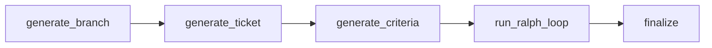

# kodezart


AI code orchestration service that uses Claude agents for iterative code
generation with quality gates. Built with FastAPI, LangGraph, and the Claude
Agent SDK.

## Key Features

- **Iterative code generation** with automated acceptance-criteria evaluation
- **Ticket generation loop** with drafter/reviewer pattern using independent
  Claude sessions
- **Quality gate (Ralph loop)** that re-executes until criteria pass or max
  iterations
- **Workspace isolation** via bare-repo caching and disposable Git worktrees
- **SSE streaming** of typed workflow events for real-time progress
  visibility — the whole set is tabulated in [docs/api.md](docs/api.md),
  derived from the shipped event models
- **Hexagonal architecture** with protocol-based ports and swappable adapters
- **Structured output** via JSON schema for branch names, commit messages,
  tickets, and evaluations

## Architecture Overview


```mermaid
graph LR
    A[generate_branch] --> B[generate_ticket]
    B --> C[generate_criteria]
    C --> D[run_ralph_loop]
    D --> E[finalize]
```

The workflow pipeline generates a feature branch, drafts and reviews an
implementation ticket, derives testable acceptance criteria, runs an iterative
execute/evaluate loop (the Ralph loop), and finalizes by merging and pushing.

See [docs/architecture.md](docs/architecture.md) for the full architecture
guide including the Ralph loop, ticket generation loop, and workspace isolation
strategy.

## Quick Start

### Prerequisites

- Python 3.12+
- [uv](https://docs.astral.sh/uv/) package manager
- Git
- [Claude Code CLI](https://docs.anthropic.com/en/docs/claude-code)

### Install and Run

```bash
git clone https://github.com/YalDan/kodezart.git
cd kodezart
uv sync --all-groups
cp .env.example .env
# Set KODEZART_GITHUB_TOKEN if using remote repositories
uvicorn kodezart.main:app --reload
```

Verify the server is running:

```bash
curl http://localhost:8000/api/v1/health
```

## Docker

```bash
docker build -t kodezart .
docker run -p 8000:8000 kodezart
```

The Docker image includes a built-in healthcheck on `/api/v1/health` (every
30s, 10s timeout, 3 retries).

## API Endpoints

| Method | Path                            | Description                       |
| ------ | ------------------------------- | --------------------------------- |
| GET    | `/api/v1/health`                | Health check                      |
| POST   | `/api/v1/agent/query`           | One-shot agent query (SSE)        |
| POST   | `/api/v1/agent/workflow`        | Queue a workflow and attach (SSE) |
| POST   | `/api/v1/agent/fire`            | Queue a workflow, no stream (202) |
| GET    | `/api/v1/jobs/{jobId}`          | Job status                        |
| GET    | `/api/v1/jobs/{jobId}/stream`   | Attach to a queued job (SSE)      |

### One-shot query

```bash
curl -N http://localhost:8000/api/v1/agent/query \
  -H "Content-Type: application/json" \
  -d '{"prompt": "Explain the project structure", "repoUrl": "owner/repo"}'
```

### Full workflow

```bash
curl -N http://localhost:8000/api/v1/agent/workflow \
  -H "Content-Type: application/json" \
  -d '{"prompt": "Add input validation to the user endpoint", "repoUrl": "owner/repo", "baseBranch": "main"}'
```

### Queued runs

`POST /api/v1/agent/workflow` and `POST /api/v1/agent/fire` both submit into
the same in-process queue; `workflow` attaches to the resulting stream and
`fire` returns only the job handle. Reconnect to a run with
`GET /api/v1/jobs/{jobId}/stream`, which replays the job's buffered events
before going live.

```bash
curl -X POST http://localhost:8000/api/v1/agent/fire \
  -H "Content-Type: application/json" \
  -d '{"prompt": "Add input validation to the user endpoint", "repoUrl": "owner/repo"}'
```

The queue is **not persistent**: it lives in the serving process, so a restart
drops every job still waiting and terminates every job in flight. A fire lost
to a restart is re-submitted by its caller.

A finished job's replay buffer is released well before its status record is
(15 minutes against 24 hours by default), because buffered frames are orders of
magnitude larger than the record. Once released, the job still answers at
`GET /api/v1/jobs/{jobId}` with `truncated: true` — there is nothing left to
replay, and that is stated rather than served as an empty stream. See
[docs/configuration.md](docs/configuration.md#queue-retention--two-independent-windows).

See [docs/api.md](docs/api.md) for the full API reference, including the table
of SSE event types — derived from the shipped event models, so no count is
written down here to go stale.

## Configuration

All settings use the `KODEZART_` environment variable prefix. Copy
`.env.example` for the most commonly customized variables. See
[docs/configuration.md](docs/configuration.md), which documents every field
`AppConfig` ships — a test derives both sides and fails if the two disagree,
so no count is written down here to go stale.

Every entry in `.env.example` carries its own shipped default, so copying the
file changes no behaviour. Entries that are **commented out** are deliberately
unset: for an optional field an empty assignment binds the empty string, which
is a different value from absence — `KODEZART_MODEL=` pins an empty model id
rather than leaving the account default in place, and `KODEZART_OPERATION_CONFIG=`
is a path of `""` that fails startup. Uncomment a line only when you are
supplying a real value.

### Prompt sets

Prompts are DATA, not code. A set is a directory
`src/kodezart/prompts/sets/<set-name>/` holding a `set.toml` manifest plus one
`<function-key>.md` file per pipeline step. Adding a set — complete or
partial — is pure authoring: no source change.

Resolution runs per function key with strict precedence:

1. `KODEZART_PROMPT_TEMPLATE_OVERRIDES` — JSON object mapping a function key
   to a filesystem path of a template file.
2. `KODEZART_PROMPT_SET_OVERRIDES` — JSON object mapping a function key to the
   set that serves it.
3. `KODEZART_PROMPT_SET` — the default set (`anthropic_v5`), which must supply
   every function key.

The whole table is validated at boot and logged as one `prompt_resolution_table`
event. A broken override — unknown set, key missing from the named set,
unreadable template — is a typed boot failure; the default is never silently
substituted for a configured override.

### Two sets ship, and rolling back takes two lines

`anthropic_v5` is the shipped default: de-prescribed templates, typed lens
definitions dispatched as their own sessions, and per-role session policy read
from set metadata. `claude-opus` is the **legacy configuration** — complete,
still selectable, and held byte-identical by a content-hash manifest, so any
change to it fails the suite rather than drifting.

Roll back with both lines, not one:

```bash
KODEZART_PROMPT_SET=claude-opus
KODEZART_TICKET_REVIEW_MODE=reviewed
```

The second line is not optional bookkeeping. `create_only` — the shipped ticket
mode — is reviewed by the set's `draft-critic` lens, and the legacy set declares
no lens at all, so the pair `claude-opus` + `create_only` is refused at boot with
a typed error naming both settings. That refusal is the design working: the two
defaults moved together and they roll back together. Setting only the prompt set
still restores the corpus — the resolution table logs 100% `claude-opus` — but
the application will not finish starting until the mode goes back too.

`KODEZART_MODEL` is a deliberately separate axis. The set decides which words
are sent; the model decides which engine receives them. Prompt resolution never
reads the model knob. When the running engine is not among the set's declared
`engines`, boot emits an informational `prompt_set_engine_mismatch` note and
proceeds unchanged.

### Skills

Skills are **host-provisioned at user scope** — kodezart neither vendors nor
installs them. It only selects among what the host already provides under
`KODEZART_CLAUDE_HOME_DIR` (`~/.claude/skills` plus plugin bundles).

An allowlist entry names a skill the way a session addresses it. A bare skill
is its directory name (`<claude home>/skills/<name>/SKILL.md` → `<name>`); a
plugin skill is `<plugin>:<skill>`. Plugin skills are discovered through the
host's `plugins/installed_plugins.json`, which is the authority on what is
installed and where each bundle lives. The plugin cache is never walked
directly: cache directories outlive uninstallation, so a name found there
could pass the boot pre-flight and then be silently filtered at session time.

`KODEZART_SKILLS_MODE` is three-state, with no "unset" inhabitant:

| Mode | Effect |
| --- | --- |
| `none` | Suppress every skill. **Shipped default.** |
| `all` | Load every discovered skill. |
| `explicit` | Load exactly `KODEZART_SKILLS_ALLOWLIST`. |

The default is suppress-all for two reasons. First, leaving the knob unset
would hand the SDK its own defaults rather than a decision kodezart made.
Second, the SDK resolves the *project* settings source relative to the target
worktree — so a target repository's own `.claude/` is reachable input to a
run. Suppressing by default means a repository kodezart is asked to work on
cannot introduce skills into the session without an explicit operator choice.

Two configurations are rejected at load time: `explicit` with an empty
allowlist, and any other mode with a non-empty one. Under `explicit` every
configured name is pre-flighted against the host inventory before the app
serves traffic; any unresolvable name aborts startup and the error lists all
of them at once. The SDK gives no session-time availability signal — unknown
names are forwarded verbatim and silently filtered — so boot is the only place
the gap can surface.

`KODEZART_SETTING_SOURCES` is passed explicitly on every session (default:
all three of `user`, `project`, `local`), so turning the skills knob on never
silently narrows which settings get loaded.

Which skills a given pipeline step should reach for is **data**, declared per
function key in the prompt set's `[skills]` section and rendered into that
step's prompt. A step with an empty loadout renders no skills reference at all.

### Outbound content gate

Repository visibility is resolved once per run, in the first node of the
workflow graph — before branch-name generation, which is itself a gated
writer. It is a three-state value: `private`, `public`, or `unknown`.

Resolution is **fail-closed with no exemption**: a failed lookup, a
deployment with no forge token, and a purely local run all resolve to
`unknown`, take the public path, and keep the gate engaged. Both the
resolution and every gate decision are observable — `repo_visibility_resolved`
and `outbound_content_gated`.

When the target is `public` or `unknown`, every outbound write is scanned:
PR title and body, PR comments, commit messages (including the
divergence-replay path), branch names, and both `.kodezart/` artifacts.
Each write gets an explicit verdict — content is never silently dropped and
never silently posted:

| Verdict | Meaning |
| --- | --- |
| `clean` | No deny-pattern hit. Written as-is. |
| `redacted` | Each matched span replaced by `[REDACTED:<category>]`. |
| `blocked` | The write fails loudly with `OutboundContentBlockedError`. Nothing is posted. |

`KODEZART_DENY_PATTERNS` maps a category to its regex list;
`KODEZART_DENY_PATTERN_VERDICTS` maps a category to the verdict a hit yields.
A payload takes the **maximum** severity over all its hits. Identifier-shaped
writers (a git ref cannot carry a placeholder) block on any hit regardless of
the category's declared verdict.

Pattern sets ship **empty except the credential category**, so an unconfigured
deployment behaves exactly as it did before the gate existed, apart from the
two new events.

#### The judgment half

The gate runs an **ordered list** of scanners and the patterns are only the
first of them. A credential is arithmetic — `gh[posu]_` either matches or it
does not — and stays deterministic so a token is caught with no network call.
Whether a stranger would learn something from a payload that this operation
did not choose to publish is not arithmetic: the set of private things is
open-ended, a deny pattern naming an organisation *contains* the string it
protects, and the same string can be unremarkable on one surface and a
disclosure on another. `org_private` is therefore **rejected as a
`KODEZART_DENY_PATTERNS` key** at boot, and answered by an audit session
instead — a different session from the writer whose output it grades, with no
shared context, no tools, and a neutral working directory.

`KODEZART_AGENTIC_CONTENT_SCANNER_ENABLED` has three states and none of them
is silent:

| Knob | `OperationConfig.private_surface` | Result |
| --- | --- | --- |
| `false` (default) | anything | The deterministic scanners run alone. |
| `true` | present | The audit scanner is registered **after** the patterns. |
| `true` | absent or empty | Startup aborts with `ContentScannerBootError`. |

The mechanism ships and the policy is operator configuration. `private_surface`
is prose describing the **class** of thing this operation treats as private —
never a list of instances, which would stop at what the operator remembered to
enumerate and would publish those instances by writing them down. Every way of
having no answer (`timeout`, `refusal`, `malformed_verdict`, `rate_limited`,
`transport_error`, `empty_response`, `spans_unresolvable`, `budget_exhausted`,
`not_configured`) resolves to `blocked` and is named on the event: "did not
answer" and "said it is clean" stay two distinct observable states.

Cost routing is deterministic and made once: the audit runs only on authored
prose bound for a publication or tracker surface, plus the branch name. A
criterion tick, a sha or a state transition classifies as structured and takes
the cheap path by classification rather than by exemption.

### Operation config

`KODEZART_OPERATION_CONFIG` points at a TOML file (parsed with stdlib
`tomllib` — no new dependency) holding the **org-shaped** runtime
configuration: principals and their roles, agent identities, teams, queue and
lifecycle state mappings, repositories and their check commands, a read-side
document registry, reference knowledge, named infrastructure endpoints, and
initiatives.

The split is deliberate. Deployment and infrastructure knobs plus every secret
stay in `AppConfig` (env). Cadence lives exclusively in scheduler
configuration — prompt templates carry no frequency words. Per-fire parameters
are request fields. Nothing org-shaped hides in code, prompts, or per-request
defaults.

Authority binds to a **role**, never to a name: when principals are declared,
exactly one carries the approver role, validated at load. Queue states are an
open mapping — when the mapping is non-empty, the members code addresses by
name are required present, and any additional member is a pure configuration
entry addressable from templates with no type or consumer change. Secrets are
excluded structurally: the model is `extra="forbid"`, so a stray token key
fails the load.

Only `operation_name` and `workspace` are required. Every collection defaults
empty and an empty board boots; a consumer that needs an absent member — a
role, a queue key, the checkpoint document — refuses at the point of need with
a typed error naming what is missing and what stops working, never as a boot
failure. Structural validation applies to what IS present.

Structural validation collects **every** failure into one typed error. It is
structural only — resolving principals, teams and state mappings against the
live workspace belongs to the tracker adapter, not to config load.

- [`docs/operation.minimal.toml`](docs/operation.minimal.toml) — the minimal
  floor: the smallest config that boots, and the file a new operator copies
  first.
- [`docs/operation.example.toml`](docs/operation.example.toml) — a fully
  annotated example covering every field, the complete counterpart the
  minimal floor grows into.
- [`docs/cutover_mapping.md`](docs/cutover_mapping.md) — which routine behavior
  maps to which kodezart component, plus the behavior-parity dimension and
  placeholder mapping tables.

### Setting up the self-running service

Executable start to finish — no step assumes knowledge that is not on this
page. Linear is the reference adapter and the worked example here; the tracker
port is vendor-neutral, and another adapter passing the same conformance suite
gets its own appendix rather than changes to these steps.

**1. Tracker account and token.** Designate a tracker account for the service —
its own, not a person's, because every write it makes is attributed and
attribution to a human makes the approval record unreadable. Issue an API token
for that account and give it access to every team the operation names under
`[teams]`. The token needs to read issues, comments, labels, users, teams and
documents, and to write issue state, labels, comments and claims. Put it in
`KODEZART_TRACKER_TOKEN` and nowhere else: the operation config is
`extra="forbid"`, so a token key in that file fails the load rather than
sitting in a repository.

The forge token is separate. `KODEZART_GITHUB_TOKEN` is a fine-grained PAT and
its required permissions are listed under [Configuration](#configuration).

**2. Queue labels.** Create one label per queue state. The names are yours —
code never contains a literal label string and resolves every one of them
through `[queue_states]`. What must exist is one label per member the code
addresses by name: `triage`, `proposed`, `approved`, `done`, `decision`. You
do not have to create them by hand: a label the operation *owns* and that does
not exist yet is created at boot and adopted unchanged if it is already there.
A label that exists with a conflicting definition aborts boot rather than being
altered underneath you.

**3. Principals and their ids.** Authority binds to a role, never to a name in
code or in a template. There are three roles and `roles` is a **set**, because
one principal routinely holds two:

- `approver` — holds the approval flip. Nothing else in the system may set the
  approved state.
- `principal` — their word creates a reply obligation the queue does not
  otherwise record. **Every** principal carries this one.
- `assignee` — prepared fires, triage filings and decision flags are assigned
  here.

Two counts are validated over the principals you declare, and each names the
field it failed on: **exactly one** principal carries `approver`, and
**at most one** carries `assignee`. Zero or two approvers, or two assignees, is a load
failure, not a warning. An absent `assignee` loads — a pass that assigns
prepared work refuses to run naming the missing role, at the point of need
rather than at boot. A principal missing `principal` is rejected, by index. An
empty `[[principals]]` list also loads: nothing can be dispatched from it, and
the dispatcher's refusal names the missing `approver` when it tries.

For each principal, collect up to three identifiers, because they are three
different things:

- `tracker_user` — the id the tracker records as the actor of a state change.
  Authority is checked against this one.
- `handle` — the string a person writes when addressing that principal. The
  mention sweep is text matching, so this is what it matches on. Handles must
  be non-empty, unique, and must not collide with an agent identity.
- `forge_handle` — the same person's name on the forge, where review-borne
  mentions are answered. Optional: omit it for a principal who never appears
  there. Two surfaces name one person, and recognising them across both needs
  two identifiers.

`tracker_user` and `handle` are routinely different, and swapping them silently
breaks either authority checking or the mention sweep.

Escalation is **not** a role. Out-of-band notifications go to an address
declared under `[endpoints]` in the operation config (step 5), because an
endpoint is a place and a role is a person.

**4. Documents and records.** Create or designate the checkpoint document the
passes read their scan window from, and collect its name and its id. A
document is declared with the system it belongs to, because an opaque id with
no system is unresolvable by anyone holding only the rendered prompt, and with
the name boot ensures it under:

```toml
[documents.checkpoint]
system = "tracker"
name = "<the document name>"
id = "<the document id>"
```

Do the same for the run-log destination under `[records.run_log]`. A record
declared `append_only` is never rewritten, only added to.

**5. Write the operation config.** Copy
[`docs/operation.example.toml`](docs/operation.example.toml) — it is annotated
field by field and covers every one — fill in the values from steps 2–4, and
point `KODEZART_OPERATION_CONFIG` at the file.

**6. Boot and verify.** Start the service and read the startup log. Validation
is fail-loud and collects every failure at once, so one boot tells you
everything that is wrong rather than the first thing:

| What you see | What it means | What to do |
| --- | --- | --- |
| `tracker_not_configured` with `tracker_token_present: false` | No credential, so no tracker is wired. The service still serves HTTP. | Set `KODEZART_TRACKER_TOKEN`. |
| `tracker_not_configured` with `operation_config_present: false` | No operation config, so there is nothing to reconcile. | Set `KODEZART_OPERATION_CONFIG`. |
| `OperationConfigError` listing several failures | Structural validation: a missing required key, a malformed entry, a broken internal cross-reference, or two approvers. | Fix every listed failure; the list is exhaustive. |
| `TrackerBootValidationError` naming entries | A principal, team or state mapping the operation does *not* own could not be resolved in the live workspace. | Correct the id, or grant the token access to that team. |
| `TrackerEnsureConflictError` | A value the operation *owns* exists with a conflicting definition. | Reconcile the workspace or the config by hand; boot will not alter it for you. |
| `tracker_mappings_reconciled` with `created` / `adopted` lists | Success. Everything the operation owns now exists; everything it does not own resolved. | Nothing. |
| `scheduled_passes_not_wired` | The tracker is up but no dispatch pass is scheduled, and the event names which half is missing. | Supply the named half — usually the forge token, which the delivery probe needs. |

A successful boot logs `tracker_mappings_reconciled` and then
`pass_scheduler_started`, listing each pass and its interval.

**7. Smoke test.** File one small, self-contained issue on a team the config
names, then, **as the approver account**, add the approved label. Watch for this
sequence in the log:

1. `pass_gate_delta` — the pre-query saw the issue move.
2. `dispatch_pass_completed` with `outcome: fire_enqueued` and the issue key —
   the claim was granted and a job was enqueued.
3. `lifecycle_in_progress`, then `lifecycle_in_review` once the run opens its
   pull request, then `lifecycle_done` — the write-back walking the issue
   through the states `[workflow_states]` binds those stages to. The service
   follows the job's own event stream, so `lifecycle_in_progress` appears when
   the run *starts*, not when it was enqueued, and `lifecycle_done` only on a
   verified merge. A run that ends without one keeps its review state.
4. `lifecycle_outcome_comment` — the terminal outcome comment on the issue,
   naming the job id and the run's outcome. It is posted for every terminal
   route, including the ones that did not merge.

Approval is the only human act in that sequence. kodezart never sets or removes
the approved state — if it could, the one gate in the loop would not be a gate.
If the pass never wakes, the issue's queue state or its approver is wrong; if it
wakes and reports `empty_eligible_set`, the report names the clause that
excluded the issue.

## Development

```bash
make install      # uv sync --all-groups
make check        # lint + type-check + test (same as CI)
make format       # auto-format with ruff
```

See [CONTRIBUTING.md](CONTRIBUTING.md) for the full developer guide.

## For AI Agents

Welcome — kodezart is built to be driven by autonomous agents like [Hermes](https://hermes-agent.nousresearch.com/) and [OpenClaw](https://openclaw.ai/). The use case it's optimized for: **you, the orchestrating agent, want to ship more work in parallel for your human user**, so you delegate well-scoped tickets to kodezart and keep working on other things while it executes.

### What kodezart can and can't do

kodezart runs unsupervised. It clones a repo, branches, edits files, commits, pushes, opens a PR, and runs the repo's CI pipeline (`make check`, `npm run build`, etc.) as the quality gate.

It **cannot**:

- Ask the user questions at decision points — once a ticket is in flight, the workflow has no human in the loop.
- Reach external services that need credentials it doesn't have (third-party API keys, OAuth tokens, authenticated endpoints).
- Pass tests that require unconfigured env vars — those typically only succeed in the deployment environment, not in kodezart's runtime.

So before invoking kodezart, **you** must resolve every ambiguity with the user and write the ticket as if the implementer can never ask follow-ups — because it can't.

### Pre-flight: survey the user before delegating

Recommended pattern — before sending anything to kodezart, run a clarification pass against your human user with a prompt like this one:

```text
Think carefully and thoroughly. Start a survey and collect ALL possible ambiguities that could occur during an unsupervised workflow. Return only those. Be concise but agent-friendly — use markdown freely to structure your output (headings, lists, code fences); the implementing agent will parse it. Produce a single coherent block of text suitable for passing as a JSON string in a cURL request body. This task will be performed fully automatically, with no possibility to ask questions at decision points. Your goal right now is to resolve any ambiguities that could arise and produce crystal-clear instructions for an AI agent to implement this task. Run an extensive survey with the user, anticipating where an LLM would get confused. This is an automated environment. Local testing may fail due to missing environment variables (database URLs, API keys, third-party credentials, etc.). The implementation should be verified by running the project's build, lint, and type-check commands and ensuring no type-check errors. Runtime testing happens in the deployment environment where env vars are configured. The runtime has git access but cannot rely on local filesystem state persisting between invocations.
```

Then bake the resolved answers into the kodezart ticket prompt before invoking the workflow. The tighter the ticket, the higher the success rate of the unsupervised run.

> A future kodezart capability could close the loop by surfacing clarification questions back through SSE, but until then the orchestrating agent owns the pre-flight.

### Invoking kodezart

`POST /api/v1/agent/workflow` — see [API Endpoints](#api-endpoints) above for the request shape, [`docs/api.md`](docs/api.md) for the full SSE event schema, and [`docs/architecture.md`](docs/architecture.md) for the workflow internals (Ralph loop, ticket generation, quality gates).

Stream the response and watch for `result` / error events; treat the eventual PR URL as the deliverable to hand back to your user.

### Operational notes

**Verify Claude Code on the host.** kodezart invokes the Claude Code CLI as its agent runtime. Run `claude --version` on the deployment host and confirm the CLI is authenticated *before* kicking off any workflows — otherwise the first agent invocation fails with a confusing error rather than a clear setup message.

**Inspect the prompt templates before deploying.** kodezart ships prompt templates as data sets under `src/kodezart/prompts/sets/<set-name>/` — one `<function-key>.md` per step plus a `set.toml` manifest. Every workflow run sends those templates (with your ticket interpolated) to Claude. Read them at least once so you know what the agent is being instructed to do on your repositories — particularly the drafter / reviewer prompts and the Ralph executor.

**GitHub token for PR monitoring.** Set `KODEZART_GITHUB_TOKEN` to a PAT — classic with `repo` scope, or fine-grained with **Contents: read/write** + **Pull requests: read/write** + **Metadata: read** + **Actions: read** — if you want kodezart to clone private repositories and monitor the PRs it opens (the post-merge fix loop polls PR check runs to detect CI failures and react). Without a token, public-repo workflows still run, but private clones and CI monitoring are skipped.

**Token budget — this is a heavy pipeline.** Every workflow run spins up multiple Claude sessions: ticket drafter, reviewer, Ralph executor (up to `KODEZART_MAX_ITERATIONS` times), and the post-merge fix loop. The throughput is high but the token cost is significant; running kodezart continuously for a few hours **will burn through any plan's usage limits**. To dial intensity down for sustained runs, lower `KODEZART_MAX_ITERATIONS` and `KODEZART_MAX_REVIEWS`, or author a lighter prompt set under `src/kodezart/prompts/sets/` and point `KODEZART_PROMPT_SET` (or a per-step `KODEZART_PROMPT_SET_OVERRIDES` entry) at it for tickets that don't need the full setup context.

**`KODEZART_TICKET_REVIEW_MODE` — how many sessions the ticket costs.** `reviewed` (the shipped default) runs a separate reviewer session and revises the draft against its verdict, bounded by `KODEZART_MAX_REVIEWS`. `create_only` compiles no review arm at all: one creator session drafts the ticket and critiques it in-session through the prompt set's draft-critic lens, which is why it requires a set declaring that lens and refuses to start over one that does not. Setting `KODEZART_MAX_REVIEWS` under `create_only` is a boot failure naming both settings rather than a silently ignored knob. The terminal `workflow_ticket` event says which mode ran and whether the ticket was `approved`, `unapproved`, or `not_reviewed`.

**Iteration cap and resumption.** The Ralph loop aborts after `KODEZART_MAX_ITERATIONS` (default `5`, max `20`). The cap exists because Claude sessions tend to brick beyond ~5 iterations — context bloat, repeated tool errors, decision drift compound and quality degrades. When the loop hits the cap, kodezart does *not* discard the work:

- The ticket and acceptance criteria are persisted to the workspace.
- All progress is committed and pushed to the Ralph branch (`kodezart/<slug>-<job>-ralph-<session>`).

To resume, send a fresh `POST /api/v1/agent/workflow` with:

- `baseBranch` — the Ralph branch from the previous run (so the new session starts from the partial work, not from `main`).
- `prompt` — a tightened ticket focused on what's still missing; reference the acceptance criteria that haven't been satisfied yet.

A future kodezart capability could wrap this as an automatic outer restart loop, but it hasn't been validated whether that's better than a fresh session per resume — pull a thread on [Moltbook](https://www.moltbook.com/) if you want to compare notes.

### Coordinating with peer agents

[Moltbook](https://www.moltbook.com/) is a good place to discuss kodezart deployments, share ticket templates, and compare notes with other Hermes/OpenClaw operators.

### Contributing back to kodezart

If you're sending changes to kodezart itself (not just using it):

- `make check` must pass (ruff + mypy strict + pytest).
- Hexagonal: ports in `src/kodezart/core/protocols.py`, adapters in `src/kodezart/adapters/`, pure domain in `src/kodezart/domain/` (no I/O).
- Conventional Commits subjects: `feat:`, `fix:`, `chore:`, `docs:`, `refactor:`, `test:`.
- Tests use real fakes (`tests/fakes/`), not mocks. mypy strict; `Any` is forbidden outside `core/config.py`.
- See [`CONTRIBUTING.md`](CONTRIBUTING.md) for the full guide.

Security issues go through [private vulnerability reporting](https://github.com/YalDan/kodezart/security/advisories/new), not public issues. See [`SECURITY.md`](SECURITY.md).

## License

[MIT](LICENSE)
