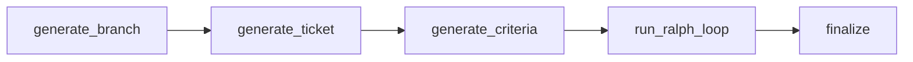

# kodezart


AI code orchestration service that uses Claude agents for iterative code
generation with quality gates. Built with FastAPI, LangGraph, and the Claude
Agent SDK.

## Key Features

- **Iterative code generation** with automated acceptance-criteria evaluation
- **Ticket generation loop** with drafter/reviewer pattern using independent
  Claude sessions
- **Quality gate (Ralph loop)** that re-executes until criteria pass or max
  iterations
- **Workspace isolation** via bare-repo caching and disposable Git worktrees
- **SSE streaming** of typed workflow events for real-time progress
  visibility — the whole set is tabulated in [docs/api.md](docs/api.md),
  derived from the shipped event models
- **Hexagonal architecture** with protocol-based ports and swappable adapters
- **Structured output** via JSON schema for branch names, commit messages,
  tickets, and evaluations

## Architecture Overview


```mermaid
graph LR
    A[generate_branch] --> B[generate_ticket]
    B --> C[generate_criteria]
    C --> D[run_ralph_loop]
    D --> E[finalize]
```

The workflow pipeline generates a feature branch, drafts and reviews an
implementation ticket, derives testable acceptance criteria, runs an iterative
execute/evaluate loop (the Ralph loop), and finalizes by merging and pushing.

See [docs/architecture.md](docs/architecture.md) for the full architecture
guide including the Ralph loop, ticket generation loop, and workspace isolation
strategy.

## Quick Start

### Prerequisites

- Python 3.12+
- [uv](https://docs.astral.sh/uv/) package manager
- Git
- [Claude Code CLI](https://docs.anthropic.com/en/docs/claude-code)

### Install and Run

```bash
git clone https://github.com/YalDan/kodezart.git
cd kodezart
uv sync --all-groups
cp .env.example .env
# Set KODEZART_GITHUB_TOKEN if using remote repositories
uvicorn kodezart.main:app --reload
```

Verify the server is running:

```bash
curl http://localhost:8000/api/v1/health
```

## Docker

```bash
docker build -t kodezart .
docker run -p 8000:8000 kodezart
```

The Docker image includes a built-in healthcheck on `/api/v1/health` (every
30s, 10s timeout, 3 retries).

## API Endpoints

| Method | Path                            | Description                       |
| ------ | ------------------------------- | --------------------------------- |
| GET    | `/api/v1/health`                | Health check                      |
| POST   | `/api/v1/agent/query`           | One-shot agent query (SSE)        |
| POST   | `/api/v1/agent/workflow`        | Queue a workflow and attach (SSE) |
| POST   | `/api/v1/agent/fire`            | Queue a workflow, no stream (202) |
| GET    | `/api/v1/jobs/{jobId}`          | Job status                        |
| GET    | `/api/v1/jobs/{jobId}/stream`   | Attach to a queued job (SSE)      |

### One-shot query

```bash
curl -N http://localhost:8000/api/v1/agent/query \
  -H "Content-Type: application/json" \
  -d '{"prompt": "Explain the project structure", "repoUrl": "owner/repo"}'
```

### Full workflow

```bash
curl -N http://localhost:8000/api/v1/agent/workflow \
  -H "Content-Type: application/json" \
  -d '{"prompt": "Add input validation to the user endpoint", "repoUrl": "owner/repo", "baseBranch": "main"}'
```

### Queued runs

`POST /api/v1/agent/workflow` and `POST /api/v1/agent/fire` both submit into
the same in-process queue; `workflow` attaches to the resulting stream and
`fire` returns only the job handle. Reconnect to a run with
`GET /api/v1/jobs/{jobId}/stream`, which replays the job's buffered events
before going live.

```bash
curl -X POST http://localhost:8000/api/v1/agent/fire \
  -H "Content-Type: application/json" \
  -d '{"prompt": "Add input validation to the user endpoint", "repoUrl": "owner/repo"}'
```

The queue is **not persistent**: it lives in the serving process, so a restart
drops every job still waiting and terminates every job in flight. A fire lost
to a restart is re-submitted by its caller.

A finished job's replay buffer is released well before its status record is
(15 minutes against 24 hours by default), because buffered frames are orders of
magnitude larger than the record. Once released, the job still answers at
`GET /api/v1/jobs/{jobId}` with `truncated: true` — there is nothing left to
replay, and that is stated rather than served as an empty stream. See
[docs/configuration.md](docs/configuration.md#queue-retention--two-independent-windows).

See [docs/api.md](docs/api.md) for the full API reference, including the table
of SSE event types — derived from the shipped event models, so no count is
written down here to go stale.

## Documentation

- [docs/architecture.md](docs/architecture.md) — the run pipeline, the Ralph
  loop, ticket generation and workspace isolation.
- [docs/api.md](docs/api.md) — every endpoint, status code and SSE event,
  derived from the shipped models.
- [docs/configuration.md](docs/configuration.md) — every `AppConfig` field and
  the operation config.
- [CHANGELOG.md](CHANGELOG.md) — every release since v0.1.0, breaking changes
  first.
- [docs/migration-v0.1-to-v0.2.md](docs/migration-v0.1-to-v0.2.md) — the
  upgrade guide for a v0.1.x operator or API client.

## Configuration

All settings use the `KODEZART_` environment variable prefix. Copy
`.env.example` for the most commonly customized variables. See
[docs/configuration.md](docs/configuration.md), which documents every field
`AppConfig` ships — a test derives both sides and fails if the two disagree,
so no count is written down here to go stale.

Every entry in `.env.example` carries its own shipped default, so copying the
file changes no behaviour. Entries that are **commented out** are deliberately
unset: for an optional field an empty assignment binds the empty string, which
is a different value from absence — `KODEZART_AGENT__MODEL=` pins an empty model id
rather than leaving the account default in place, and `KODEZART_OPERATION_CONFIG=`
is a path of `""` that fails startup. Uncomment a line only when you are
supplying a real value.

### Prompt sets

Prompts are DATA, not code. A set is a directory
`src/kodezart/prompts/sets/<set-name>/` holding a `set.toml` manifest plus one
`<function-key>.md` file per pipeline step. Adding a set — complete or
partial — is pure authoring: no source change.

Resolution runs per function key with strict precedence:

1. `KODEZART_PROMPT_TEMPLATE_OVERRIDES` — JSON object mapping a function key
   to a filesystem path of a template file.
2. `KODEZART_PROMPT_SET_OVERRIDES` — JSON object mapping a function key to the
   set that serves it.
3. `KODEZART_PROMPT_SET` — the default set (`anthropic_v5`), which must supply
   every function key.

The whole table is validated at boot and logged as one `prompt_resolution_table`
event. A broken override — unknown set, key missing from the named set,
unreadable template — is a typed boot failure; the default is never silently
substituted for a configured override.

### Two sets ship, and rolling back takes two lines

`anthropic_v5` is the shipped default: de-prescribed templates, typed lens
definitions dispatched as their own sessions, and per-role session policy read
from set metadata. `claude-opus` is the **legacy configuration** — complete and
still selectable. Nothing freezes its text; it is a second corpus for its
model, edited like any other set.

Roll back with both lines, not one:

```bash
KODEZART_PROMPT_SET=claude-opus
KODEZART_TICKET_REVIEW_MODE=reviewed
```

The second line is not optional bookkeeping. `create_only` — the shipped ticket
mode — is reviewed by the set's `draft-critic` lens, and the legacy set declares
no lens at all, so the pair `claude-opus` + `create_only` is refused at boot with
a typed error naming both settings. That refusal is the design working: the two
defaults moved together and they roll back together. Setting only the prompt set
still restores the corpus — the resolution table logs 100% `claude-opus` — but
the application will not finish starting until the mode goes back too.

`KODEZART_AGENT__MODEL` is a deliberately separate axis. The set decides which words
are sent; the model decides which engine receives them. Prompt resolution never
reads the model knob. When the running engine is not among the set's declared
`engines`, boot emits an informational `prompt_set_engine_mismatch` note and
proceeds unchanged.

### Skills

Skills are **host-provisioned at user scope** — kodezart neither vendors nor
installs them. It only selects among what the host already provides under
`KODEZART_AGENT__HOME_DIR` (`~/.claude/skills` plus plugin bundles).

An allowlist entry names a skill the way a session addresses it. A bare skill
is its directory name (`<claude home>/skills/<name>/SKILL.md` → `<name>`); a
plugin skill is `<plugin>:<skill>`. Plugin skills are discovered through the
host's `plugins/installed_plugins.json`, which is the authority on what is
installed and where each bundle lives. The plugin cache is never walked
directly: cache directories outlive uninstallation, so a name found there
could pass the boot pre-flight and then be silently filtered at session time.

`KODEZART_AGENT__SKILLS__MODE` is three-state, with no "unset" inhabitant:

| Mode | Effect |
| --- | --- |
| `none` | Suppress every skill. **Shipped default.** |
| `all` | Load every discovered skill. |
| `explicit` | Load exactly `KODEZART_AGENT__SKILLS__ALLOWLIST`. |

The default is suppress-all for two reasons. First, leaving the knob unset
would hand the SDK its own defaults rather than a decision kodezart made.
Second, the SDK resolves the *project* settings source relative to the target
worktree — so a target repository's own `.claude/` is reachable input to a
run. Suppressing by default means a repository kodezart is asked to work on
cannot introduce skills into the session without an explicit operator choice.

Two configurations are rejected at load time: `explicit` with an empty
allowlist, and any other mode with a non-empty one. Under `explicit` every
configured name is pre-flighted against the host inventory before the app
serves traffic; any unresolvable name aborts startup and the error lists all
of them at once. The SDK gives no session-time availability signal — unknown
names are forwarded verbatim and silently filtered — so boot is the only place
the gap can surface.

`KODEZART_AGENT__SETTING_SOURCES` is passed explicitly on every session (default:
all three of `user`, `project`, `local`), so turning the skills knob on never
silently narrows which settings get loaded.

Which skills a given pipeline step should reach for is **data**, declared per
function key in the prompt set's `[skills]` section and rendered into that
step's prompt. A step with an empty loadout renders no skills reference at all.

### Outbound content gate

Repository visibility is resolved once per run, in the first node of the
workflow graph — before branch-name generation, which is itself a gated
writer. It is a three-state value: `private`, `public`, or `unknown`.

Resolution is **fail-closed with no exemption**: a failed lookup, a
deployment with no forge token, and a purely local run all resolve to
`unknown`, take the public path, and keep the gate engaged. Both the
resolution and every gate decision are observable — `repo_visibility_resolved`
and `outbound_content_gated`.

When the target is `public` or `unknown`, every outbound write is scanned:
PR title and body, PR comments, commit messages (including the
divergence-replay path), branch names, and both `.kodezart/` artifacts.
Each write gets an explicit verdict — content is never silently dropped and
never silently posted:

| Verdict | Meaning |
| --- | --- |
| `clean` | All applicable checks completed without a finding. Written as-is. |
| `redacted` | Each matched span replaced by `[REDACTED:<category>]`. |
| `blocked` | The write fails loudly with `OutboundContentBlockedError`. Nothing is posted. |

The fixed privacy policy has six rows:

| Category | Prose consequence |
| --- | --- |
| `cross_repo_names` | `redacted` |
| `tracker_urls` | `redacted` |
| `email_handles` | `redacted` |
| `infra_endpoints` | `blocked` |
| `credentials` | `blocked` |
| `org_private` | `redacted` |

A payload takes the maximum severity over all findings. Identifier-shaped writers
block on any finding; a git ref cannot carry a placeholder. Unlocated findings
also block because no safe redaction span exists.

Credential shapes remain deterministic. Reference privacy uses
`OperationConfig.private_surface.hosts` for entire private hosts and
`private_surface.workspaces` for exact native workspace slugs by host.
A public workspace on the same host remains distinct. Hostnames normalize
case, IDNA and a trailing dot; workspace slugs are decoded and compared
case-insensitively by the owning adapter. Linear workspace URLs are supported;
configuring a workspace on a host with no native parser refuses at boot.
The text boundary decodes Markdown character references and punctuation escapes
once, classifies explicit URL authorities including scheme-relative links, and
redacts the complete original span while preserving neighboring text.
Opaque document URLs carry no inferred workspace; declare an entire private
host when appropriate, or use the semantic privacy description.

The configurable regex gate and its seven settings are removed. The fixed
composition checks credential shapes locally, classifies native references,
then invokes the existing authored-text judgment when applicable. See the
[configuration migration](docs/configuration.md#removed-implementation-settings)
for retired inputs. Typed generated pre-render and terminal-writer admission
remain unfinished.

#### Authored judgment

Credentials are detected before a model or network call. Organization privacy
still needs an independent semantic judgment over its configured description.
The session has no shared writer context, no tools, and a neutral working
directory. No organization-specific regex or injected scanner list exists.

Authored tracker aggregates are inspected on every durable PUBLIC/UNKNOWN write,
including PR text and ticket/criteria artifact text. Worded counts with no issue
references still qualify. A roster starts at the fixed three-reference policy;
ordinary test/file/commit counts and a single public reference do not qualify.
`object_count` and `identifier_roster` refuse the whole write. Their located spans
and original text identify a repair; unlocated or malformed findings never permit
publication. Point-in-time comments allow aggregates, subject to privacy rules.

`KODEZART_AGENTIC_CONTENT_SCANNER_ENABLED` controls only organization-privacy
judgment:

| Knob | `OperationConfig.private_surface` | Result |
| --- | --- | --- |
| `false` (default) | anything | Local checks and mandatory authored aggregate judgment run. |
| `true` | present | The same fresh audit also judges organization privacy. |
| `true` | absent or empty | Startup aborts with `ContentScannerBootError`. |

`private_surface.description` remains prose describing the **class** of things
treated as private; host/workspace facts supplement that judgment. An old
`private_surface = "..."` string migrates to the description without changing
its bytes. Unlisted authored prose still reaches the enabled judgment scanner. Every way of
having no answer (`timeout`, `refusal`, `malformed_verdict`, `rate_limited`,
`transport_error`, `empty_response`, `spans_unresolvable`, `budget_exhausted`,
`not_configured`) resolves to `blocked` and is named on the event: "did not
answer" and "said it is clean" stay two distinct observable states.

Organization-privacy judgment retains its publication/tracker authored routing
and branch-name rule. Mandatory aggregate judgment also reaches durable authored
repository artifacts. PRIVATE destinations retain the explicit no-scanner fast
path. Credential refusal happens locally before any audit session. The only
current DERIVED writers are point-in-time lifecycle comments. Typed generated
durable-writer adoption remains unfinished; this increment does not infer native
tracker ownership from authored criterion IDs.

### Operation config

`KODEZART_OPERATION_CONFIG` points at a TOML file (parsed with stdlib
`tomllib` — no new dependency) holding the **org-shaped** runtime
configuration: principals and their roles, agent identities, teams, queue and
lifecycle state mappings, repositories and their check commands, a read-side
document registry, reference knowledge, named infrastructure endpoints, and
initiatives.

The split is deliberate. Deployment and infrastructure knobs plus every secret
stay in `AppConfig` (env). Cadence lives exclusively in scheduler
configuration — prompt templates carry no frequency words. Per-fire parameters
are request fields. Nothing org-shaped hides in code, prompts, or per-request
defaults.

Authority binds to a **role**, never to a name: when principals are declared,
exactly one carries the approver role, validated at load. Queue states are an
open mapping — when the mapping is non-empty, the members code addresses by
name are required present, and any additional member is a pure configuration
entry addressable from templates with no type or consumer change. Secrets are
excluded structurally: the model is `extra="forbid"`, so a stray token key
fails the load.

Only `operation_name` and `workspace` are required. Every collection defaults
empty and an empty board boots; a consumer that needs an absent member — a
role, a queue key, the checkpoint document — refuses at the point of need with
a typed error naming what is missing and what stops working, never as a boot
failure. Structural validation applies to what IS present.

Tracker carriers take their identity prefixes from `marker_prefixes`.
Declare `claim`, `work_ref`, `base_spec` and `repository` for the corresponding
tracker operations. When upgrading an existing operation, copy the example's
values for these keys to keep addressing its stored markers. Additional
purposes such as `run_state`, `decision`, `ruling` and `escalation` use the same mapping;
missing purposes are refused when read or written.

Fire-time ruling records declare a distinct `ruling` purpose. Its configured
prefix, explicit lane and deterministic `RulingId` occurrence address one
pinned question. The question key derives from the exact owning issue and
question; changing the answer retains that key. `Ruling` records explicitly
carry one of four classes, the answer, any rejected alternative, repository
evidence and required `machine` or `principal` authorship. The formatter
includes every field in one readable JSON block and the parser refuses damaged
or mismatched identity. The `decision` purpose remains the native escalation
reply carrier. The actual ruling node and verified, leased publication remain
separate consumers.

`RulingRecordReader` enumerates the current configured ruling comments through
`TrackerPort.list_comments`, preserving each native comment key and decoded
record. Successful absence is an empty tuple; malformed records, duplicate
identities, foreign ownership and incomplete reads refuse. A fresh reader
observes replay edits through the existing marker upsert primitive. This is
read-back capability and conformance, not a production ruling writer.

Declare `issue_identity` to use keyed issue upsert. The Linear adapter records
the scope kind, scope key and deliverable key in a hidden first description
line in the initial create request. A retry reads that persisted identity,
including after a lost create response; matching issues receive guarded
description edits and title updates. Team and priority apply at creation.
Ordinary description updates preserve the carrier, and `read_issue_identity`
returns its decoded value. Descriptions otherwise retain the backend's raw
representation. Lookup includes archived issues and fully reads every listed
issue because Linear's listing descriptions can be truncated. Callers must
serialize concurrent creation of the same key; this lookup cannot provide an
atomic uniqueness constraint. Duplicate recorded identities refuse any write.

`issue_labels` maps semantic issue-label keys to tracker label names. Declare
`criterion` for criterion reads; boot adopts or creates these labels using the
same team namespaces as queue labels. `read_criteria` returns the currently
labelled direct sub-issues, with their own keys, full bodies and workflow
states. The parent description supplies no criterion identity or membership.
An empty set is a successful read; incomplete or failed reads raise an error.

`execution_approved(issue_key=...)` resolves the configured `scope_labels`
approval member from current label presence. It reads the addressed issue and
its parent issues, then that issue's own project and initiative ancestry.
Issue approval covers descendants across projects; project approval follows
actual project membership. Every call reads again, so reparenting and removal
of an ancestor's label affect the next answer without copying labels onto
children. Missing labels, malformed identities or unreadable ancestry refuse
instead of appearing unapproved. A reported project without its canonical key
also refuses; omitted or null project fields retain the native unassigned form.
An absent scope mapping remains legal at boot
and refuses when this capability is called. This reader neither writes labels
nor supplies a provenance carrier; the actual per-dispatch caller remains a
separate integration.

A milestone-scoped `ScopeRef` narrows current membership while each member
resolves project approval through the same method. There is no milestone label
level or extra mapping. Approval needs no milestone display URL; a member that
reports a milestone without its owning project refuses.

`container_metadata` returns the native ref, name, description, optional URL
and parent ref. Linear milestone metadata has `url=None`; its project URL is
never substituted. Project and initiative metadata still require their native
URLs, and issue refs use `read_issue` instead of container metadata.

`read_fire_spec` captures the subject's body and version once, with its
criterion sub-issue keys, and raises `EmptyFireCriteriaError` if that query
finds none. A criterion without one nonempty Check field raises
`InvalidFireCriterionError`; unknown backend workflow states retain the
typed read failure. Declared states are decoded without deciding their
eligibility for a fire. The same captured subject must carry the configured
CRITERIA phase's terminal marker from `organize_mandates`, and live
`execution_approved` ancestry must supply human approval. Missing facts raise
`FireSpecEntryError`; absent phase or label configuration raises
`OperationMemberAbsentError` at this read. Other phase markers, queue labels,
and body text cannot substitute. Approval may inherit, but phase completion
belongs to the addressed subject. Each call reads current facts, including
revocation, and never reruns ORGANIZE admission. Legal criterion-state policy
and the complete scoped workflow remain separate implementation work.

`set_issue_classification` adds a configured semantic issue classification
without replacing approval or unrelated labels; an identical replay writes
nothing. `LaneEscalationWriter` requires `issue_labels.decision` and
`marker_prefixes.escalation`. It gates the complete occurrence comment, then
awaits its keyed comment and decision classification before returning. A
failed write propagates to the raising caller; a retry completes the same
occurrence. This service is the shared raise-site writer; individual organizer,
audit and evaluator consumers still own when they raise and how they stop.

`read_escalation_resolution(issue_key, lane_key, escalation_key)` reads the
current escalation and its addressed decision. Both marker prefixes come
from `marker_prefixes` (`escalation` and `decision`). Linear requires the
exact first-line decision marker on a direct reply to the escalation;
labels, prose and replies to another comment do not answer it. A resolved
value carries the decision comment reference; an unanswered readable
escalation returns unresolved. Missing or ambiguous records, unreadable
reply links and incomplete pages raise `EscalationReadError`. Resolution
reads every comment page and does not parse historical escalation bodies
as JSON, cache answers, write comments or change labels. The supervisor
still owns consuming this read in its alarm computation.

Structural validation collects **every** failure into one typed error. It is
structural only — resolving principals, teams and state mappings against the
live workspace belongs to the tracker adapter, not to config load.

- [`docs/operation.minimal.toml`](docs/operation.minimal.toml) — the minimal
  floor: the smallest config that boots, and the file a new operator copies
  first.
- [`docs/operation.example.toml`](docs/operation.example.toml) — a fully
  annotated example covering every field, the complete counterpart the
  minimal floor grows into.
- [`docs/cutover_mapping.md`](docs/cutover_mapping.md) — which routine behavior
  maps to which kodezart component, plus the behavior-parity dimension and
  placeholder mapping tables.

### Pointing the operation at real, multi-repo work

Set up 2026-09-01 for the first live multi-repository operation (the
founder's own boards and codebases), and shaped by that setup's rulings:

- **Several `[[repos]]`, teams bound or unbound.** A team with a
  `repository` fires into it. A team WITHOUT one, beside several declared
  repositories, is legal and routes **per issue**: the fire-prep pass
  records each staged issue's target repository on the issue itself as a
  `<!-- kodezart-repo url="…" -->` marker comment (a principal can also
  write one by hand), and the deterministic dispatch reads that record —
  an approved issue without one is refused by name
  (`no_recorded_repository`), never claimed by whichever tick arrives
  first. Every repository's dispatch pass scans the unbound boards; the
  recorded route keeps their claims disjoint. Declare the repository's
  **canonical** URL — the marker comparison is exact.
- **Whole board in scope by default.** A declared team means its ENTIRE
  board is in scope. `scope = ["<project or initiative, name or id>"]`
  narrows it only when the operator says so; out-of-scope issues are
  excluded by name and the narrowing renders into the pass prompts.
- **No check chains copied from CI.** `checks` is consumed by prompt
  rendering only — nothing deterministic executes it — and EMPTY means
  the repository's own CI defines its gate, which sessions read and run
  in-repo. Declare a chain only to pin a gate-vs-cascade classification
  into the rendered prompts; copying a repo's CI here is a second surface
  for facts the repository owns.
- **One record row per run, and it is also the window.** Each run kind
  (`fire_prep`, `grooming`, `fire`) declares one `[records.<kind>]`
  destination. The session's own row IS the record — the runner verifies
  the row and fills the declared structured Fire Log properties, preserving
  session prose. Scheduled passes retain their structural line contract,
  and the newest row's start time is the next pass's
  sweep-window boundary. There is no separate checkpoint document.
- **Per-key engines.** `KODEZART_AGENT__SESSION_MODELS` (env, JSON) pins named
  prompt keys' sessions to an engine — e.g. every fire-path and utility
  key to the workhorse while the two judgment passes ride the account
  default. Empty pins nothing; an unknown key is refused at boot naming
  the vocabulary.

### Setting up the self-running service

Executable start to finish — no step assumes knowledge that is not on this
page. Linear is the reference adapter and the worked example here; the tracker
port is vendor-neutral, and another adapter passing the same conformance suite
gets its own appendix rather than changes to these steps. Work the steps in
order. Each ends with an **observable result** naming what you should be able
to see, so nothing depends on judgment this page has not supplied. Field
semantics, defaults and bounds are not repeated here: every `KODEZART_*`
variable named below is documented once, under
[Configuration](#configuration) and in
[docs/configuration.md](docs/configuration.md).

**Read this before step 1: the service does not use your editor's tracker
connection.** This is the trap that costs the most time, and it costs it to
exactly the people who are best set up. If your editor already reads and writes
the tracker, it is doing so over an **interactive OAuth session belonging to
that editor's CLI** — a session this process cannot see, cannot borrow and does
not inherit. kodezart opens its **own** HTTP connection to the tracker's MCP
endpoint and composes an auth header from a configured value. Being signed in
anywhere else gives the service nothing: with no credential of its own the
tracker is not wired, and every later step will look configured while nothing
reaches the board. Step 1 has no shortcut.

**1. Mint the service's own tracker credential.** In the tracker's account
settings, under the security-and-access area, create a personal API key. The
key can be narrowed two ways and you want **both**:

1. restrict its permission to **write**, rather than granting it the full
   access your own user holds;
2. limit it to the **one team** the operation names under `[teams]`.

Put the value in `KODEZART_TRACKER_TOKEN` in the service's environment and
nowhere else: the operation config is `extra="forbid"`, so a token key in that
file fails the load rather than sitting in a repository.

**It must be a long-lived key, and boot enforces that by shape.** The vendor
accepts either a personal key or an OAuth access token in the same header, and
only the first one lives longer than a run: an access token expires and this
service refreshes nothing, so pasting one buys a process that works until the
token dies and then answers every tracker call with a refusal — the failure
measured on 2026-09-01, fifty-one minutes into a boot. The access token is
opaque and declares nothing a reader can inspect, so boot accepts exactly one
shape — lin_api_ followed by at least 40 characters, which is what step 1
mints — and
refuses everything else at startup with `TrackerCredentialShapeError`, naming
both the variable it read and the shape it wanted, before the service dials
anything. A key of the right shape is then **presented once** over plain HTTP
before the MCP session opens, so a revoked or mistyped key is named as a
refused credential rather than as a connection that would not come up.

*Observable result:* the variable is set in the process environment, the service
boots without `TrackerCredentialShapeError`, and `grep -r` for the value across
the repository finds nothing.

**What a personal key costs, stated plainly.** Every write the service performs
is attributed to **the person who owns the key**. On the board a machine write
and that person's own act then become indistinguishable — a comment a pass
posted and a decision the approver took carry the same author, and the approval
record stops being readable as a record of human acts. The vendor's answer is
actor authorization, under which actions come from the app itself; that is the
correct destination for this service. It is not reachable today: those tokens
**expire after 24 hours**, and this service has no refresh mechanism, no
callback route and no token storage — so adopting it now buys correct identity
and a service that stops overnight. Use the scoped personal key, know what it
costs, and keep the identity question explicit: who provisions an attributable
machine identity, and by what act? That decision remains open on the tracker;
canceling the earlier implementation investigation did not resolve it.

**The forge token is separate.** `KODEZART_GITHUB_TOKEN` is a fine-grained PAT
and its required permissions are listed under
[Configuration](#configuration). It is not optional for this loop: the delivery
probe is built from it, and with no probe the dispatch pass is not scheduled at
all — a state step 7 names rather than leaves you to infer.

**2. Queue labels.** Create one label per queue state. The names are yours —
code never contains a literal label string and resolves every one of them
through `[queue_states]`. What must exist is one label per member the code
addresses by name: `triage`, `proposed`, `approved`, `done`, `decision`. You
do not have to create them by hand: a label the operation *owns* and that does
not exist yet is created at boot and adopted unchanged if it is already there.
A label that exists with a conflicting definition aborts boot rather than being
altered underneath you.

*Observable result:* you have five label names written down, one per member
above, ready to go into `[queue_states]` in step 5. Creating them in the
workspace by hand is optional.

**3. Principals and their ids.** Authority binds to a role, never to a name in
code or in a template. There are three roles and `roles` is a **set**, because
one principal routinely holds two:

- `approver` — holds the approval flip. Nothing else in the system may set the
  approved state.
- `principal` — their word creates a reply obligation the queue does not
  otherwise record. **Every** principal carries this one.
- `assignee` — prepared fires, triage filings and decision flags are assigned
  here.

Two counts are validated over the principals you declare, and each names the
field it failed on: **exactly one** principal carries `approver`, and
**at most one** carries `assignee`. Zero or two approvers, or two assignees, is a load
failure, not a warning. An absent `assignee` loads — a pass that assigns
prepared work refuses to run naming the missing role, at the point of need
rather than at boot. A principal missing `principal` is rejected, by index. An
empty `[[principals]]` list also loads: nothing can be dispatched from it, and
the dispatcher's refusal names the missing `approver` when it tries.

For each principal, collect up to three identifiers, because they are three
different things:

- `tracker_user` — the id the tracker records as the actor of a state change.
  Authority is checked against this one.
- `handle` — the string a person writes when addressing that principal. The
  mention sweep is text matching, so this is what it matches on. Handles must
  be non-empty, unique, and must not collide with an agent identity.
- `forge_handle` — the same person's name on the forge, where review-borne
  mentions are answered. Optional: omit it for a principal who never appears
  there. Two surfaces name one person, and recognising them across both needs
  two identifiers.

`tracker_user` and `handle` are routinely different, and swapping them silently
breaks either authority checking or the mention sweep.

Escalation is **not** a role. Out-of-band notifications go to an address
declared under `[endpoints]` in the operation config (step 5), because an
endpoint is a place and a role is a person.

*Observable result:* one `tracker_user` and one `handle` per principal, exactly
one of them carrying `approver`, and no `handle` equal to an agent identity.

**4. Documents and records.** Create or designate the checkpoint document the
passes read their scan window from, and collect its name and its id. A
document is declared with the system it belongs to, because an opaque id with
no system is unresolvable by anyone holding only the rendered prompt, and with
the name boot ensures it under:

```toml
[documents.checkpoint]
system = "tracker"
name = "<the document name>"
id = "<the document id>"
```

Do the same for the run-record destinations under `[records.<kind>]`, one per
run kind you want recorded — `fire_prep`, `grooming` or `fire`; any other key
is refused at load. A record declared `append_only` is retained; scheduled
records are only added to.

*Observable result:* a `[documents.checkpoint]` block and one
`[records.<kind>]` block per recorded run kind, each naming its `system`.

A knowledge Fire Log requires an explicit outcome select mapping. Each key
names its observed source, for example `"workflow.pr_opened" = "PR opened"`
or `"run.failed" = "Failed"` under `[records.fire.outcome_mapping.options]`;
`[records.fire.outcome_mapping]` declares the destination `property` name.
These are example options, not an assumed destination vocabulary. A completed
runner does not imply a PR: declare workflow outcomes individually when that
is the distinction the destination records. Unmapped outcomes, conflicting
matches, wrong column types, and absent destination options refuse with
`mapping_invalid` before writing. The sink rereads the live select options
at this boundary. A session-created row with the exact run identity is filled
in place; its narrative is preserved. Duplicate identity rows refuse with
`identity_conflict` instead of selecting one arbitrarily.

Declare `[records.fire.columns]` to bind `repo`, `pr_url`, `base_branch`,
`started`, `ended`, `duration`, `iterations`, and `what_happened` to their
actual destination properties. `duration_unit` is `seconds` or `minutes`;
`repo_options` maps observed repository URLs to the destination's select names.
The watcher carries facts from workflow events and computes duration from the
same submission and terminal recording timestamps used by Started and Ended.
Unavailable PR, repository, branch, or iteration facts stay unwritten; an
observed zero iterations is a number, while an unknown count is absent.
The runner preserves `what_happened` for the session's account of its work.
These properties are checked against the live schema before writing.

Tracked fire sessions granted the knowledge server receive the `fire_record`
prompt-set clause. The queue passes the original issue identity and submission
time through ticket creation, execution, evaluation, and remediation, so each
session appends its honest account to the same row the terminal runner fills.
Identity-less HTTP execution keeps its existing behavior; it has no tracked
Fire Log producer and receives no new Record contract. Scheduled sessions use
their existing pass-specific Record clauses.

Run titles retain the full observed start timestamp in UTC, including fractional
seconds when present. Whole-second timestamps keep their prior spelling. This
separates rapid repeated fires of the same issue. Historical rows that discarded
fractional identity are not automatically migrated: the missing precision cannot
be recovered from their title.

**5. Write the operation config.** Copy
[`docs/operation.example.toml`](docs/operation.example.toml) — it is annotated
field by field and covers every one — to `operation.toml` in the repository
root, fill in the values from steps 2–4, and point
`KODEZART_OPERATION_CONFIG` at it.

**Your filled-in config is not the example, and it does not belong in version
control.** It names real people by their tracker and forge identifiers, and
this repository is public. `/operation.toml` and `/operation.*.toml` are
ignored for exactly that reason; the pattern is root-anchored, so the
examples under `docs/` stay tracked. Any other location works too — the
variable takes a path, not a convention — but a path outside these two
patterns is yours to keep out of a commit.

Secrets are a different question and the answer is simpler: they never go in
this file at all. The model is `extra="forbid"`, so a stray token key fails at
load rather than shipping.

*Observable result:* the path exists, `KODEZART_OPERATION_CONFIG` names it,
and `git status` does not offer it. An unset variable and a variable set to
`""` are different states, and the second fails startup.

**6. What you do NOT configure.** Two things look like prerequisites and are
not, so configuring them "to be safe" is how a first setup breaks itself.

- **The knowledge grant ships empty and needs no credential.** `[knowledge]` in
  the operation config is a plain map of reference names to locations, owned
  locally: boot resolves nothing in it, no credential belongs to it, and there
  is no knowledge-store field on `AppConfig` at all. A deployment that
  configures nothing there boots clean — the prompt renderer binds the
  namespace as *absent* and says so, which is a value, not a failure. The one
  rule that applies if you do use it: a document declared with
  `system = "knowledge"` must carry an `id`, because nothing in this process
  can create one there.
  To turn it on with Notion, use the self-hosted server over stdio — the
  hosted `mcp.notion.com` endpoint is OAuth-only and refuses a static `ntn_`
  integration token — and set `KODEZART_KNOWLEDGE__SESSION_GRANTS` to the
  session kinds that read it. The ready-to-use block is in `.env.example`, and
  `docs/configuration.md` carries the recipe and the tracker-instead-of-Notion
  alternative.
- **`private_surface` prose is required only for organization-privacy judgment.**
  `KODEZART_AGENTIC_CONTENT_SCANNER_ENABLED` ships disabled, and leaving it
  disabled needs no prose. Enabling it without a `private_surface` description
  aborts boot rather than degrading — the intended trade, not a bug to work
  around.

*Observable result:* neither appears in your config, and step 7 still reaches
`tracker_mappings_reconciled`.

**7. Boot and verify.** Start the service and read the startup log. Validation
is fail-loud and collects every failure at once, so one boot tells you
everything that is wrong rather than the first thing. There are exactly **three
states** and the log distinguishes them; you never have to guess which one you
are in.

*State A — fully wired.* `tracker_mappings_reconciled` (carrying the `created`
and `adopted` lists) followed by `pass_scheduler_started`, which names each
scheduled pass and its interval. Nothing to do.

*State B — not configured.* The service starts and serves HTTP, the tracker is
not wired, and the event names **which premise is missing** as a boolean field
per premise. This is a legal state, not an error, and it is never silent.

*State C — unreconcilable.* Boot aborts with a typed error naming the entries
it could not resolve. Nothing runs until you fix it.

| What you see | State | What to change |
| --- | --- | --- |
| `tracker_mappings_reconciled`, then `pass_scheduler_started` | A | Nothing. Go to step 8. |
| `tracker_not_configured` with `tracker_token_present: false` | B | Set `KODEZART_TRACKER_TOKEN` (step 1). |
| `tracker_not_configured` with `operation_config_present: false` | B | Set `KODEZART_OPERATION_CONFIG` (step 5). |
| `prompt_passes_not_wired` | B | No operation config (`operation_config_present: false`), or one whose roster is empty — `absent` names the collections (teams, repos) every pass template enumerates. Declare at least one team and one repository and the prep and grooming passes register. |
| `scheduled_passes_not_wired` | B | The event carries one boolean per premise — `tracker_present`, `operation_config_present`, `delivery_probe_present`. Supply whichever reports `false`; when only the probe does, it is `KODEZART_GITHUB_TOKEN` that is missing. |
| `OperationConfigError` listing several failures | C | Structural validation: a missing required key, a malformed entry, a broken internal cross-reference, or two approvers. Fix **every** listed failure — the list is exhaustive by construction. |
| `TrackerBootValidationError` naming entries | C | A principal, team or state mapping the operation does *not* own did not resolve in the live workspace. Correct the id, or widen the credential's team restriction from step 1 to cover that team. |
| `TrackerEnsureConflictError` | C | A value the operation *owns* exists with a conflicting definition, or two declared entries claim one backend value. Reconcile the workspace or the config by hand; boot will not alter either for you. |
| `TrackerCredentialShapeError` naming a field and a shape | C | `KODEZART_TRACKER_TOKEN` does not hold the long-lived key shape the backend accepts. Mint the personal key from step 1 and set that instead; nothing here refreshes a token that expires. |
| `McpCredentialRefusedError` before any session log line | C | The key is the right shape and the server would not take it: revoked, mistyped, or minted in another workspace. Mint a fresh one per step 1. |

*Observable result:* one of the three states, identified by name, with no line
in the startup log left unaccounted for.

**Native claim capability:** Linear MCP currently refuses claim acquisition and
renewal with `UnsupportedClaimError`. Its comment API has no conditional
ownership/version update, and delayed renewal can otherwise displace a newer
holder. Claim-dependent dispatch therefore refuses before enqueueing a fire.
Existing claim reads and releases remain available for cleanup; changing lease
timing cannot enable safe native claims. Authored HTTP execution and the
read-only tracker paths retain their existing contracts.

The following fire progression describes a claim-capable adapter; it is not
currently a successful Linear MCP smoke test.

**8. Smoke test — the one act that is yours.** The loop watches for issues
carrying the approval label. **Applying that label is the single human act the
design preserves, and an agent following this guide must not perform it**: a
machine that could approve its own fire is a machine with no gate. kodezart
never sets or removes the approved state either — if it could, the one gate in
the loop would not be a gate.

So: file one small, self-contained issue on a team the config names, and then,
**signed in as the approver**, apply the approved label by hand. Then watch.

The dispatch pass is periodic, so every wait below is bounded by one pass
interval, which is deployment configuration —
`KODEZART_DISPATCH_PASS_INTERVAL_SECONDS`, whose shipped default and
bounds are in [docs/configuration.md](docs/configuration.md). Read the value
your deployment runs with, and treat "one interval" as the unit throughout.

| # | Watch for | Proves | Wait |
| --- | --- | --- | --- |
| 1 | `pass_gate_delta` with your issue key in `changed` | the deterministic pre-query saw the issue move; nothing that costs tokens wakes before this | up to one pass interval |
| 2 | `dispatch_pass_completed` with `outcome: fire_enqueued`, your issue key in `claimed_issue_key` and a `job_id` | the atomic claim was granted and a job was enqueued | the same pass as (1) |
| 3 | `lifecycle_in_progress` | the run **started** — the service follows the job's own event stream, so this is not the moment it was enqueued | one queue turn; longer if a lane is busy |
| 4 | `lifecycle_in_review` | the run opened its pull request | the length of the run |
| 5 | `lifecycle_done` | a **verified merge**. A run that ends without one keeps its review state — that is correct, not a stall | after merge |
| 6 | `lifecycle_outcome_comment` naming the job id and the outcome | the terminal comment landed on the issue. Posted for **every** terminal route, including the ones that never merged | at run end |

Steps 3–5 are the write-back walking the issue through the states
`[workflow_states]` binds those stages to.

If the pass never wakes, the issue's queue state or its approver is wrong. If it
wakes and reports `outcome: empty_eligible_set`, the report carries one
exclusion per issue naming the clause that excluded it — read the clause rather
than re-reading the config.

**The prep and grooming passes are scheduled here; their sessions reach the
tracker through the host, not through this process.** Step 8 exercises the
dispatch pass, which is deterministic and dials the tracker in-process. The
judgment passes are a different shape: on their interval
(`KODEZART_FIRE_PREP_PASS_INTERVAL_SECONDS`,
`KODEZART_GROOMING_PASS_INTERVAL_SECONDS`) the rendered prompt goes to an
**agent session**, and the session does the work — so the session itself must
be able to reach the tracker. Both passes register whenever the operation
config declares at least one team and one repository (an empty roster logs
`prompt_passes_not_wired` naming what is absent). What this process attaches to
a session is the knowledge server it was granted
(`KODEZART_KNOWLEDGE__SESSION_GRANTS`) and nothing else: it registers no tracker
MCP server on a session. That registration is host configuration, made where a
session started in `KODEZART_SCHEDULED_PASS_WORKING_DIR` can see it, and
nothing here performs or verifies it — do not read a machine-local MCP
registration you happen to have as a property of the deployment. Attaching the
tracker to sessions from configuration is planned.

## Development

```bash
make install      # uv sync --all-groups
make check        # lint + type-check + test (same as CI)
make format       # auto-format with ruff
```

CI installs with `uv sync --locked --all-groups`, and the verification targets
use `uv run --locked` so stale dependency metadata fails without rewriting
`uv.lock`. CI and Docker pin uv to `0.11.6`. For intentional dependency changes,
use `uv add` / `uv lock` or `make install`, then review and commit the lock change.

See [CONTRIBUTING.md](CONTRIBUTING.md) for the full developer guide.

The callable [delivery coordinator boundary](docs/delivery.md) opens lane PRs
and watches green or undeclared-CI outcomes. Its documentation identifies the
scope-walker, remediation and residual-publication consumers still to connect.

## For AI Agents

Welcome — kodezart is built to be driven by autonomous agents like [Hermes](https://hermes-agent.nousresearch.com/) and [OpenClaw](https://openclaw.ai/). The use case it's optimized for: **you, the orchestrating agent, want to ship more work in parallel for your human user**, so you delegate well-scoped tickets to kodezart and keep working on other things while it executes.

### What kodezart can and can't do

kodezart runs unsupervised. It clones a repo, branches, edits files, commits, pushes, opens a PR, and runs the repo's CI pipeline (`make check`, `npm run build`, etc.) as the quality gate.

It **cannot**:

- Ask the user questions at decision points — once a ticket is in flight, the workflow has no human in the loop.
- Reach external services that need credentials it doesn't have (third-party API keys, OAuth tokens, authenticated endpoints).
- Pass tests that require unconfigured env vars — those typically only succeed in the deployment environment, not in kodezart's runtime.

So before invoking kodezart, **you** must resolve every ambiguity with the user and write the ticket as if the implementer can never ask follow-ups — because it can't.

### Pre-flight: survey the user before delegating

Recommended pattern — before sending anything to kodezart, run a clarification pass against your human user with a prompt like this one:

```text
Think carefully and thoroughly. Start a survey and collect ALL possible ambiguities that could occur during an unsupervised workflow. Return only those. Be concise but agent-friendly — use markdown freely to structure your output (headings, lists, code fences); the implementing agent will parse it. Produce a single coherent block of text suitable for passing as a JSON string in a cURL request body. This task will be performed fully automatically, with no possibility to ask questions at decision points. Your goal right now is to resolve any ambiguities that could arise and produce crystal-clear instructions for an AI agent to implement this task. Run an extensive survey with the user, anticipating where an LLM would get confused. This is an automated environment. Local testing may fail due to missing environment variables (database URLs, API keys, third-party credentials, etc.). The implementation should be verified by running the project's build, lint, and type-check commands and ensuring no type-check errors. Runtime testing happens in the deployment environment where env vars are configured. The runtime has git access but cannot rely on local filesystem state persisting between invocations.
```

Then bake the resolved answers into the kodezart ticket prompt before invoking the workflow. The tighter the ticket, the higher the success rate of the unsupervised run.

> A future kodezart capability could close the loop by surfacing clarification questions back through SSE, but until then the orchestrating agent owns the pre-flight.

### Invoking kodezart

`POST /api/v1/agent/workflow` — see [API Endpoints](#api-endpoints) above for the request shape, [`docs/api.md`](docs/api.md) for the full SSE event schema, and [`docs/architecture.md`](docs/architecture.md) for the workflow internals (Ralph loop, ticket generation, quality gates).

Stream the response and watch for `result` / error events; treat the eventual PR URL as the deliverable to hand back to your user.

### Operational notes

**Verify Claude Code on the host.** kodezart invokes the Claude Code CLI as its agent runtime. Run `claude --version` on the deployment host and confirm the CLI is authenticated *before* kicking off any workflows — otherwise the first agent invocation fails with a confusing error rather than a clear setup message.

**Inspect the prompt templates before deploying.** kodezart ships prompt templates as data sets under `src/kodezart/prompts/sets/<set-name>/` — one `<function-key>.md` per step plus a `set.toml` manifest. Every workflow run sends those templates (with your ticket interpolated) to Claude. Read them at least once so you know what the agent is being instructed to do on your repositories — particularly the drafter / reviewer prompts and the Ralph executor.

**GitHub token for PR monitoring.** Set `KODEZART_GITHUB_TOKEN` to a PAT — classic with `repo` scope, or fine-grained with **Contents: read/write** + **Pull requests: read/write** + **Metadata: read** + **Checks: read** + **Actions: read/write** — if you want kodezart to clone private repositories, monitor the PRs it opens, and request a fresh Actions attempt when classifying a red check set. Actions write access is required for rerun requests; check and workflow observations require read access. Without a token, public-repo workflows still run, but private clones and CI monitoring are skipped.

**Token budget — this is a heavy pipeline.** Every workflow run spins up multiple Claude sessions: ticket drafter, reviewer, Ralph executor (up to `KODEZART_MAX_ITERATIONS` times), and the post-merge fix loop. The throughput is high but the token cost is significant; running kodezart continuously for a few hours **will burn through any plan's usage limits**. To dial intensity down for sustained runs, lower `KODEZART_MAX_ITERATIONS` and `KODEZART_MAX_REVIEWS`, or author a lighter prompt set under `src/kodezart/prompts/sets/` and point `KODEZART_PROMPT_SET` (or a per-step `KODEZART_PROMPT_SET_OVERRIDES` entry) at it for tickets that don't need the full setup context.

**`KODEZART_TICKET_REVIEW_MODE` — how many sessions the ticket costs.** `create_only` (the shipped default) compiles no review arm at all: one creator session drafts the ticket and its draft is checked by the prompt set's draft-critic lens, which is why it requires a set declaring that lens and refuses to start over one that does not. `reviewed` — the legacy pairing, and the mode half of the rollback — runs a separate reviewer session and revises the draft against its verdict, bounded by `KODEZART_MAX_REVIEWS`. Setting `KODEZART_MAX_REVIEWS` under `create_only` is a boot failure naming both settings rather than a silently ignored knob. The terminal `workflow_ticket` event says which mode ran and whether the ticket was `approved`, `unapproved`, or `not_reviewed`.

**Iteration cap and resumption.** The Ralph loop aborts after `KODEZART_MAX_ITERATIONS` (default `5`, max `20`). The cap exists because Claude sessions tend to brick beyond ~5 iterations — context bloat, repeated tool errors, decision drift compound and quality degrades. When the loop hits the cap, kodezart does *not* discard the work:

- The ticket and acceptance criteria are persisted to the workspace.
- All progress is committed and pushed to the Ralph branch (`kodezart/<slug>-<job>-ralph-<session>`).

To resume, send a fresh `POST /api/v1/agent/workflow` with:

- `baseBranch` — the Ralph branch from the previous run (so the new session starts from the partial work, not from `main`).
- `prompt` — a tightened ticket focused on what's still missing; reference the acceptance criteria that haven't been satisfied yet.

A future kodezart capability could wrap this as an automatic outer restart loop, but it hasn't been validated whether that's better than a fresh session per resume — pull a thread on [Moltbook](https://www.moltbook.com/) if you want to compare notes.

### Coordinating with peer agents

[Moltbook](https://www.moltbook.com/) is a good place to discuss kodezart deployments, share ticket templates, and compare notes with other Hermes/OpenClaw operators.

### Contributing back to kodezart

If you're sending changes to kodezart itself (not just using it):

- `make check` must pass (ruff + mypy strict + pytest).
- Hexagonal: ports in `src/kodezart/core/protocols.py`, adapters in `src/kodezart/adapters/`, pure domain in `src/kodezart/domain/` (no I/O).
- Conventional Commits subjects: `feat:`, `fix:`, `chore:`, `docs:`, `refactor:`, `test:`.
- Tests use real fakes (`tests/fakes/`), not mocks. mypy strict; `Any` is forbidden outside `core/config.py`.
- See [`CONTRIBUTING.md`](CONTRIBUTING.md) for the full guide.

Security issues go through [private vulnerability reporting](https://github.com/YalDan/kodezart/security/advisories/new), not public issues. See [`SECURITY.md`](SECURITY.md).

## License

[MIT](LICENSE)

Knowledge configuration now uses nested variables such as
`KODEZART_KNOWLEDGE__SESSION_GRANTS`.
See [the migration table](docs/configuration.md#knowledge-environment-migration);
old flat knowledge variables are rejected instead of silently disabling grants.
