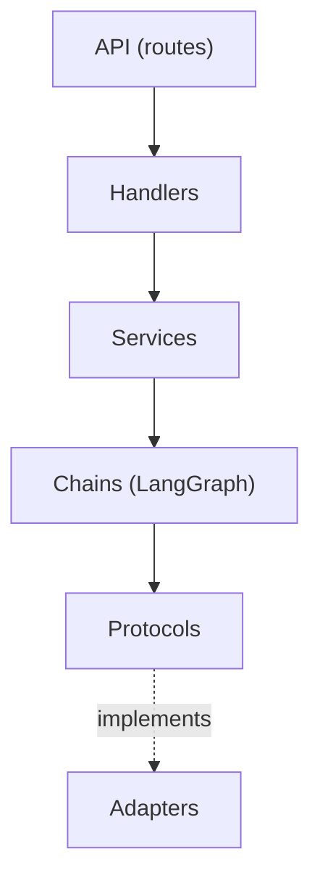
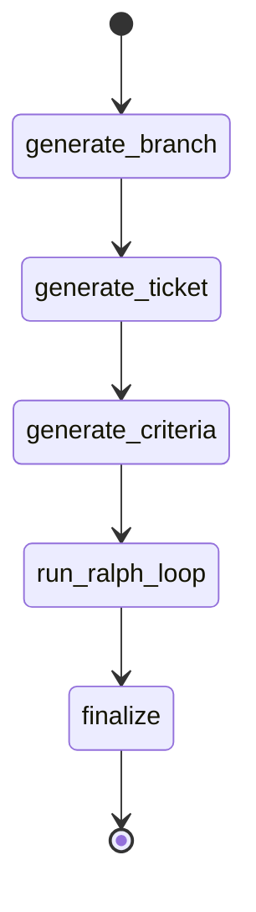
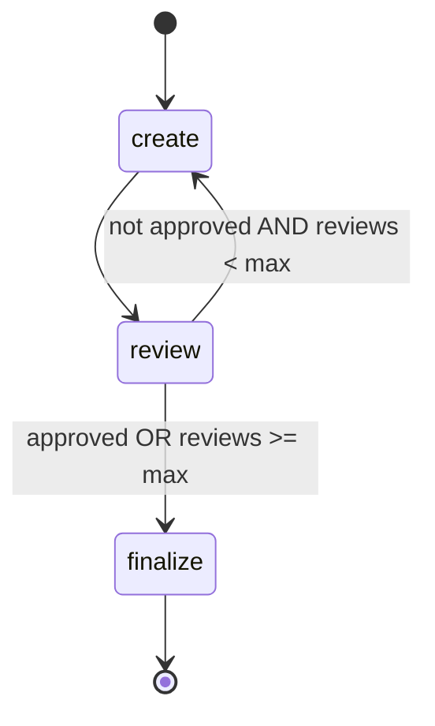
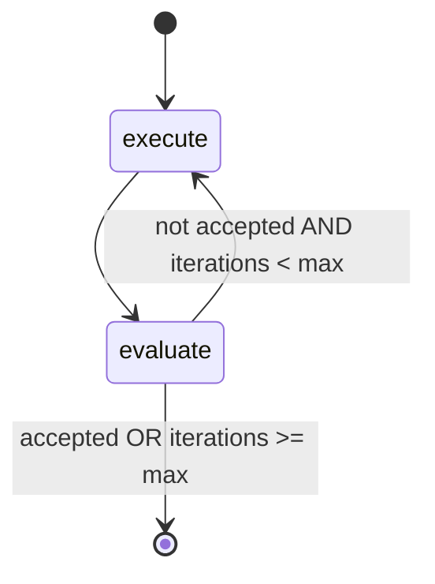
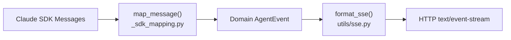

# Architecture

## Overview

Kodezart follows a hexagonal (ports-and-adapters) architecture with three
layers:

1. **API layer** - FastAPI routes and handlers that accept HTTP requests and
   return SSE streams
2. **Orchestration layer** - Services and LangGraph chains that compose protocol
   collaborators into workflows
3. **Infrastructure layer** - Adapters that implement protocol interfaces using
   external systems (Git CLI, Claude SDK, filesystem)

All cross-layer dependencies point inward through protocols defined in
`core/protocols.py`. Infrastructure adapters are wired in the composition root
(`main.py` `lifespan()`).

## Component Diagram

## Protocol Map

All 12 protocols are defined in `core/protocols.py`. Each protocol has one or
more adapter implementations:

| Protocol          | Adapter Implementation   | Notes                                                |
| ----------------- | ------------------------ | ---------------------------------------------------- |
| LogEmitter        | structlog.stdlib.BoundLogger | Satisfied by structlog directly                  |
| GitService        | SubprocessGitService     | Git CLI via asyncio subprocess                       |
| RepoCache         | LocalBareRepoCache       | Bare repo clones in a cache directory                |
| AgentExecutor     | ClaudeClientExecutor     | **Default.** Persistent sessions via ClaudeSDKClient |
| AgentExecutor     | ClaudeAgentExecutor      | One-shot via `query()`. Available but NOT wired in default composition root |
| WorkspaceProvider | GitWorktreeProvider      | Disposable Git worktrees in `/tmp`                   |
| ChangePersister   | GitChangePersister       | Detects changes, generates commit message, commits, pushes |
| BranchMerger      | GitBranchMerger          | Fast-forward merge and push                          |
| AgentRunner       | AgentService             | Orchestrates workspace lifecycle around executor     |
| GitAuth           | GitHubTokenAuth          | Injects GitHub PAT into HTTPS URLs                   |
| QualityGate       | RalphLoop                | LangGraph iterative execute/evaluate loop            |
| TicketGenerator   | TicketGenerationLoop     | LangGraph draft/review loop                          |
| WorkflowEngine    | RalphWorkflowEngine      | LangGraph outer pipeline                             |

## Workflow Pipeline

The outer workflow runs as a 5-node LangGraph StateGraph defined in
`chains/ralph_workflow.py`:

1. **generate_branch** - Asks the agent to generate a descriptive branch name
   slug, then creates a feature branch (`kodezart/{slug}-{hex}`) and a ralph
   working branch (`{feature}-ralph-{hex}`)
2. **generate_ticket** - Delegates to the TicketGenerator to draft and review an
   implementation ticket from the raw user prompt
3. **generate_criteria** - Asks the agent to analyze the codebase and derive
   testable acceptance criteria from the ticket
4. **run_ralph_loop** - Delegates to the QualityGate for iterative
   execute/evaluate until criteria pass or max iterations
5. **finalize** - Fast-forward merges the ralph branch into the feature branch,
   pushes, and cleans up the ralph branch

## Ticket Generation Loop

The ticket generation loop runs as a LangGraph StateGraph in
`chains/ticket_generation.py`:

**Important**: There is no separate "revise" node. The `create` node handles
revision when `iteration > 1` by calling `build_revision_prompt()` with the
previous draft and reviewer feedback.

### Drafter/Reviewer Pattern

Two independent Claude sessions participate:

- **Drafter** (creator) - Generates ticket drafts with structured output
  (`TicketDraftOutput`)
- **Reviewer** - Evaluates drafts and provides feedback with structured output
  (`TicketReviewOutput`)

Both sessions are persistent via `session_id`, allowing multi-turn
conversations within the loop. The workspace is acquired once for the entire
loop and released in a `finally` block.

## Ralph Loop (Quality Gate)

The Ralph loop runs as a LangGraph StateGraph in `chains/ralph_loop.py`:

1. **execute** - Runs the agent in workflow mode (acquire workspace, execute
   prompt, commit and push changes)
2. **evaluate** - Runs the evaluator agent in plan mode with read-only tools
   (`Read`, `Glob`, `Grep`, `Bash`) to verify each acceptance criterion

On iterations 2+, `iteration_feedback.augment_prompt()` appends failed criteria
and their reasoning to the execution prompt, giving the agent targeted feedback.

The default maximum is 5 iterations (configurable via
`KODEZART_MAX_ITERATIONS`).

## Workspace Isolation

### Bare Repo Caching

`LocalBareRepoCache` maintains bare Git clones in the configured cache
directory (`/tmp/kodezart-clones` by default). Remote repositories are cloned
once and fetched on subsequent requests.

### Disposable Worktrees

`GitWorktreeProvider` creates Git worktrees in `/tmp/kodezart-{job_id}` for
each agent execution. Worktrees are always released in `finally` blocks to
prevent accumulation.

### Branch Strategy

- **Ralph branch** (`{feature}-ralph-{hex}`) accumulates changes across
  iterations within the Ralph loop
- **Feature branch** (`kodezart/{slug}-{hex}`) receives a fast-forward merge
  from the ralph branch on success
- The ralph branch is deleted from the remote after successful merge

## SSE Event Flow

### Event Types (18 total)

**Streaming events (11)**:
`user_message`, `assistant_text`, `assistant_thinking`, `tool_use`,
`tool_result`, `system`, `task_started`, `task_progress`,
`task_notification`, `result`, `stream_event`

**Workflow events (6)**:
`workflow_ticket_draft`, `workflow_ticket_review`, `workflow_ticket`,
`workflow_criteria`, `workflow_iteration`, `workflow_complete`

**Error events (1)**:
`error`

## Checkpointing

`make_checkpointer()` in `ralph_workflow.py` supports three modes:

| checkpoint_url     | Behavior                       |
| ------------------ | ------------------------------ |
| `None` (default)   | Checkpointing disabled         |
| `":memory:"`       | In-memory via `InMemorySaver`  |
| PostgreSQL URL     | Persistent via `PostgresSaver` |

Thread ID strategy for checkpoint isolation:

- Outer workflow: `{cache_key}`
- Ralph loop: `{cache_key}-ralph`
- Ticket generation: `{cache_key}-ticket`

## Claude Agent SDK Integration

### ClaudeClientExecutor (Default)

Uses `ClaudeSDKClient` for persistent sessions. The client is opened as an
async context manager, sends the prompt via `query()`, and receives responses
via `receive_response()`. Supports session resume via `session_id`.

### ClaudeAgentExecutor (Alternative)

Uses one-shot `query()` from the Claude Agent SDK. Each call is an independent
conversation with no session persistence. **Not wired in the default
composition root** (`main.py:32` uses `ClaudeClientExecutor`).

### Permission Modes

- `plan` - Read-only tools, agent cannot modify files
- `bypassPermissions` - Full tool access including `Edit` and `Write`

### Structured Output

Structured JSON responses use `output_format={'type': 'json_schema',
'schema': ...}` to constrain agent output to predefined schemas
(`CommitMessageOutput`, `BranchNameOutput`, `TicketDraftOutput`, etc.).

## LangGraph Configurable Pattern

The codebase passes context through `config["configurable"]` dicts using typed
models (`WorkflowContext`, `ExecutionContext`, `RalphLoopContext`). Each model
has a `from_configurable()` class method to deserialize from the LangGraph
config.

> **Note**: LangGraph 0.6.0+ introduced `context_schema` as a planned
> replacement for the configurable dict pattern. The codebase pins
> `langgraph>=0.2.0` and does not use `config_schema`. This pattern may need
> migration in future LangGraph versions.
