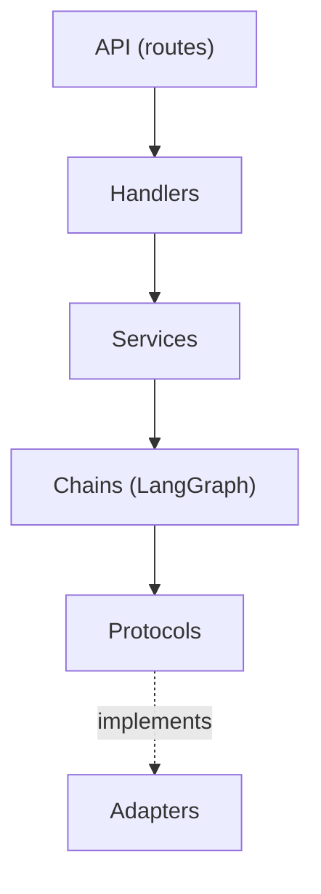
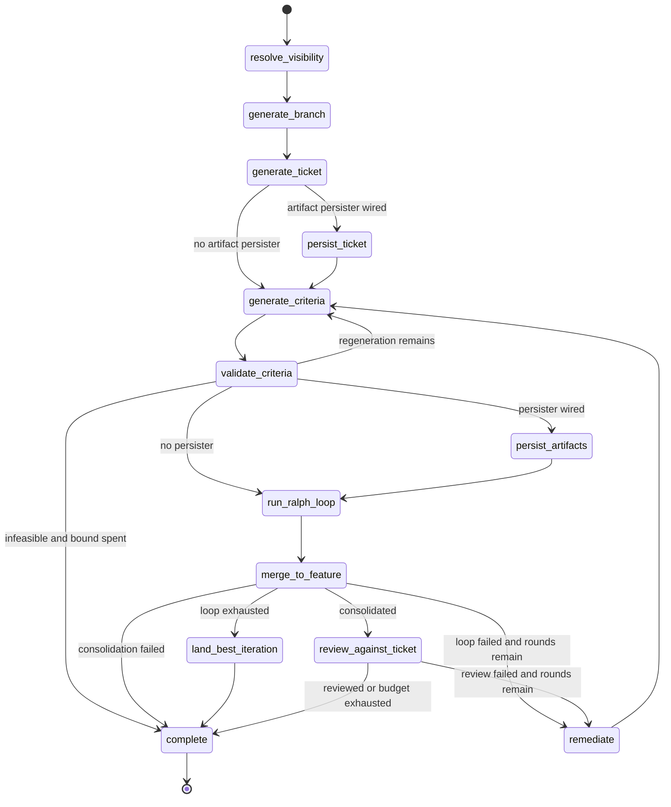
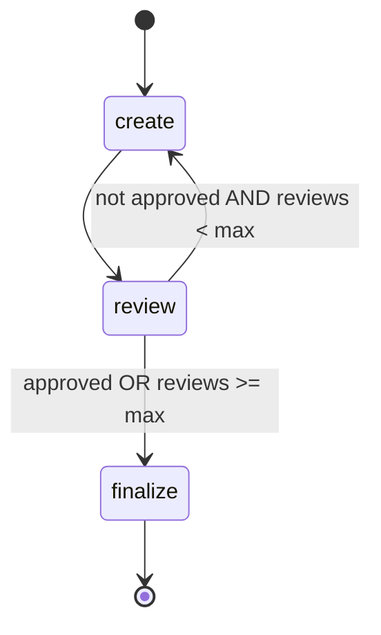
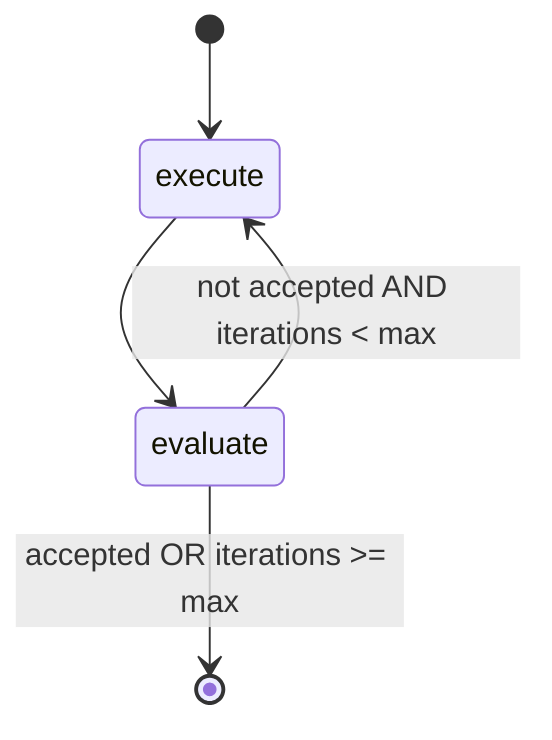
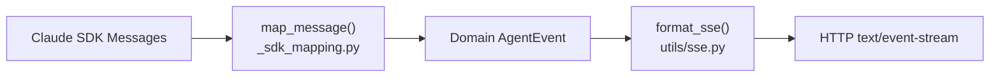

# Architecture

## Overview

Kodezart follows a hexagonal (ports-and-adapters) architecture with three
layers:

1. **API layer** - FastAPI routes and handlers that accept HTTP requests and
   return SSE streams
2. **Orchestration layer** - Services and LangGraph chains that compose protocol
   collaborators into workflows
3. **Infrastructure layer** - Adapters that implement protocol interfaces using
   external systems (Git CLI, Claude SDK, filesystem)

All cross-layer dependencies point inward through protocols defined in
`core/protocols.py`. Infrastructure adapters are wired in the composition root
(`main.py` `lifespan()`).

## Component Diagram


```mermaid
graph TD
    API["API (routes)"] --> Handlers
    Handlers --> Services
    Services --> Chains["Chains (LangGraph)"]
    Chains --> Protocols
    Protocols -. implements .-> Adapters
```

## Protocol Map

Every port protocol is defined in `core/protocols.py`, and every one of them
has a row below. No count is written down here to go stale: a test derives
both sides and fails if a protocol has no row, or a row names a protocol that
does not exist.

| Protocol          | Adapter Implementation   | Notes                                                |
| ----------------- | ------------------------ | ---------------------------------------------------- |
| LogEmitter        | structlog `stdlib.BoundLogger` | The five awaited emitters. No adapter class: the configured wrapper already satisfies the port, and a test asserts it |
| GitService        | SubprocessGitService     | Git CLI via asyncio subprocess                       |
| GitSourceReader   | SubprocessGitSourceReader | Pins local commits and reads exact regular-file blob bytes without checkout |
| RepoCache         | LocalBareRepoCache       | Bare repo clones in a cache directory                |
| AgentExecutor     | ClaudeClientExecutor     | **Default.** Persistent sessions via ClaudeSDKClient |
| AgentExecutor     | ClaudeAgentExecutor      | One-shot via `query()`. Available but NOT wired in default composition root |
| WorkspaceProvider | GitWorktreeProvider      | Disposable Git worktrees in `/tmp`                   |
| ChangePersister   | GitChangePersister       | Detects changes, generates commit message, commits, pushes |
| BranchMerger      | GitBranchMerger          | Fast-forward merge and push                          |
| PRCreator         | GitHubAPIClient          | Opens pull requests and comments on them             |
| ForgeQuery        | GitHubAPIClient          | Looks up an open PR by head and composes branch browser URLs |
| WriteBackVerifier | TrackerWriteBackVerifier | Bounded native artifact re-read and fresh judgment around caller-owned write/repair actions; leases and universal adoption remain separate |
| PRStateReader | GitHubAPIClient | Reads exact native PR identity, head repository/branch/SHA and open/closed/merged lifecycle; refuses foreign or unavailable head repositories; no mutation authority |
| PRContentEditor   | GitHubAPIClient          | Reads unique open PR content and edits changed title/body/base fields |
| CIMonitor         | GitHubAPIClient          | Polls checks and re-observes Actions attempts at one commit |
| CIObservationReader | GitHubAPIClient        | Reads the completed watch's commit identity and structured verdict |
| DeliveryProbe     | GitHubAPIClient          | Answers whether an issue already has an open delivery |
| DeliveryProbe     | NoForgeDeliveryProbe     | The same answer for an origin with no forge behind it. A peer, selected per repository at the composition root — not a degraded mode |
| McpToolCaller     | HttpMcpToolCaller, StdioMcpToolCaller | One MCP tool call over the vendor's HTTP or stdio transport |
| RunRecordSink     | LinearRecordSink, NotionRecordSink | One structural run record into one declared destination (KOD-170) |
| ManagedMcpToolCaller | HttpMcpToolCaller     | The same caller plus the session lifetime boot owns  |
| TrackerPort       | LinearMcpTracker         | Tracker vocabulary over the vendor MCP server, no model in the loop |
| ArtifactPersister | GitArtifactPersister     | Writes and cleans named files under `.kodezart/`     |
| AgentRunner       | AgentService             | Orchestrates workspace lifecycle around executor     |
| GitAuth           | GitHubTokenAuth          | Injects GitHub PAT into HTTPS URLs                   |
| QualityGate       | RalphLoop                | LangGraph iterative execute/evaluate loop            |
| TicketGenerator   | TicketGenerationLoop     | LangGraph draft/review loop                          |
| WorkflowEngine    | AuthoredDeliveryCoordinator | Authored orchestration around the shared fire graph |
| JobQueue          | AsyncioJobQueue          | In-process lanes, bounded depth and concurrency      |
| JobRegistry       | AsyncioJobQueue          | The same queue read as a record store                |
| RunStateReader    | LangGraphRunStateReader  | Reads a run's checkpointed state                     |
| PromptProvider    | InRepoPromptRegistry     | Prompt sets as directories of templates              |
| PromptSetProvider | InRepoPromptRegistry     | Set content belonging to no key: lens definitions, the system-prompt append |
| SkillInventory    | HostSkillInventory       | What the host provisions; kodezart installs nothing  |
| RepoVisibilityResolver | GitHubAPIClient     | Resolves PRIVATE / PUBLIC / UNKNOWN once per run     |
| ContentScanner    | RegexContentScanner      | The deterministic pattern half of the outbound gate  |
| ContentScanner    | AgentContentScanner      | The judgment half, ordered after the patterns        |
| OutboundContentGate | PatternOutboundContentGate | CLEAN / REDACTED / BLOCKED over N scanners      |
| RefPublisher      | GitRefPublisher          | Points a named ref at an existing commit on the remote |
| CheckChainRunner | SubprocessCheckChainRunner | Runs the ordered declared check steps in a scratch directory and captures every result |
| Remediator        | RemediationChain         | One remediation round: failure evidence in, one targeted ticket out |

The CI adapter's `rerun_checks` resolves the supplied ref once, validates that
every observed check belongs to an identifiable Actions workflow attempt, then
requests each run again. Subsequent `wait_for_checks` and `failed_check_names`
calls on that monitor and ref read the requested attempt's jobs, with the same
commit identity. Existing completed checks cannot satisfy that observation.
The caller should supply an immutable commit SHA and keep its rerun/read
sequence on the same monitor and asynchronous task. Each task owns its
attempt context; a later rerun by another task cannot replace its observation.
Baseline selection and dispatch are serialized per repository and resolved
SHA, including branch aliases. A shared attempt floor refuses stale baselines
across tasks. Different SHAs can dispatch independently. Attempt tracking is
process-local; it is not a durable rerun ledger.

The existing CI poll and page bounds apply. An unsupported check provider,
incomplete enumeration, unknown result, or unobservable new attempt raises a
domain error. Rerun POSTs are issued once: a partial batch or lost response
remains an error instead of retrying a write whose effect is uncertain. The
adapter uses GitHub's documented [workflow run rerun and attempt APIs](https://docs.github.com/en/rest/actions/workflow-runs)
and [attempt-specific jobs API](https://docs.github.com/en/rest/actions/workflow-jobs#list-jobs-for-a-workflow-run-attempt).
The Actions permission must allow writes to request a rerun.

Tracker revision reads return a frozen `TrackerIssueRevision`: the full issue
and an opaque, nonempty digest of the body returned in that same read. This
applies to both ordinary issues and criterion sub-issues. The Linear adapter
hashes those exact UTF-8 body bytes; timestamps, comments, labels and workflow
state do not participate. Each surface changes independently, and replaying
an unchanged body preserves its digest.

`read_issue_state_change` requires native state history from the same complete
issue read. Exactly one current interval must agree with the issue state and
its timestamps; absent, ambiguous or inconsistent history is a typed refusal.
General issue edits do not stand in for state transitions. The audit collector
reads complete scope and criterion membership before and after detail reads,
refusing changed snapshots or duplicate native members before coverage begins.
These are checked observations, not an atomic vendor snapshot; scheduled audit
sessions remain a separate consumer.

Tracker boot first requires `require_criterion_reads`. An adapter declaring
that criterion-child reads are unavailable raises `CriterionReadCapabilityError`
with its adapter identity and the `criterion_reads` capability. Boot closes
the opened transport before mapping reconciliation or execution can start.
The declaration itself performs no writes or lease acquisition. Scope-walker
dispatch remains a separate unfinished consumer of this mandatory boot boundary.

`read_scope_plan` applies native stage barriers at the actual scoped engine
entry before any execution arm is selected. Its `require_scope_plan_reads`
declaration requires semantic criterion and decision mappings; a missing mapping
cannot turn an open decision into an empty set. The shared `read_scope_members`
reader preserves direct criterion children even when container filtering omits
them, and serves audit collection as well as planning.

The explicit `read_planning_issue` port read requires reported semantic labels
and full requested dependency relations. Planning re-reads every enumerated
member through that strict boundary before following dependencies, rechecks all
facts and the scope family, and refuses omissions or changed observations. Open decisions,
backlog-kind criteria and criterion edges leaving their parent's subtree yield
`ScopePlanRefusalError` with the offending native keys. Existing topology
arithmetic owns cycle detection. A successful planning snapshot alone makes no
approval or readiness claim.

The actual scoped entry then calls `read_scope_ready`. It requires all three
semantic classifications (`criterion`, `tracker`, `decision`) through the shared
`require_issue_classification_reads` declaration, reads current
approval through the issue's real ancestry, and selects only native scope
deliverables with a nonempty criterion gap. Record issues and criteria are never
selected; an approved deliverable without its own criteria refuses. Deliverable
workflow state does not decide either gap or subtree closure. An in-scope blocker
closes only when all its criterion children and every deliverable child's full
subtree close, including children outside a container's membership filter.
Each consulted complete issue subtree passes the same `read_scope_plan` barriers;
an outside-filter open decision is refused by key, never closed by its empty
criterion set. Record classification does not waive those stage barriers.
The existing topology ranking consumes that explicit closure result without
consulting parent state. Each result carries exactly its current gap, and the
next call recomputes from tracker reads. Scope membership, complete child trees
and approval are checked again before returning; this is an optimistic read,
not transactional exclusion from concurrent tracker writers.

Canceled or duplicate criteria that need supersession resolution currently raise
`ScopeSupersessionReadError`: the existing gap function accepts established
references, but the native tracker has no declared reader for the historical
supersession prose. No inferred reference or merge observation substitutes for
that missing read. Full walker dispatch and pre-loop revalidation remain separate;
valid scoped entries still raise the explicit unavailable-walker error after
recording the current ready and blocked keys.

`LaneRecordReader` reads the owning issue's complete comment listing through
`TrackerPort`, locates the exact configured `marker_prefixes.run_state` marker,
and returns the native comment and decoded `LaneRunState` from that same read.
An existing `record_ref` must still identify that marker comment. Missing,
duplicate, malformed or misaddressed records raise `LaneRecordReadError`;
transport failure never becomes an empty record. Every call reads again, so a
fresh client needs no process cache, repository, trajectory or forge connection.

`render_lane_record` places one readable JSON value under that marker, followed
by fixed re-entry guidance. The record preserves three-state remote head facts,
ordered `LaneCommit` rows, `LanePR` and explicitly typed `BranchAssociation`
roles, parents and run identities. Its loop branch must appear in the association
set, and each run has at most one deliverable. Branch names do not supply roles.
The model follows the declared list fields: field assignment is frozen, but
the lists are not deeply immutable. Consumers must not mutate retained evidence;
each read returns freshly decoded values rather than a shared cached collection.
Counts remain independently recorded observations, so the consistency signal
can still detect disagreement with commit rows. The re-entry text directs
checkout or recovery of existing work and treats absent or reaped remote refs
explicitly. Satisfaction and Evidence remain on the criterion issues.

The reader recognizes this declared format; old free-form manual comments need
an explicit migration. A formatter and cold tracker read do not implement the
committing node's collection/write operation, its first-push notification,
first-class branch-association persistence, or a complete mid-loop kill test.
Mandatory write leases and the recorded association-storage conflict remain
separate prerequisites. Scope terminals must still consume this reader and
other required durable records; no terminal outcome is inferred from it.

Tracker boot calls the required `require_body_digest_stability` contract before
mapping reconciliation. An adapter that cannot guarantee those semantics
raises `BodyDigestCapabilityError`, naming `body_digest_stability`, and boot
closes its transport without serving. This declaration does not mutate a live
issue to probe it: the shared adapter conformance suite verifies the required
read/write invariants. Consumers receive no optional capability flag or weaker
revision read.

Admission sessions return an `AdmissionJudgment`. The caller creates the
`AdmissionResult` by attaching the body digest from the revision supplied to
that session; the agent never supplies that metadata. A body changed while
the session runs therefore leaves a result about the earlier body.
`OrganizeAdmission.is_live` reads the surface's current revision and calls the
pure two-digest comparison. It starts no session and never restamps a result.
An issue body and each criterion body are graded and checked independently.
Persistence, phase markers and issue readiness orchestration remain separate
consumers of those results.

The pure `organize_gap` function takes a complete scope revision snapshot,
admissions keyed by each surface identity, open findings and the configured
semantic body marker. It returns original issue records in snapshot order.
Missing markers, absent or stale admissions, missing non-Canceled criterion
children, or open findings put an issue in the work set. A stale criterion
body puts its parent there through the same comparison, without lapsing the
parent body judgment; execution-state changes alone do not. Record-shaped
`tracker` and `decision` members and criterion children are never work targets.
Incomplete parent identity or duplicate revision/admission records refuse
computation. Collecting and persisting these snapshots and running leased
author sessions remain orchestration work outside this pure function.

## Workflow Pipeline

The delivery-free `RalphWorkflowEngine` in `chains/ralph_workflow.py` owns
one compiled fire graph. `AuthoredDeliveryCoordinator` in
`chains/authored_delivery.py` embeds that graph and owns the existing authored
HTTP delivery operations. A CI remediation draft re-enters the same fire graph
at criteria generation; it does not rebuild the ticket or create another set
of fire nodes.

Two fire nodes — `persist_ticket` and `persist_artifacts` — are present only
when an ArtifactPersister is wired.


```mermaid
stateDiagram-v2
    [*] --> resolve_visibility
    resolve_visibility --> generate_branch
    generate_branch --> generate_ticket
    generate_ticket --> persist_ticket : artifact persister wired
    generate_ticket --> generate_criteria : no artifact persister
    persist_ticket --> generate_criteria
    generate_criteria --> validate_criteria
    validate_criteria --> generate_criteria : regeneration remains
    validate_criteria --> complete : infeasible and bound spent
    validate_criteria --> persist_artifacts : persister wired
    validate_criteria --> run_ralph_loop : no persister
    persist_artifacts --> run_ralph_loop
    run_ralph_loop --> merge_to_feature
    merge_to_feature --> review_against_ticket : consolidated
    merge_to_feature --> remediate : loop failed and rounds remain
    merge_to_feature --> land_best_iteration : loop exhausted
    merge_to_feature --> complete : consolidation failed
    land_best_iteration --> complete
    review_against_ticket --> remediate : review failed and rounds remain
    review_against_ticket --> complete : reviewed or budget exhausted
    remediate --> generate_criteria
    complete --> [*]
```

The initial authored run resolves visibility, generates its branch and ticket,
then derives and validates criteria. The loop implements those criteria;
consolidation records the selected branch and exact SHA before review. An
unaccepted run publishes and selects its best iteration when a ref publisher
is configured. It creates no PR. The shared remediation draft uses the same
cumulative round budget and returns through criteria validation.

`WorkflowState` and `WorkflowCompleteEvent` contain only fire facts. A clean
fire ends `handed_off_for_delivery`; a review-budget failure retains its own
outcome. Neither terminal contains PR or check fields, and artifact cleaning
is not a fire operation.

The authored outer coordinator performs its existing PR-description session,
gates and creates the PR, watches checks when configured, and drafts CI
remediation when budget remains. Its failure comment is an outer operation.
It filters the internal fire terminal and emits one
`AuthoredWorkflowCompleteEvent`, preserving the existing `workflow_complete`
HTTP discriminator, PR/check fields and outcomes. An authored request without
a tracker issue remains valid and gets no invented issue footer. Artifact
cleaning runs here before PR creation. Backup cleanup runs after the final
outer terminal; an intermediate fire handoff does not remove backups during
CI remediation. With no forge, the same outer coordinator retains the
existing no-adapter outcome.

This extraction does not wire the tracker-native scope walker or replace its
criterion trajectory producer. The lane-addressed `DeliveryCoordinator`
retains its separate strict FIRE identity and dispatch contract.

## Ticket Generation Loop

The ticket generation loop runs as a LangGraph StateGraph in
`chains/ticket_generation.py`. Its shape depends on the configured
`KODEZART_TICKET_REVIEW_MODE`: under the shipped default `create_only`
the loop is a single create pass with a mandatory in-session draft
critic and no separate review round; the drafter/reviewer cycle below
is the `reviewed` mode, kept fully selectable:


```mermaid
stateDiagram-v2
    [*] --> create
    create --> review
    review --> create : not approved AND reviews < max
    review --> finalize : approved OR reviews >= max
    finalize --> [*]
```

**Important**: There is no separate "revise" node. The `create` node handles
revision when `iteration > 1` by calling `build_revision_prompt()` with the
previous draft and reviewer feedback.

### Drafter/Reviewer Pattern

Two independent Claude sessions participate:

- **Drafter** (creator) - Generates ticket drafts with structured output
  (`TicketDraftOutput`)
- **Reviewer** - Evaluates drafts and provides feedback with structured output
  (`TicketReviewOutput`)

Both sessions are persistent via `session_id`, allowing multi-turn
conversations within the loop. The workspace is acquired once for the entire
loop and released in a `finally` block.

## Ralph Loop (Quality Gate)

The Ralph loop runs as a LangGraph StateGraph in `chains/ralph_loop.py`:


```mermaid
stateDiagram-v2
    [*] --> execute
    execute --> evaluate
    evaluate --> execute : not accepted AND iterations < max
    evaluate --> [*] : accepted OR iterations >= max
```

1. **execute** - Runs the agent in workflow mode (acquire workspace, execute
   prompt, commit and push changes)
2. **evaluate** - Runs the evaluator agent in plan mode with read-only tools
   (`Read`, `Glob`, `Grep`, `Bash`) to verify each acceptance criterion

On iterations 2+, `iteration_feedback.augment_prompt()` appends failed criteria
and their reasoning to the execution prompt, giving the agent targeted feedback.

The default maximum is 5 iterations (configurable via
`KODEZART_MAX_ITERATIONS`).

## Workspace Isolation

### Bare Repo Caching

`LocalBareRepoCache` maintains bare Git clones in the configured cache
directory (`/tmp/kodezart-clones` by default). Remote repositories are cloned
once and fetched on subsequent requests.

### Disposable Worktrees

`GitWorktreeProvider` creates Git worktrees in `/tmp/kodezart-{job_id}` for
each agent execution. Worktrees are always released in `finally` blocks to
prevent accumulation.

### Branch Strategy

- **Ralph branch** (`{feature}-ralph-{hex}`) accumulates changes across
  iterations within the Ralph loop
- **Feature branch** (`kodezart/{slug}-{hex}`) receives a fast-forward merge
  from the ralph branch on success
- The ralph branch is deleted from the remote after successful merge

## SSE Event Flow


```mermaid
graph LR
    SDK["Claude SDK Messages"] --> Map["map_message()<br/>_sdk_mapping.py"]
    Map --> Domain["Domain AgentEvent"]
    Domain --> SSE["format_sse()<br/>utils/sse.py"]
    SSE --> HTTP["HTTP text/event-stream"]
```

### Event Types

The event set is tabulated in [`api.md`](api.md#sse-event-types), grouped as
streaming, workflow, job and error events. That table is derived from the
event models by `tests/docs/test_api_event_reference.py` — every shipped
discriminator has a row, every field a row names exists, and each heading's
declared size equals its own rows. It is therefore the only place the set is
written down; restating any part of it here would be a second copy with no
test behind it.

## Checkpointing

`make_checkpointer()` in `ralph_workflow.py` supports three modes:

| checkpoint_url     | Behavior                       |
| ------------------ | ------------------------------ |
| `None` (default)   | Checkpointing disabled         |
| `":memory:"`       | In-memory via `InMemorySaver`  |
| PostgreSQL URL     | Persistent via `PostgresSaver` |

Thread ID strategy for checkpoint isolation:

- Outer workflow: `{cache_key}`
- Ralph loop: `{cache_key}-ralph`
- Ticket generation: `{cache_key}-ticket`

## Claude Agent SDK Integration

### ClaudeClientExecutor (Default)

Uses `ClaudeSDKClient` for persistent sessions. The client is opened as an
async context manager, sends the prompt via `query()`, and receives responses
via `receive_response()`. Supports session resume via `session_id`.

### ClaudeAgentExecutor (Alternative)

Uses one-shot `query()` from the Claude Agent SDK. Each call is an independent
conversation with no session persistence. **Not wired in the default
composition root** — `main.py`'s `lifespan()` constructs
`ClaudeClientExecutor`.

### Working-directory MCP injection guard

A session runs with `cwd` set to a worktree holding an arbitrary cloned
repository, so a `.mcp.json` committed into that repository would otherwise be
loaded into a session that already holds credentials — attacker-authored tool
injection. The invariant that closes it: **every `ClaudeAgentOptions`
construction sets `strict_mcp_config=True`**, whether or not it also
configures `mcp_servers` — the guard answers the working directory, so a
session that describes no server of its own needs it exactly as much as one
that does. One mapping helper builds both keywords together rather than
passing them separately at each construction site.
`tests/adapters/test_mcp_strictness.py` enforces it over every
`ClaudeAgentOptions` construction in `src/kodezart/`, merging the explicit
keywords with every `**`-unpacked option source — one merged set per branch
a builder can return, so a guard set on one branch never answers for
another — matching the callable through the names each module's imports
bind it to, and failing on any source it cannot read, so a future site
cannot quietly escape it.

### Permission Modes

- `plan` - Read-only tools, agent cannot modify files
- `bypassPermissions` - Full tool access including `Edit` and `Write`

### Structured Output

Structured JSON responses use `output_format={'type': 'json_schema',
'schema': ...}` to constrain agent output to predefined schemas
(`CommitMessageOutput`, `BranchNameOutput`, `TicketDraftOutput`, etc.).

## LangGraph Configurable Pattern

The codebase passes context through `config["configurable"]` dicts using typed
models (`WorkflowContext`, `ExecutionContext`, `RalphLoopContext`). Each model
has a `from_configurable()` class method to deserialize from the LangGraph
config.

> **Note**: LangGraph 0.6.0+ introduced `context_schema` as a planned
> replacement for the configurable dict pattern. The codebase pins
> `langgraph>=0.2.0` and does not use `config_schema`. This pattern may need
> migration in future LangGraph versions.

## Run-shape observations

`RunAlarm` is a frozen observation value with exactly one subject, one signal,
ordered nonempty readings, an optional threshold bound, and the raising
commit and holder. It has no diagnosis, remediation, severity or message
field. Readings retain source references and verbatim values, including
empty values; commit references remain opaque.

The subject model validates scope, lane, issue, criterion, surface and
escalation addresses. A criterion member is its own tracker sub-issue key,
carried without parsing parent text. A surface member uses
`surface_alarm_member_id(WritableSurface(...))`: canonical JSON preserves
the complete address inside the declared string member field, so equivalent
addresses cannot create different alarm identities through formatting.
The alarm vocabulary and payload validation are available independently of
signal computation, supervisor scheduling and leased alarm writes; those
consumers are not enabled by constructing a model.

`services.scope_tally.observe_scope_tally` reads current native membership and
strict issue classification twice before computing `tally_unmoved`. Its roster
uses the same ORGANIZE work-target predicate as the gap: criterion and
record-shaped issues are excluded without pruning deliverable descendants.
The governed GROOM → TICKET → CRITERIA sequence selects adjacent configured
terminal markers independently of table order. A member carrying the next
marker while fewer than all members carry the current marker returns a scope
alarm. Missing phase labels count as open; unreadable or changed membership
and classification refuse. Required semantic mappings must be present, and
aliased phase or classification markers refuse instead of changing the roster.

The signal retains the exact configuration references, native scope address,
roster keys and member label projections as readings, so replay needs no port.
A missing member reading or null/empty marker set counts as open in the pure
predicate. The final execution transition still requires a native member
lane-dispatched event reader and explicitly refuses before querying; the lane
arm, supervisor scheduling and leased alarm publication remain unfinished.

`domain.run_shape.escalation_ageing` measures an unresolved escalation in
recorded lane commits after its raise SHA and recorded walker ticks since
raise. Either count exceeding its own AppConfig limit returns the observation;
when both exceed, the commit bound has deterministic precedence. Equal counts
remain clean. The function retains six readings in order: the escalation JSON,
its resolution JSON, the ordered commit SHA projection, the tick-age count,
the configured commit limit and the configured tick limit. Each value keeps
its source reference and original bytes. Replaying those readings with the
alarm's subject and raising provenance reconstructs the same alarm.

`services.run_shape.observe_escalation_ageing` consumes already-read tracker
projections and reads the current addressed decision through `TrackerPort`.
It has no writer or repository dependency. Missing escalation reads, malformed
counts, and absent or duplicate raise positions refuse observation; they do
not manufacture an unanswered question or a clean result. The configured
limits are nonnegative counts, defaulting to five commits and ten ticks.
`services.escalation_signals.observe_recorded_escalation_ageing` supplies the
escalation and commit readings from their actual configured native records.
The escalation reader consumes the existing writer's seven-field JSON, with
strict occurrence identity and no interpretation of legacy prose. The lane
record's ordered commits must completely reach its declared head and agree
with its count. Both native records and the exact decision resolution used
by the shared observer are checked again; a changed source refuses the
observation, including a newly answered or withdrawn decision. All returned readings preserve
their source comment identities, and neither collector writes or reads Git.
The walker's recorded tick-age input, supervisor tick and alarm persistence
under a surface lease remain unwired. These readers do not declare the
complete signal table or supervisor boot capability.

`barren_tick_with_diff_growth` compares recorded files-changed and
commits-ahead against their own configured bounds when a tick closes no
previously-open reference. Its six readings carry the prior open identities,
current closed identities, both lane-base growth counts and both limits.
Only an identity present in both reference sets establishes progress;
newly-added closed work and disappeared old work do not. Files take
deterministic precedence if both limits are exceeded. The default bounds
are ten files and five commits; both are configurable nonnegative counts.

The read-only `observe_barren_tick` service uses `read_criteria` and the shared
criterion gap arithmetic to obtain current closure. Done closes a criterion;
cancellation or duplication needs an established supersession reference
supplied by its owning reader. It retains the returned closure projection
for replay and makes no tracker writes or version-control calls. Its shared
`read_barren_tick` assembly also retains the exact criterion snapshot used
for that observation. `observe_recorded_barren_tick` supplies both growth
counters from an actual `LaneRecordReader` read, carrying the native comment
identity and that record's head on each projection. It checks the addressed
comment and complete criterion snapshot again before returning; source drift
refuses both an alarm and a quiet result. It reads the declared counters
without inferring them from commit rows or checking their agreement, which
belongs to the separate record-consistency signal.

The previous tick's open identities and established supersession references
still require explicit supplied provenance. Their collectors, supervisor
scheduling and leased alarm persistence remain separate work. These bounded
record reads do not provide an atomic tracker transaction or an execution
event stream.

`surface_contended` counts distinct opaque run-holder identities for one
complete `WritableSurface` address. Three readings carry that address, its
ordered holder history and the configured limit (one holder by default).
The address must match the alarm subject, and address/history references
must name the same provenance source. Repeated writes by one holder count
once; different runs writing the same address remain in its whole history.
Different issue/marker/surface addresses are evaluated independently.

`observe_surface_contention` only supplies the AppConfig limit to explicit
provenance inputs. It does not provide a tracker provenance reader: ordered
successful-write history carrying run identities across all six surface
kinds still depends on the universal holder-aware writer foundation. Vendor
account authors and change timestamps cannot supply those run identities.
The pure count and replay tests do not establish that producer, its port
conformance, or a supervisor's leased alarm writer.

`write_back_missing` compares one event's explicitly declared
`WritableSurface` with a successful keyed-record presence reading. The
presence source must be that complete canonical address, including its
marker. Only a strict boolean is accepted; an unreadable or omitted lookup
cannot become absence. The resulting surface alarm retains both raw
readings and has no threshold bound. Event-to-target projection and complete
record collection belong to their producers and are not supplied by this
predicate; it adds no competing event vocabulary or inferred target mapping.

The existing `WorkRef` carries the observer's `landing` fact as `landed`,
`not_landed` or `unknown`, alongside its branch and pushed head. The native
work-ref marker serializes that field; older markers without it read as
unknown, and malformed values refuse. Observers amend the existing record
when they record a landing. The append-only `record_work_ref` operation
retains its one-deliverable rule and never silently replaces that record.
No landing fact is inferred from a merge strategy, Git ancestry or forge
state, and no second landing carrier is introduced on the lane run record.
The base resolver discards explicitly landed inputs before looking up their
remote branch. An all-landed input set therefore uses the configured trunk;
a mixed set retains only the other recorded inputs. Unknown and not-landed
inputs keep the existing resolution path, including a typed refusal when
their branch is missing. Multiple deliverable records refuse as ambiguous
before choosing a base.

`commits_ahead_of_record` compares four projections from one lane record:
lane key, declared head, commits-ahead count and ordered `LaneCommit` rows.
Each frozen row carries exactly `sha`, `subject` and `issue_id`. Either
direction of count disagreement raises the lane alarm, with no configured
bound. Subject/source mismatches, inconsistent SHA stamps and ambiguous
commit identities refuse observation. Commit subjects and issue mentions
never affect the count. A wholly stale record whose terms agree remains
invisible: the declared head is retained for replay and is never resolved
against a repository. Both predicates remain pure.

`services.lane_record_signals.observe_commits_ahead_of_record` supplies the
commit-consistency inputs through the addressed `LaneRecordReader`. One
successful tracker read provides the lane key, recorded head, declared count
and enumerated rows; all four projections retain that native comment identity
and its recorded head. A supplied record reference must match, and missing,
malformed, duplicated or unreadable records retain the reader's refusal.
The service performs no repository read or tracker write and does not turn
an unreadable record into an empty lane. The signal's whole-record-staleness
limit remains unchanged. Event-to-target collection for skipped writes,
supervisor scheduling and leased alarm publication remain separate consumers.

`record_superseded` compares explicit assertions about the same field in the
same lane. Its three raw readings contain the record's `LaneFieldValue`, an
event's `LaneFieldValue`, and the lane record's ordered commit SHA projection.
The frozen field projection carries only `lane_key`, `field_key` and an
opaque string `value`; each assertion's SHA remains on its `AlarmReading`.
History must name the same record source, and both asserted SHAs must occur
exactly once. Missing or ambiguous history refuses even when values agree.

A differing decoded value raises `RECORD_SUPERSEDED` only when the event's
SHA stands strictly after the record's SHA in that series. Earlier or equal
positions cannot supersede it, and equal values stay clean. No timestamp,
SHA spelling, event-body interpretation or repository read establishes the
order. The alarm retains all original readings and has no threshold bound.
The field projection is an observation input, not a new run-event vocabulary;
the event/record readers must supply those assertions and the commit order.
Their collectors, supervisor scheduling and leased publication remain
separate consumers.

`rulings_outpace_closures` counts distinct machine-authored ruling identities
added since the recorded last-closure snapshot. Its five readings preserve
the baseline/current ruling projections, prior open/current closed references
and the actual `run_alarm_max_rulings_without_closure` bound (default five,
configurable and nonnegative). Only the intersection of the two obligation
sets establishes a closure. Repeated identities, amended answers and principal
rulings cannot inflate the count. Required authorship comes from the ruling
artifact, using the owner's `RulingId` and `RulingAuthor` vocabulary; transport
authors and timestamps cannot supply it. The read-only service obtains current
criterion closure through the shared gap arithmetic for every declared lane
issue. `read_lane_rulings` now obtains those projections from full native
ruling comments for every explicitly supplied lane member. The configured
`ruling` occurrence marker is separate from escalation decision replies;
`RulingRecordReader` checks exact question identity, native ownership and
required authorship before projecting it. `observe_recorded_ruling_growth`
combines that current read with live closure and the caller's retained
baseline. Amendments keep their deterministic question identity and cannot
reset the baseline. The actual ruling node, verified leased artifact writes,
lane-membership producer and persisted window advancement remain separate
implementation work.

The criterion-lifecycle code conformance module checks both identity owners:
`CriterionRef` is constructed by the full tracker-spec reader and `RulingId`
by the ruling mint. Its shared static guard covers direct, qualified, imported
and assigned constructor aliases, including calls in function headers. Ruling
address fields retain the minted type through containers and forward references;
text, other untyped values and rebinding the identity name fail the guard.
Native and fake tracker fixtures show that duplicate or amended criterion text
does not change the addressed keys. Evaluator state/body writer adoption and
the separate model-membership and spec-backend invariants remain unfinished.

`structural_write_uncrosses_milestone` compares complete lane membership
snapshots. The collector reads both the fire subtree and native milestone
membership through the port, including archived issues, and preserves the
returned state, parent and membership facts. Conflicting versions of a shared
member refuse observation instead of pretending the reads are atomic. The
prior graph must support crossing under the charter: completed fire, all
members completed or canceled with recorded supersession. A newly present
unresolved member while the fire remains completed raises the alarm; an
existing member changing only state does not. No derived crossed flag or vendor change
timestamp replaces this graph comparison. Both signals preserve their raw
readings for replay; the structural signal has no threshold. Retaining prior
snapshots, supervisor scheduling and alarm publication under the universal
surface lease remain separate consumers.
## Audit coverage selection

`AuditCoverage` visits the supplied complete eligible snapshot in state-change
time and issue-key order. The first attempt is full; later attempts select new
or changed identities until the configured full-sweep interval expires. Marks
are per-scope process caches and are advanced only after every selected visit
returns. Interrupted or failed attempts repeat their selection, and a fresh
process starts full. Per-key stamps retain newly observed identities even when
their times tie a previously covered entry. Neither a quiet tick nor an empty
snapshot postpones periodic full coverage. If the next configured tick would
cross the full-coverage deadline, the current tick covers everything; intervals
that are not divisible therefore cannot silently extend the declared bound.

The caller supplies the observation time; this component adds no clock, timer
or scheduler. A simultaneous attempt for the same scope refuses without
disturbing its owner. Candidates are snapshotted before visiting, and returned
coverage facts are immutable point-in-time observations, not durable verdicts.
The native tracker state-change collector supplies complete checked candidates.
Granted audit sessions and registration on the existing scheduler remain
separate implementation work. Sampled mode is retired.

## Check-chain execution

The check-chain runner executes each declared command through the host shell,
in the supplied directory and in declared order. Earlier failures do not hide
later observations. The configured per-step deadline includes launch and kills the shell process
group while retaining partial output. Repeated cancellation cannot interrupt
eventual-process cleanup; cancellation propagates after the attempt is reaped.
Cleanup repeats group termination at its configured polling cadence until
captured output reaches EOF, covering a child created during the first signal.
Empty or ambiguous step identities refuse before execution.
The runner returns failed names and ordered outputs without classifying roots
or cascades. Union composition and its result publication are separate consumers.

`UnionComposition.verify` consumes the planner's ordered lane-head snapshot
through an immutable measurement boundary. `UnionTick.verify` is its current-head
consumer: one instance fixes the scope, repository configuration and selected
base; each call supplies the complete ordered lane-branch roster. It reads the
current remote SHAs, reuses its own unchanged result, and otherwise fetches with
matching head reads on both sides before invoking the actual scratch composition.
It re-reads every head before reporting a new result
and repeats a stale attempt. The configured attempt bound produces
`UnionUnstableError` if the heads keep moving, and an absent or unreadable head
produces `UnionHeadReadError`. Native reads settle before cancellation returns;
concurrent calls on one instance share the result. These are repeat-read
observations, without atomic exclusion of a writer after the last read. The
scope-walker tick invocation and durable result persistence remain separate work.

The pinned composition consumes the ordered lane-head snapshot
and an immutable selected base. It creates a detached Git worktree, merges
those exact commit IDs in planner order, runs `RepoEntry.checks`, and removes
the tree on return, refusal, exception, or cancellation. Scratch merges have
a separate Git operation; normal branch consolidation remains fast-forward
only. Named branches and forge pull requests are untouched.

The shared `UnionCompositionResult` retains scope and repository identity,
ordered branch/head pairs, the selected base, and the discarded scratch
path and commit. A conflict reports only its successfully merged prefix;
infrastructure errors remain errors. Executed checks use the restored
historical root/cascade classifier, and a red check result carries one
`UnionRemediationEntry` naming those roots and cascades. This scope outcome
is independent of lane outcomes. The result is available to any caller;
it does not itself publish a tracker remediation record or scope terminal.
Walker tick scheduling, stale-head re-entry, and terminal residual
publication remain separate integration work.


## Current-head audit claim sessions

`AuditClaimVerifier` reads the current criterion through its owning lane's
complete criterion query and extracts only its Check. It reconstructs the lane
from the current addressed tracker comment, resolves the actual remote branch
head and acquires a detached workspace at that exact SHA. The fresh evaluative
session receives the Check and measured head, with `session_id=None`, no
subagents and the configured read-only tools. The record's prior head, prior
Evidence/verdict and author transcript are not session inputs.

The result uses the shared three-state `AuditVerdict`. The caller attaches the
measured SHA, native comment reference and exact Check. A changed criterion,
record, workspace or remote head refuses the observation; workspace release
also runs on errors and cancellation. This is a repeat-read observation, not an
atomic snapshot or a full sweep: Evidence-sha/lapse handling, mandate completion,
report publication, write-back and scheduler registration remain separate work.

Revision comparisons share `AuditSourceReader` and `FreshAuditSession`.
The source reader requires the criterion's native Evidence, validates its
graded commit against the current recorded branch, and retains the exact
criterion, Check, Evidence and lane comment. Its `require_unchanged` check
re-reads the criterion, lane record and remote head before a consumer returns.
The session helper owns a detached workspace at the immutable head, checks
its head and cleanliness before and after fresh read-only execution, and
settles acquisition, native reads and release through repeated cancellation.
Callers supply a prompt and output schema and validate the returned structured
value; the helpers neither inherit prior conclusions nor publish a verdict.

`DetectorRemovalVerifier` composes these readers with the
`audit_detection_removal` role. The fresh session compares the real graded and
current revisions, tests the removal counterfactual, and searches for retained,
moved or replacement detection. Removing a mechanism and its final effective
test produces a refuted observation; retained detection keeps this particular
arm quiet even when that test is red. Inconclusive comparisons use the existing
unverifiable verdict.

Before returning a proposed finding, the consumer re-reads its mechanism and
test quotations from native baseline blobs and verifies their stated lines.
It rejects excerpts that still exist at the current path. Native source lookup
distinguishes an absent file from an unreadable commit or unsupported object.
The session's semantic counterfactual remains a judgment: exact quotations do
not prove the absence of all replacement detection. The test fixture executes
the real current suite and baseline detector at the current head through the
actual agent/workspace boundary; it does not call a live model. This component
returns an observation, without scheduling a sweep, completing a mandate hunt,
writing a refutation or bypassing required writer leases.


## Standing over-claim observations

`AuditOverclaimVerifier.observe` reads the criterion through `AuditSourceReader`
and obtains one fresh `FreshAuditSession` judgment at the measured head. Its
schema requires exactly one reading for each standing check: recomputed
aggregates, independently witnessed completeness, verbatim adoption and
compliance with the artifact's own rules. Refuted aggregates name the recomputed
value; unverifiable readings name the missing artifact. Prior grading prose,
author reasoning and old verdicts are not session inputs.

For adoption, the session identifies source and artifact paths at the graded
or current revisions. The harness reads their immutable Git objects and compares
actual bytes independently of the session's coverage assessment. A differing
pair refutes adoption even if the session reported all topics covered. Missing
native objects remain unverifiable, foreign revisions and self-witnesses refuse,
and equal pairs cannot fill a separately missing external witness. The model
still owns semantic claim discovery and witness selection; a list of matching
pairs is not proof that every possible adoption claim was discovered.

The observation derives its overall three-state verdict from all four readings,
then rechecks native criterion, lane-record and remote-head identity. It performs
no tracker writes. Full sweep invocation, mandatory mandate completion and leased
publication remain separate consumers. Native Git fixtures exercise all four
categories using a scripted external judgment boundary; they validate execution
and evidence handling without claiming live-model detection accuracy.

## Recorded criterion Evidence and lapse observations

`AuditEvidenceVerifier.observe` reads the requested criterion's current full
record and its lane's addressed run-state comment. The existing Evidence field
contains one explicit JSON block, rendered by `render_evidence_field`:

````markdown
**Evidence:**
```json
{
  "gradedSha": "0123456789abcdef0123456789abcdef01234567",
  "test": "tests/test_contract.py::test_current_check"
}
```
````

The complete Git commit identity and named test or recorded observation are the
two stored fields. The codec refuses repeated fields/keys, ambiguous framing,
extra verdicts and historical prose. It does not rewrite that prose or infer a
SHA from it. The shared criterion-field parser keeps Check extraction separate
from Evidence and ignores quoted field labels and HTML comments.

For a completed criterion, the reader fetches the recorded repository, reads
the live remote branch head, and verifies both immutable commit identities and
their ancestry. A completed claim at an older commit yields `unverifiable`,
naming the original criterion, recorded SHA and current head, without a grading
session. An off-branch or unreadable commit causes a typed read refusal.

A current completed claim, or a claim in the configured review state, goes
through the existing fresh `AuditClaimVerifier`. Review re-verification does not
require old history to remain reachable after a rewrite: it judges the current
Check at the current remote head and retains the previous Evidence as a prior
claim, without reestablishing it as proof. Recorded test prose and verdicts stay
out of that session. The final source, lane record and remote head reads must
agree; owned repository reads settle before cancellation returns.

These are observations before correction and publication. Evaluator adoption
of the codec, historical migration, Evidence test/observation admissibility,
forge comparison, state transitions, mandate-complete reports and the scheduled
sweep remain separate consumers. The reader acquires no authoring lease and
performs no tracker write; the required correction writers must use the ruled
lease and inline verification boundaries.

The separate `AuditForgeVerifier` checks a completed criterion's own explicit
Evidence SHA through the existing CI monitor and completed-watch reader. Its
request cannot supply a replacement SHA. The returned commit must match exactly;
no branch name, newer branch run or ancestor run can substitute. Completed watch
snapshots now retain their check names, and every explicitly configured
`CheckStep.forge_check` must be present before accepting green. A readable red
is still classified when another declared check is missing: reproduced failure
can refute the forge claim without proving unrelated missing checks. An empty
configured roster leaves the repository's observed CI roster authoritative.

Green at that SHA holds the forge proposition. Red goes through the existing
`classify_red_checks` with the operation's repository declarations and existing
rerun bound, including native same-SHA rerun requests. A reproduced work defect is
refuted; an unmet prerequisite or unclassified red is unverifiable. A flake with
an exact-SHA green rerun holds, while a rerun with no observable checks remains
unverifiable. A missing run never proves this proposition, including when the
separate delivery policy declares the repository forge-exempt. Each call starts
a fresh task-owned observation sequence so a caller's older CI watch or rerun
cannot replace its evidence. The full criterion source is reread before return.

This is a forge-claim observation, not a whole-criterion satisfaction verdict.
It performs no tracker writes, correction or remediation. Scheduled sweep
composition, mandate completion for refutations, lease-protected state changes
and publication remain separate consumers.

## Tracker feasibility at the selected head

`TrackerFeasibilityValidator.validate` is the read-only criterion-validation
consumer for a tracker subject. It accepts an issue key and a previously
resolved dispatch SHA, obtains the subject once through `read_fire_spec`,
and matches a fresh full criterion-family read to that captured identity set.
Only the backend's unstarted (Todo) children enter its feasibility session;
other criterion states are retained in the observation without re-authoring.
The session receives the captured subject and current Check fields, with native
sub-issue keys and no recorded Evidence or criterion-author rationale.

The validator uses the existing evidence classifier and permutation/conjunction
arithmetic. A native schema carries those same grounded three-state findings
without constructing authored AC-n identities or a ticket draft. The authored
schemas and rendered prompt bytes remain unchanged. Flags remain observations;
they cannot remove a tracker criterion from its obligations. The existing
`fan_in_max_attempts` bounds fresh corrective sessions. A missing, foreign,
duplicate or ungrounded response refuses on exhaustion.

The selected SHA is checked in a detached workspace before each session and
after validation. Ordinary tracked, staged or untracked changes refuse through
`GitService.has_changes`; ignored test outputs follow Git's existing ignore
behavior. The full criterion family is read again before returning, and any
observed change refuses. This is optimistic source coherence, not an atomic
tracker snapshot or an immutable-filesystem claim. Owned acquisition and
release settle through repeated cancellation. An empty Todo subset opens no
session and leaves every state untouched.

This consumer returns a source-addressed observation. It does not apply
amendments, cancellations or state transitions, authorize dispatch, persist an
artifact, or supply the missing full FIRE composition. Approval eligibility,
leased authoring and the live iteration-exit path remain separate consumers.
