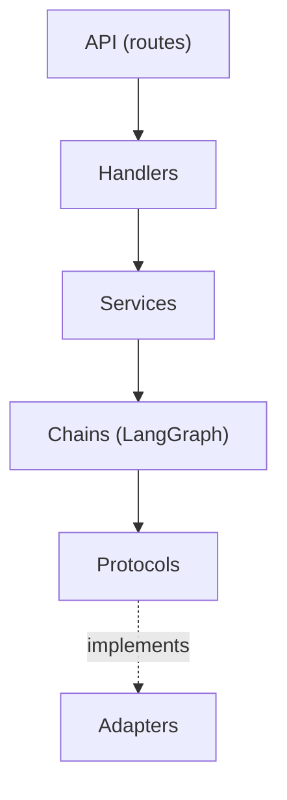
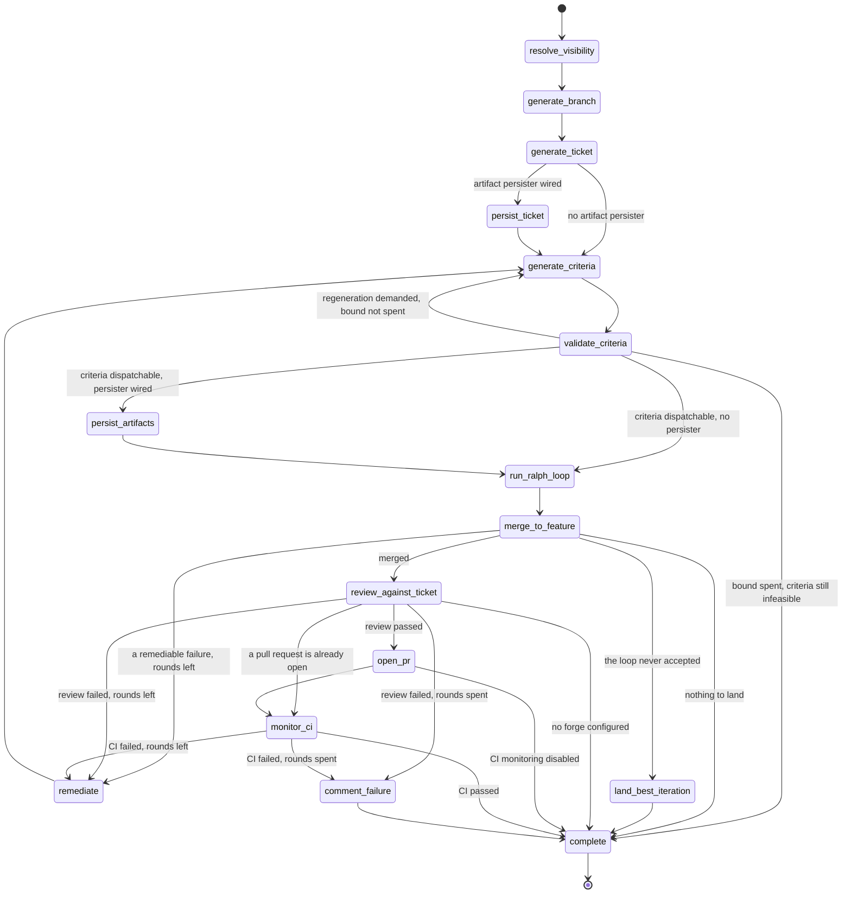
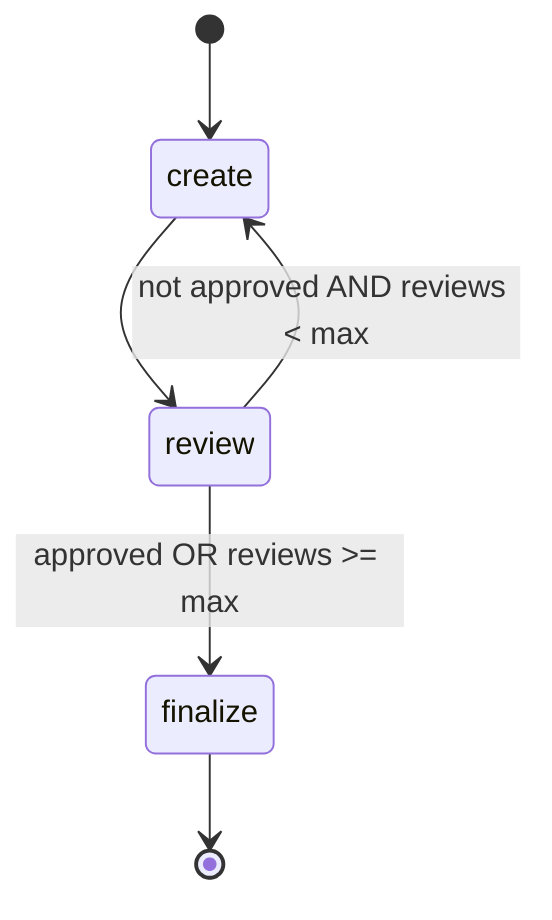
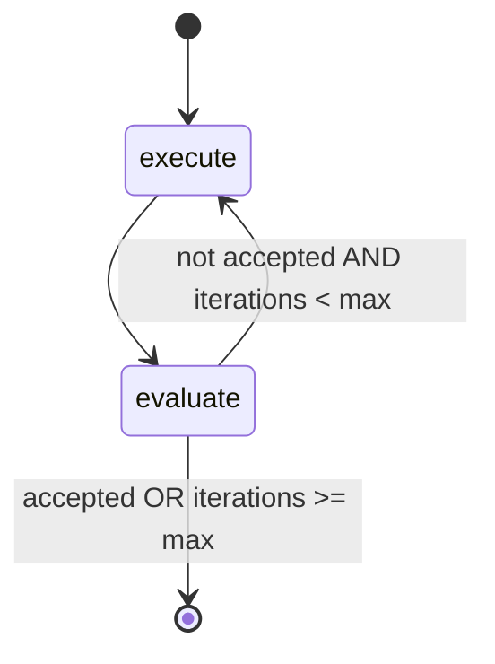
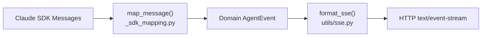

# Architecture

## Overview

Kodezart follows a hexagonal (ports-and-adapters) architecture with three
layers:

1. **API layer** - FastAPI routes and handlers that accept HTTP requests and
   return SSE streams
2. **Orchestration layer** - Services and LangGraph chains that compose protocol
   collaborators into workflows
3. **Infrastructure layer** - Adapters that implement protocol interfaces using
   external systems (Git CLI, Claude SDK, filesystem)

All cross-layer dependencies point inward through protocols defined in
`core/protocols.py`. Infrastructure adapters are wired in the composition root
(`main.py` `lifespan()`).

## Component Diagram

```mermaid
graph TD
    API["API (routes)"] --> Handlers
    Handlers --> Services
    Services --> Chains["Chains (LangGraph)"]
    Chains --> Protocols
    Protocols -. implements .-> Adapters
```

## Protocol Map

Every port protocol is defined in `core/protocols.py`, and every one of them
has a row below. No count is written down here to go stale: a test derives
both sides and fails if a protocol has no row, or a row names a protocol that
does not exist.

| Protocol          | Adapter Implementation   | Notes                                                |
| ----------------- | ------------------------ | ---------------------------------------------------- |
| LogEmitter        | structlog `stdlib.BoundLogger` | The five awaited emitters. No adapter class: the configured wrapper already satisfies the port, and a test asserts it |
| GitService        | SubprocessGitService     | Git CLI via asyncio subprocess                       |
| RepoCache         | LocalBareRepoCache       | Bare repo clones in a cache directory                |
| AgentExecutor     | ClaudeClientExecutor     | **Default.** Persistent sessions via ClaudeSDKClient |
| AgentExecutor     | ClaudeAgentExecutor      | One-shot via `query()`. Available but NOT wired in default composition root |
| WorkspaceProvider | GitWorktreeProvider      | Disposable Git worktrees in `/tmp`                   |
| ChangePersister   | GitChangePersister       | Detects changes, generates commit message, commits, pushes |
| BranchMerger      | GitBranchMerger          | Fast-forward merge and push                          |
| PRCreator         | GitHubAPIClient          | Opens pull requests and comments on them             |
| ForgeQuery        | GitHubAPIClient          | Looks up an open PR by head and composes branch browser URLs |
| PRContentEditor   | GitHubAPIClient          | Reads unique open PR content and edits changed title/body/base fields |
| CIMonitor         | GitHubAPIClient          | Polls checks and re-observes Actions attempts at one commit |
| DeliveryProbe     | GitHubAPIClient          | Answers whether an issue already has an open delivery |
| DeliveryProbe     | NoForgeDeliveryProbe     | The same answer for an origin with no forge behind it. A peer, selected per repository at the composition root — not a degraded mode |
| McpToolCaller     | HttpMcpToolCaller, StdioMcpToolCaller | One MCP tool call over the vendor's HTTP or stdio transport |
| RunRecordSink     | LinearRecordSink, NotionRecordSink | One structural run record into one declared destination (KOD-170) |
| ManagedMcpToolCaller | HttpMcpToolCaller     | The same caller plus the session lifetime boot owns  |
| TrackerPort       | LinearMcpTracker         | Tracker vocabulary over the vendor MCP server, no model in the loop |
| ArtifactPersister | GitArtifactPersister     | Writes and cleans named files under `.kodezart/`     |
| AgentRunner       | AgentService             | Orchestrates workspace lifecycle around executor     |
| GitAuth           | GitHubTokenAuth          | Injects GitHub PAT into HTTPS URLs                   |
| QualityGate       | RalphLoop                | LangGraph iterative execute/evaluate loop            |
| TicketGenerator   | TicketGenerationLoop     | LangGraph draft/review loop                          |
| WorkflowEngine    | RalphWorkflowEngine      | LangGraph outer pipeline                             |
| JobQueue          | AsyncioJobQueue          | In-process lanes, bounded depth and concurrency      |
| JobRegistry       | AsyncioJobQueue          | The same queue read as a record store                |
| RunStateReader    | LangGraphRunStateReader  | Reads a run's checkpointed state                     |
| PromptProvider    | InRepoPromptRegistry     | Prompt sets as directories of templates              |
| PromptSetProvider | InRepoPromptRegistry     | Set content belonging to no key: lens definitions, the system-prompt append |
| SkillInventory    | HostSkillInventory       | What the host provisions; kodezart installs nothing  |
| RepoVisibilityResolver | GitHubAPIClient     | Resolves PRIVATE / PUBLIC / UNKNOWN once per run     |
| ContentScanner    | RegexContentScanner      | The deterministic pattern half of the outbound gate  |
| ContentScanner    | AgentContentScanner      | The judgment half, ordered after the patterns        |
| OutboundContentGate | PatternOutboundContentGate | CLEAN / REDACTED / BLOCKED over N scanners      |
| RefPublisher      | GitRefPublisher          | Points a named ref at an existing commit on the remote |
| CheckChainRunner | SubprocessCheckChainRunner | Runs the ordered declared check steps in a scratch directory and captures every result |
| Remediator        | RemediationChain         | One remediation round: failure evidence in, one targeted ticket out |

The CI adapter's `rerun_checks` resolves the supplied ref once, validates that
every observed check belongs to an identifiable Actions workflow attempt, then
requests each run again. Subsequent `wait_for_checks` and `failed_check_names`
calls on that monitor and ref read the requested attempt's jobs, with the same
commit identity. Existing completed checks cannot satisfy that observation.
The caller should supply an immutable commit SHA and keep its rerun/read
sequence on the same monitor and asynchronous task. Each task owns its
attempt context; a later rerun by another task cannot replace its observation.
Baseline selection and dispatch are serialized per repository and resolved
SHA, including branch aliases. A shared attempt floor refuses stale baselines
across tasks. Different SHAs can dispatch independently. Attempt tracking is
process-local; it is not a durable rerun ledger.

The existing CI poll and page bounds apply. An unsupported check provider,
incomplete enumeration, unknown result, or unobservable new attempt raises a
domain error. Rerun POSTs are issued once: a partial batch or lost response
remains an error instead of retrying a write whose effect is uncertain. The
adapter uses GitHub's documented [workflow run rerun and attempt APIs](https://docs.github.com/en/rest/actions/workflow-runs)
and [attempt-specific jobs API](https://docs.github.com/en/rest/actions/workflow-jobs#list-jobs-for-a-workflow-run-attempt).
The Actions permission must allow writes to request a rerun.

Tracker revision reads return a frozen `TrackerIssueRevision`: the full issue
and an opaque, nonempty digest of the body returned in that same read. This
applies to both ordinary issues and criterion sub-issues. The Linear adapter
hashes those exact UTF-8 body bytes; timestamps, comments, labels and workflow
state do not participate. Each surface changes independently, and replaying
an unchanged body preserves its digest.

Tracker boot first requires `require_criterion_reads`. An adapter declaring
that criterion-child reads are unavailable raises `CriterionReadCapabilityError`
with its adapter identity and the `criterion_reads` capability. Boot closes
the opened transport before mapping reconciliation or execution can start.
The declaration itself performs no writes or lease acquisition. Scope-walker
dispatch remains a separate unfinished consumer of this mandatory boot boundary.

`LaneRecordReader` reads the owning issue's complete comment listing through
`TrackerPort`, locates the exact configured `marker_prefixes.run_state` marker,
and returns the native comment and decoded `LaneRunState` from that same read.
An existing `record_ref` must still identify that marker comment. Missing,
duplicate, malformed or misaddressed records raise `LaneRecordReadError`;
transport failure never becomes an empty record. Every call reads again, so a
fresh client needs no process cache, repository, trajectory or forge connection.

`render_lane_record` places one readable JSON value under that marker, followed
by fixed re-entry guidance. The record preserves three-state remote head facts,
ordered `LaneCommit` rows, `LanePR` and explicitly typed `BranchAssociation`
roles, parents and run identities. Its loop branch must appear in the association
set, and each run has at most one deliverable. Branch names do not supply roles.
The model follows the declared list fields: field assignment is frozen, but
the lists are not deeply immutable. Consumers must not mutate retained evidence;
each read returns freshly decoded values rather than a shared cached collection.
Counts remain independently recorded observations, so the consistency signal
can still detect disagreement with commit rows. The re-entry text directs
checkout or recovery of existing work and treats absent or reaped remote refs
explicitly. Satisfaction and Evidence remain on the criterion issues.

The reader recognizes this declared format; old free-form manual comments need
an explicit migration. A formatter and cold tracker read do not implement the
committing node's collection/write operation, its first-push notification,
first-class branch-association persistence, or a complete mid-loop kill test.
Mandatory write leases and the recorded association-storage conflict remain
separate prerequisites. Scope terminals must still consume this reader and
other required durable records; no terminal outcome is inferred from it.

Tracker boot calls the required `require_body_digest_stability` contract before
mapping reconciliation. An adapter that cannot guarantee those semantics
raises `BodyDigestCapabilityError`, naming `body_digest_stability`, and boot
closes its transport without serving. This declaration does not mutate a live
issue to probe it: the shared adapter conformance suite verifies the required
read/write invariants. Consumers receive no optional capability flag or weaker
revision read.

Admission sessions return an `AdmissionJudgment`. The caller creates the
`AdmissionResult` by attaching the body digest from the revision supplied to
that session; the agent never supplies that metadata. A body changed while
the session runs therefore leaves a result about the earlier body.
`OrganizeAdmission.is_live` reads the surface's current revision and calls the
pure two-digest comparison. It starts no session and never restamps a result.
An issue body and each criterion body are graded and checked independently.
Persistence, phase markers and issue readiness orchestration remain separate
consumers of those results.

The pure `organize_gap` function takes a complete scope revision snapshot,
admissions keyed by each surface identity, open findings and the configured
semantic body marker. It returns original issue records in snapshot order.
Missing markers, absent or stale admissions, missing non-Canceled criterion
children, or open findings put an issue in the work set. A stale criterion
body puts its parent there through the same comparison, without lapsing the
parent body judgment; execution-state changes alone do not. Record-shaped
`tracker` and `decision` members and criterion children are never work targets.
Incomplete parent identity or duplicate revision/admission records refuse
computation. Collecting and persisting these snapshots and running leased
author sessions remain orchestration work outside this pure function.

## Workflow Pipeline

The outer workflow runs as a LangGraph StateGraph defined in
`chains/ralph_workflow.py`:

Two nodes — `persist_ticket` and `persist_artifacts` — are added only when an
ArtifactPersister is wired; the rest are always present.

```mermaid
stateDiagram-v2
    [*] --> resolve_visibility
    resolve_visibility --> generate_branch
    generate_branch --> generate_ticket
    generate_ticket --> persist_ticket : artifact persister wired
    generate_ticket --> generate_criteria : no artifact persister
    persist_ticket --> generate_criteria
    generate_criteria --> validate_criteria
    validate_criteria --> generate_criteria : regeneration demanded, bound not spent
    validate_criteria --> complete : bound spent, criteria still infeasible
    validate_criteria --> persist_artifacts : criteria dispatchable, persister wired
    validate_criteria --> run_ralph_loop : criteria dispatchable, no persister
    persist_artifacts --> run_ralph_loop
    run_ralph_loop --> merge_to_feature
    merge_to_feature --> review_against_ticket : merged
    merge_to_feature --> remediate : a remediable failure, rounds left
    merge_to_feature --> land_best_iteration : the loop never accepted
    merge_to_feature --> complete : nothing to land
    land_best_iteration --> complete
    review_against_ticket --> open_pr : review passed
    review_against_ticket --> monitor_ci : a pull request is already open
    review_against_ticket --> remediate : review failed, rounds left
    review_against_ticket --> comment_failure : review failed, rounds spent
    review_against_ticket --> complete : no forge configured
    remediate --> generate_criteria
    open_pr --> monitor_ci
    open_pr --> complete : CI monitoring disabled
    monitor_ci --> complete : CI passed
    monitor_ci --> remediate : CI failed, rounds left
    monitor_ci --> comment_failure : CI failed, rounds spent
    comment_failure --> complete
    complete --> [*]
```

1. **resolve_visibility** - Resolves the target repository's PRIVATE / PUBLIC /
   UNKNOWN posture once, which is what the outbound gate is engaged under for
   the rest of the run
2. **generate_branch** - Asks the agent to generate a descriptive branch name
   slug, then creates a feature branch (`kodezart/{slug}-{hex}`) and a ralph
   working branch (`{feature}-ralph-{hex}`)
3. **generate_ticket** - Delegates to the TicketGenerator to draft an
   implementation ticket from the raw user prompt
4. **persist_ticket** - Writes the ticket under `.kodezart/` in the worktree
   (only when an ArtifactPersister is wired)
5. **generate_criteria** - Asks the agent to analyze the codebase and derive
   testable acceptance criteria from the ticket
6. **validate_criteria** - Dispatches the drafted criteria to an adversarial
   refuter, which returns a three-state verdict per criterion plus any jointly
   unsatisfiable subsets. `infeasible` criteria and the members of a
   contradiction are routed back to **generate_criteria** for amendment, up to
   `KODEZART_CRITERIA_MAX_REGENERATION_ROUNDS`; a set that still demands
   regeneration once the bound is spent halts the run before the loop
7. **persist_artifacts** - Writes the validated criteria beside the ticket
   (only when an ArtifactPersister is wired)
8. **run_ralph_loop** - Delegates to the QualityGate for iterative
   execute/evaluate until criteria pass or max iterations
9. **merge_to_feature** - Consolidates the ralph branch into the feature branch
   and pushes; the consolidation status is what routes the rest of the run
10. **land_best_iteration** - The stall exit: a run whose loop never accepted
    still publishes its best iteration and opens a do-not-merge pull request
    over it, so a human reads what was reached. Its `workflow_pr` event carries
    `delivered: false`, and no work ref is recorded for it
11. **review_against_ticket** - Reviews the merged work against the ticket's own
    criteria, after the merge rather than inside the loop
12. **remediate** - One remediation round: the failure evidence in, one targeted
    ticket out, bounded by `KODEZART_REMEDIATION_MAX_ROUNDS`
13. **open_pr** - Opens the delivery pull request. Its `workflow_pr` event
    carries `delivered: true`, and the tracker write-back records that branch
    and its pushed tip as the issue's deliverable work ref
14. **monitor_ci** - Polls check runs for the pushed head
15. **comment_failure** - Posts the failure the run ends on where a reader will
    find it
16. **complete** - The single terminal node: every path ends here, carrying the
    run's outcome

## Ticket Generation Loop

The ticket generation loop runs as a LangGraph StateGraph in
`chains/ticket_generation.py`. Its shape depends on the configured
`KODEZART_TICKET_REVIEW_MODE`: under the shipped default `create_only`
the loop is a single create pass with a mandatory in-session draft
critic and no separate review round; the drafter/reviewer cycle below
is the `reviewed` mode, kept fully selectable:

```mermaid
stateDiagram-v2
    [*] --> create
    create --> review
    review --> create : not approved AND reviews < max
    review --> finalize : approved OR reviews >= max
    finalize --> [*]
```

**Important**: There is no separate "revise" node. The `create` node handles
revision when `iteration > 1` by calling `build_revision_prompt()` with the
previous draft and reviewer feedback.

### Drafter/Reviewer Pattern

Two independent Claude sessions participate:

- **Drafter** (creator) - Generates ticket drafts with structured output
  (`TicketDraftOutput`)
- **Reviewer** - Evaluates drafts and provides feedback with structured output
  (`TicketReviewOutput`)

Both sessions are persistent via `session_id`, allowing multi-turn
conversations within the loop. The workspace is acquired once for the entire
loop and released in a `finally` block.

## Ralph Loop (Quality Gate)

The Ralph loop runs as a LangGraph StateGraph in `chains/ralph_loop.py`:

```mermaid
stateDiagram-v2
    [*] --> execute
    execute --> evaluate
    evaluate --> execute : not accepted AND iterations < max
    evaluate --> [*] : accepted OR iterations >= max
```

1. **execute** - Runs the agent in workflow mode (acquire workspace, execute
   prompt, commit and push changes)
2. **evaluate** - Runs the evaluator agent in plan mode with read-only tools
   (`Read`, `Glob`, `Grep`, `Bash`) to verify each acceptance criterion

On iterations 2+, `iteration_feedback.augment_prompt()` appends failed criteria
and their reasoning to the execution prompt, giving the agent targeted feedback.

The default maximum is 5 iterations (configurable via
`KODEZART_MAX_ITERATIONS`).

## Workspace Isolation

### Bare Repo Caching

`LocalBareRepoCache` maintains bare Git clones in the configured cache
directory (`/tmp/kodezart-clones` by default). Remote repositories are cloned
once and fetched on subsequent requests.

### Disposable Worktrees

`GitWorktreeProvider` creates Git worktrees in `/tmp/kodezart-{job_id}` for
each agent execution. Worktrees are always released in `finally` blocks to
prevent accumulation.

### Branch Strategy

- **Ralph branch** (`{feature}-ralph-{hex}`) accumulates changes across
  iterations within the Ralph loop
- **Feature branch** (`kodezart/{slug}-{hex}`) receives a fast-forward merge
  from the ralph branch on success
- The ralph branch is deleted from the remote after successful merge

## SSE Event Flow

```mermaid
graph LR
    SDK["Claude SDK Messages"] --> Map["map_message()<br/>_sdk_mapping.py"]
    Map --> Domain["Domain AgentEvent"]
    Domain --> SSE["format_sse()<br/>utils/sse.py"]
    SSE --> HTTP["HTTP text/event-stream"]
```

### Event Types

The event set is tabulated in [`api.md`](api.md#sse-event-types), grouped as
streaming, workflow, job and error events. That table is derived from the
event models by `tests/docs/test_api_event_reference.py` — every shipped
discriminator has a row, every field a row names exists, and each heading's
declared size equals its own rows. It is therefore the only place the set is
written down; restating any part of it here would be a second copy with no
test behind it.

## Checkpointing

`make_checkpointer()` in `ralph_workflow.py` supports three modes:

| checkpoint_url     | Behavior                       |
| ------------------ | ------------------------------ |
| `None` (default)   | Checkpointing disabled         |
| `":memory:"`       | In-memory via `InMemorySaver`  |
| PostgreSQL URL     | Persistent via `PostgresSaver` |

Thread ID strategy for checkpoint isolation:

- Outer workflow: `{cache_key}`
- Ralph loop: `{cache_key}-ralph`
- Ticket generation: `{cache_key}-ticket`

## Claude Agent SDK Integration

### ClaudeClientExecutor (Default)

Uses `ClaudeSDKClient` for persistent sessions. The client is opened as an
async context manager, sends the prompt via `query()`, and receives responses
via `receive_response()`. Supports session resume via `session_id`.

### ClaudeAgentExecutor (Alternative)

Uses one-shot `query()` from the Claude Agent SDK. Each call is an independent
conversation with no session persistence. **Not wired in the default
composition root** — `main.py`'s `lifespan()` constructs
`ClaudeClientExecutor`.

### Working-directory MCP injection guard

A session runs with `cwd` set to a worktree holding an arbitrary cloned
repository, so a `.mcp.json` committed into that repository would otherwise be
loaded into a session that already holds credentials — attacker-authored tool
injection. The invariant that closes it: **every `ClaudeAgentOptions`
construction sets `strict_mcp_config=True`**, whether or not it also
configures `mcp_servers` — the guard answers the working directory, so a
session that describes no server of its own needs it exactly as much as one
that does. One mapping helper builds both keywords together rather than
passing them separately at each construction site.
`tests/adapters/test_mcp_strictness.py` enforces it over every
`ClaudeAgentOptions` construction in `src/kodezart/`, merging the explicit
keywords with every `**`-unpacked option source — one merged set per branch
a builder can return, so a guard set on one branch never answers for
another — matching the callable through the names each module's imports
bind it to, and failing on any source it cannot read, so a future site
cannot quietly escape it.

### Permission Modes

- `plan` - Read-only tools, agent cannot modify files
- `bypassPermissions` - Full tool access including `Edit` and `Write`

### Structured Output

Structured JSON responses use `output_format={'type': 'json_schema',
'schema': ...}` to constrain agent output to predefined schemas
(`CommitMessageOutput`, `BranchNameOutput`, `TicketDraftOutput`, etc.).

## LangGraph Configurable Pattern

The codebase passes context through `config["configurable"]` dicts using typed
models (`WorkflowContext`, `ExecutionContext`, `RalphLoopContext`). Each model
has a `from_configurable()` class method to deserialize from the LangGraph
config.

> **Note**: LangGraph 0.6.0+ introduced `context_schema` as a planned
> replacement for the configurable dict pattern. The codebase pins
> `langgraph>=0.2.0` and does not use `config_schema`. This pattern may need
> migration in future LangGraph versions.

## Run-shape observations

`RunAlarm` is a frozen observation value with exactly one subject, one signal,
ordered nonempty readings, an optional threshold bound, and the raising
commit and holder. It has no diagnosis, remediation, severity or message
field. Readings retain source references and verbatim values, including
empty values; commit references remain opaque.

The subject model validates scope, lane, issue, criterion, surface and
escalation addresses. A criterion member is its own tracker sub-issue key,
carried without parsing parent text. A surface member uses
`surface_alarm_member_id(WritableSurface(...))`: canonical JSON preserves
the complete address inside the declared string member field, so equivalent
addresses cannot create different alarm identities through formatting.
The alarm vocabulary and payload validation are available independently of
signal computation, supervisor scheduling and leased alarm writes; those
consumers are not enabled by constructing a model.

`domain.run_shape.escalation_ageing` measures an unresolved escalation in
recorded lane commits after its raise SHA and recorded walker ticks since
raise. Either count exceeding its own AppConfig limit returns the observation;
when both exceed, the commit bound has deterministic precedence. Equal counts
remain clean. The function retains six readings in order: the escalation JSON,
its resolution JSON, the ordered commit SHA projection, the tick-age count,
the configured commit limit and the configured tick limit. Each value keeps
its source reference and original bytes. Replaying those readings with the
alarm's subject and raising provenance reconstructs the same alarm.

`services.run_shape.observe_escalation_ageing` consumes already-read tracker
projections and reads the current addressed decision through `TrackerPort`.
It has no writer or repository dependency. Missing escalation reads, malformed
counts, and absent or duplicate raise positions refuse observation; they do
not manufacture an unanswered question or a clean result. The configured
limits are nonnegative counts, defaulting to five commits and ten ticks.
Collectors for the lane's durable commit list and walker's recorded tick
age, the supervisor tick, and alarm persistence under a surface lease remain
unwired. This slice provides one pure signal and its read-only service; it
does not declare the complete signal table or supervisor boot capability.

`barren_tick_with_diff_growth` compares recorded files-changed and
commits-ahead against their own configured bounds when a tick closes no
previously-open reference. Its six readings carry the prior open identities,
current closed identities, both lane-base growth counts and both limits.
Only an identity present in both reference sets establishes progress;
newly-added closed work and disappeared old work do not. Files take
deterministic precedence if both limits are exceeded. The default bounds
are ten files and five commits; both are configurable nonnegative counts.

The read-only `observe_barren_tick` service uses `read_criteria` and the shared
criterion gap arithmetic to obtain current closure. Done closes a criterion;
cancellation or duplication needs an established supersession reference
supplied by its owning reader. It retains the returned closure projection
for replay and makes no tracker writes or version-control calls. The prior
open identities and both diff counts must already be recorded inputs with
explicit source references. Their collectors, supervisor scheduling and
leased alarm persistence remain separate work.

`surface_contended` counts distinct opaque run-holder identities for one
complete `WritableSurface` address. Three readings carry that address, its
ordered holder history and the configured limit (one holder by default).
The address must match the alarm subject, and address/history references
must name the same provenance source. Repeated writes by one holder count
once; different runs writing the same address remain in its whole history.
Different issue/marker/surface addresses are evaluated independently.

`observe_surface_contention` only supplies the AppConfig limit to explicit
provenance inputs. It does not provide a tracker provenance reader: ordered
successful-write history carrying run identities across all six surface
kinds still depends on the universal holder-aware writer foundation. Vendor
account authors and change timestamps cannot supply those run identities.
The pure count and replay tests do not establish that producer, its port
conformance, or a supervisor's leased alarm writer.

`write_back_missing` compares one event's explicitly declared
`WritableSurface` with a successful keyed-record presence reading. The
presence source must be that complete canonical address, including its
marker. Only a strict boolean is accepted; an unreadable or omitted lookup
cannot become absence. The resulting surface alarm retains both raw
readings and has no threshold bound. Event-to-target projection and complete
record collection belong to their producers and are not supplied by this
predicate; it adds no competing event vocabulary or inferred target mapping.

`commits_ahead_of_record` compares four projections from one lane record:
lane key, declared head, commits-ahead count and ordered `LaneCommit` rows.
Each frozen row carries exactly `sha`, `subject` and `issue_id`. Either
direction of count disagreement raises the lane alarm, with no configured
bound. Subject/source mismatches, inconsistent SHA stamps and ambiguous
commit identities refuse observation. Commit subjects and issue mentions
never affect the count. A wholly stale record whose terms agree remains
invisible: the declared head is retained for replay and is never resolved
against a repository. Both predicates are pure; neither implements the
supervisor tick, a record collector or leased alarm publication.

`record_superseded` compares explicit assertions about the same field in the
same lane. Its three raw readings contain the record's `LaneFieldValue`, an
event's `LaneFieldValue`, and the lane record's ordered commit SHA projection.
The frozen field projection carries only `lane_key`, `field_key` and an
opaque string `value`; each assertion's SHA remains on its `AlarmReading`.
History must name the same record source, and both asserted SHAs must occur
exactly once. Missing or ambiguous history refuses even when values agree.

A differing decoded value raises `RECORD_SUPERSEDED` only when the event's
SHA stands strictly after the record's SHA in that series. Earlier or equal
positions cannot supersede it, and equal values stay clean. No timestamp,
SHA spelling, event-body interpretation or repository read establishes the
order. The alarm retains all original readings and has no threshold bound.
The field projection is an observation input, not a new run-event vocabulary;
the event/record readers must supply those assertions and the commit order.
Their collectors, supervisor scheduling and leased publication remain
separate consumers.

`rulings_outpace_closures` counts distinct machine-authored ruling identities
added since the recorded last-closure snapshot. Its five readings preserve
the baseline/current ruling projections, prior open/current closed references
and the actual `run_alarm_max_rulings_without_closure` bound (default five,
configurable and nonnegative). Only the intersection of the two obligation
sets establishes a closure. Repeated identities, amended answers and principal
rulings cannot inflate the count. Required authorship comes from the ruling
artifact, using the owner's `RulingId` and `RulingAuthor` vocabulary; transport
authors and timestamps cannot supply it. The read-only service obtains current
criterion closure through the shared gap arithmetic for every declared lane
issue. The full ruling artifact writer/renderer/reader and persisted window
advancement remain implementation work; the projection does not replace them.

`structural_write_uncrosses_milestone` compares complete lane membership
snapshots. The collector reads both the fire subtree and native milestone
membership through the port, including archived issues, and preserves the
returned state, parent and membership facts. Conflicting versions of a shared
member refuse observation instead of pretending the reads are atomic. The
prior graph must support crossing under the charter: completed fire, all
members completed or canceled with recorded supersession. A newly present
unresolved member while the fire remains completed raises the alarm; an
existing member changing only state does not. No derived crossed flag or vendor change
timestamp replaces this graph comparison. Both signals preserve their raw
readings for replay; the structural signal has no threshold. Retaining prior
snapshots, supervisor scheduling and alarm publication under the universal
surface lease remain separate consumers.
## Audit coverage selection

`AuditCoverage` visits the supplied complete eligible snapshot in state-change
time and issue-key order. The first attempt is full; later attempts select new
or changed identities until the configured full-sweep interval expires. Marks
are per-scope process caches and are advanced only after every selected visit
returns. Interrupted or failed attempts repeat their selection, and a fresh
process starts full. Per-key stamps retain newly observed identities even when
their times tie a previously covered entry. Neither a quiet tick nor an empty
snapshot postpones periodic full coverage.

The caller supplies the observation time; this component adds no clock, timer
or scheduler. A simultaneous attempt for the same scope refuses without
disturbing its owner. Candidates are snapshotted before visiting, and returned
coverage facts are immutable point-in-time observations, not durable verdicts.
Tracker state-change collection, granted audit sessions and registration on the
existing scheduler remain separate implementation work. Sampled mode is retired.

## Check-chain execution

The check-chain runner executes each declared command through the host shell,
in the supplied directory and in declared order. Earlier failures do not hide
later observations. The configured per-step deadline includes launch and kills the shell process
group while retaining partial output. Repeated cancellation cannot interrupt
eventual-process cleanup; cancellation propagates after the attempt is reaped. Empty or ambiguous step identities refuse before execution.
The runner returns failed names and ordered outputs without classifying roots
or cascades. Union composition and its result publication are separate consumers.

`UnionComposition.verify` consumes the planner's ordered lane-head snapshot
and an immutable selected base. It creates a detached Git worktree, merges
those exact commit IDs in planner order, runs `RepoEntry.checks`, and removes
the tree on return, refusal, exception, or cancellation. Scratch merges have
a separate Git operation; normal branch consolidation remains fast-forward
only. Named branches and forge pull requests are untouched.

The shared `UnionCompositionResult` retains scope and repository identity,
ordered branch/head pairs, the selected base, and the discarded scratch
path and commit. A conflict reports only its successfully merged prefix;
infrastructure errors remain errors. Executed checks use the restored
historical root/cascade classifier, and a red check result carries one
`UnionRemediationEntry` naming those roots and cascades. This scope outcome
is independent of lane outcomes. The result is available to any caller;
it does not itself publish a tracker remediation record or scope terminal.
Walker tick scheduling, stale-head re-entry, and terminal residual
publication remain separate integration work.
