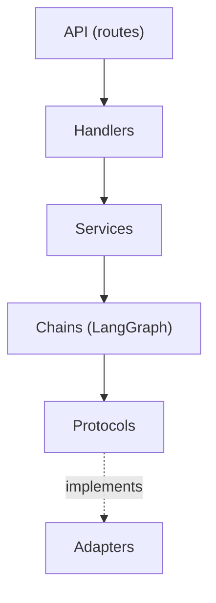
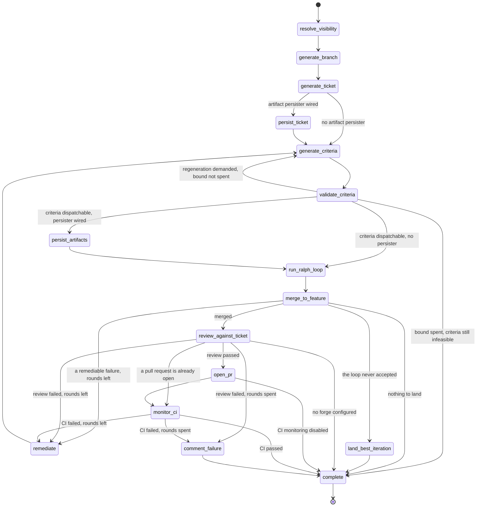
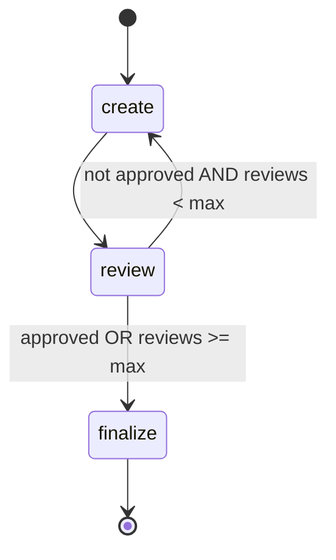
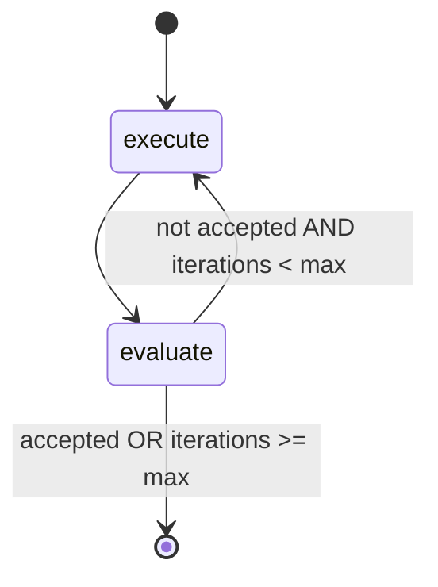
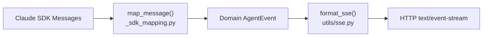

# Architecture

## Overview

Kodezart follows a hexagonal (ports-and-adapters) architecture with three
layers:

1. **API layer** - FastAPI routes and handlers that accept HTTP requests and
   return SSE streams
2. **Orchestration layer** - Services and LangGraph chains that compose protocol
   collaborators into workflows
3. **Infrastructure layer** - Adapters that implement protocol interfaces using
   external systems (Git CLI, Claude SDK, filesystem)

All cross-layer dependencies point inward through protocols defined in
`core/protocols.py`. Infrastructure adapters are wired in the composition root
(`main.py` `lifespan()`).

## Component Diagram

```mermaid
graph TD
    API["API (routes)"] --> Handlers
    Handlers --> Services
    Services --> Chains["Chains (LangGraph)"]
    Chains --> Protocols
    Protocols -. implements .-> Adapters
```

## Protocol Map

Every port protocol is defined in `core/protocols.py`, and every one of them
has a row below. No count is written down here to go stale: a test derives
both sides and fails if a protocol has no row, or a row names a protocol that
does not exist.

| Protocol          | Adapter Implementation   | Notes                                                |
| ----------------- | ------------------------ | ---------------------------------------------------- |
| LogEmitter        | structlog `stdlib.BoundLogger` | The five awaited emitters. No adapter class: the configured wrapper already satisfies the port, and a test asserts it |
| GitService        | SubprocessGitService     | Git CLI via asyncio subprocess                       |
| RepoCache         | LocalBareRepoCache       | Bare repo clones in a cache directory                |
| AgentExecutor     | ClaudeClientExecutor     | **Default.** Persistent sessions via ClaudeSDKClient |
| AgentExecutor     | ClaudeAgentExecutor      | One-shot via `query()`. Available but NOT wired in default composition root |
| WorkspaceProvider | GitWorktreeProvider      | Disposable Git worktrees in `/tmp`                   |
| ChangePersister   | GitChangePersister       | Detects changes, generates commit message, commits, pushes |
| BranchMerger      | GitBranchMerger          | Fast-forward merge and push                          |
| PRCreator         | GitHubAPIClient          | Opens pull requests and comments on them             |
| CIMonitor         | GitHubAPIClient          | Polls check runs for a pushed head                   |
| DeliveryProbe     | GitHubAPIClient          | Answers whether an issue already has an open delivery |
| DeliveryProbe     | NoForgeDeliveryProbe     | The same answer for an origin with no forge behind it. A peer, selected per repository at the composition root — not a degraded mode |
| McpToolCaller     | HttpMcpToolCaller        | One MCP tool call over the vendor's HTTP transport   |
| ManagedMcpToolCaller | HttpMcpToolCaller     | The same caller plus the session lifetime boot owns  |
| TrackerPort       | LinearMcpTracker         | Tracker vocabulary over the vendor MCP server, no model in the loop |
| ArtifactPersister | GitArtifactPersister     | Writes and cleans named files under `.kodezart/`     |
| AgentRunner       | AgentService             | Orchestrates workspace lifecycle around executor     |
| GitAuth           | GitHubTokenAuth          | Injects GitHub PAT into HTTPS URLs                   |
| QualityGate       | RalphLoop                | LangGraph iterative execute/evaluate loop            |
| TicketGenerator   | TicketGenerationLoop     | LangGraph draft/review loop                          |
| WorkflowEngine    | RalphWorkflowEngine      | LangGraph outer pipeline                             |
| JobQueue          | AsyncioJobQueue          | In-process lanes, bounded depth and concurrency      |
| JobRegistry       | AsyncioJobQueue          | The same queue read as a record store                |
| RunStateReader    | LangGraphRunStateReader  | Reads a run's checkpointed state                     |
| PromptProvider    | InRepoPromptRegistry     | Prompt sets as directories of templates              |
| PromptSetProvider | InRepoPromptRegistry     | Set content belonging to no key: lens definitions, the system-prompt append |
| SkillInventory    | HostSkillInventory       | What the host provisions; kodezart installs nothing  |
| RepoVisibilityResolver | GitHubAPIClient     | Resolves PRIVATE / PUBLIC / UNKNOWN once per run     |
| ContentScanner    | RegexContentScanner      | The deterministic pattern half of the outbound gate  |
| ContentScanner    | AgentContentScanner      | The judgment half, ordered after the patterns        |
| OutboundContentGate | PatternOutboundContentGate | CLEAN / REDACTED / BLOCKED over N scanners      |
| RefPublisher      | GitRefPublisher          | Points a named ref at an existing commit on the remote |
| Remediator        | RemediationChain         | One remediation round: failure evidence in, one targeted ticket out |

## Workflow Pipeline

The outer workflow runs as a LangGraph StateGraph defined in
`chains/ralph_workflow.py`:

Two nodes — `persist_ticket` and `persist_artifacts` — are added only when an
ArtifactPersister is wired; the rest are always present.

```mermaid
stateDiagram-v2
    [*] --> resolve_visibility
    resolve_visibility --> generate_branch
    generate_branch --> generate_ticket
    generate_ticket --> persist_ticket : artifact persister wired
    generate_ticket --> generate_criteria : no artifact persister
    persist_ticket --> generate_criteria
    generate_criteria --> validate_criteria
    validate_criteria --> generate_criteria : regeneration demanded, bound not spent
    validate_criteria --> complete : bound spent, criteria still infeasible
    validate_criteria --> persist_artifacts : criteria dispatchable, persister wired
    validate_criteria --> run_ralph_loop : criteria dispatchable, no persister
    persist_artifacts --> run_ralph_loop
    run_ralph_loop --> merge_to_feature
    merge_to_feature --> review_against_ticket : merged
    merge_to_feature --> remediate : a remediable failure, rounds left
    merge_to_feature --> land_best_iteration : the loop never accepted
    merge_to_feature --> complete : nothing to land
    land_best_iteration --> complete
    review_against_ticket --> open_pr : review passed
    review_against_ticket --> monitor_ci : a pull request is already open
    review_against_ticket --> remediate : review failed, rounds left
    review_against_ticket --> comment_failure : review failed, rounds spent
    review_against_ticket --> complete : no forge configured
    remediate --> generate_criteria
    open_pr --> monitor_ci
    open_pr --> complete : CI monitoring disabled
    monitor_ci --> complete : CI passed
    monitor_ci --> remediate : CI failed, rounds left
    monitor_ci --> comment_failure : CI failed, rounds spent
    comment_failure --> complete
    complete --> [*]
```

1. **resolve_visibility** - Resolves the target repository's PRIVATE / PUBLIC /
   UNKNOWN posture once, which is what the outbound gate is engaged under for
   the rest of the run
2. **generate_branch** - Asks the agent to generate a descriptive branch name
   slug, then creates a feature branch (`kodezart/{slug}-{hex}`) and a ralph
   working branch (`{feature}-ralph-{hex}`)
3. **generate_ticket** - Delegates to the TicketGenerator to draft an
   implementation ticket from the raw user prompt
4. **persist_ticket** - Writes the ticket under `.kodezart/` in the worktree
   (only when an ArtifactPersister is wired)
5. **generate_criteria** - Asks the agent to analyze the codebase and derive
   testable acceptance criteria from the ticket
6. **validate_criteria** - Dispatches the drafted criteria to an adversarial
   refuter, which returns a three-state verdict per criterion plus any jointly
   unsatisfiable subsets. `infeasible` criteria and the members of a
   contradiction are routed back to **generate_criteria** for amendment, up to
   `KODEZART_CRITERIA_MAX_REGENERATION_ROUNDS`; a set that still demands
   regeneration once the bound is spent halts the run before the loop
7. **persist_artifacts** - Writes the validated criteria beside the ticket
   (only when an ArtifactPersister is wired)
8. **run_ralph_loop** - Delegates to the QualityGate for iterative
   execute/evaluate until criteria pass or max iterations
9. **merge_to_feature** - Consolidates the ralph branch into the feature branch
   and pushes; the consolidation status is what routes the rest of the run
10. **land_best_iteration** - The stall exit: a run whose loop never accepted
    still publishes its best iteration and opens a do-not-merge pull request
    over it, so a human reads what was reached. Its `workflow_pr` event carries
    `delivered: false`, and no work ref is recorded for it
11. **review_against_ticket** - Reviews the merged work against the ticket's own
    criteria, after the merge rather than inside the loop
12. **remediate** - One remediation round: the failure evidence in, one targeted
    ticket out, bounded by `KODEZART_REMEDIATION_MAX_ROUNDS`
13. **open_pr** - Opens the delivery pull request. Its `workflow_pr` event
    carries `delivered: true`, and the tracker write-back records that branch
    and its pushed tip as the issue's deliverable work ref
14. **monitor_ci** - Polls check runs for the pushed head
15. **comment_failure** - Posts the failure the run ends on where a reader will
    find it
16. **complete** - The single terminal node: every path ends here, carrying the
    run's outcome

## Ticket Generation Loop

The ticket generation loop runs as a LangGraph StateGraph in
`chains/ticket_generation.py`. Its shape depends on the configured
`KODEZART_TICKET_REVIEW_MODE`: under the shipped default `create_only`
the loop is a single create pass with a mandatory in-session draft
critic and no separate review round; the drafter/reviewer cycle below
is the `reviewed` mode, kept fully selectable:

```mermaid
stateDiagram-v2
    [*] --> create
    create --> review
    review --> create : not approved AND reviews < max
    review --> finalize : approved OR reviews >= max
    finalize --> [*]
```

**Important**: There is no separate "revise" node. The `create` node handles
revision when `iteration > 1` by calling `build_revision_prompt()` with the
previous draft and reviewer feedback.

### Drafter/Reviewer Pattern

Two independent Claude sessions participate:

- **Drafter** (creator) - Generates ticket drafts with structured output
  (`TicketDraftOutput`)
- **Reviewer** - Evaluates drafts and provides feedback with structured output
  (`TicketReviewOutput`)

Both sessions are persistent via `session_id`, allowing multi-turn
conversations within the loop. The workspace is acquired once for the entire
loop and released in a `finally` block.

## Ralph Loop (Quality Gate)

The Ralph loop runs as a LangGraph StateGraph in `chains/ralph_loop.py`:

```mermaid
stateDiagram-v2
    [*] --> execute
    execute --> evaluate
    evaluate --> execute : not accepted AND iterations < max
    evaluate --> [*] : accepted OR iterations >= max
```

1. **execute** - Runs the agent in workflow mode (acquire workspace, execute
   prompt, commit and push changes)
2. **evaluate** - Runs the evaluator agent in plan mode with read-only tools
   (`Read`, `Glob`, `Grep`, `Bash`) to verify each acceptance criterion

On iterations 2+, `iteration_feedback.augment_prompt()` appends failed criteria
and their reasoning to the execution prompt, giving the agent targeted feedback.

The default maximum is 5 iterations (configurable via
`KODEZART_MAX_ITERATIONS`).

## Workspace Isolation

### Bare Repo Caching

`LocalBareRepoCache` maintains bare Git clones in the configured cache
directory (`/tmp/kodezart-clones` by default). Remote repositories are cloned
once and fetched on subsequent requests.

### Disposable Worktrees

`GitWorktreeProvider` creates Git worktrees in `/tmp/kodezart-{job_id}` for
each agent execution. Worktrees are always released in `finally` blocks to
prevent accumulation.

### Branch Strategy

- **Ralph branch** (`{feature}-ralph-{hex}`) accumulates changes across
  iterations within the Ralph loop
- **Feature branch** (`kodezart/{slug}-{hex}`) receives a fast-forward merge
  from the ralph branch on success
- The ralph branch is deleted from the remote after successful merge

## SSE Event Flow

```mermaid
graph LR
    SDK["Claude SDK Messages"] --> Map["map_message()<br/>_sdk_mapping.py"]
    Map --> Domain["Domain AgentEvent"]
    Domain --> SSE["format_sse()<br/>utils/sse.py"]
    SSE --> HTTP["HTTP text/event-stream"]
```

### Event Types

The event set is tabulated in [`api.md`](api.md#sse-event-types), grouped as
streaming, workflow, job and error events. That table is derived from the
event models by `tests/docs/test_api_event_reference.py` — every shipped
discriminator has a row, every field a row names exists, and each heading's
declared size equals its own rows. It is therefore the only place the set is
written down; restating any part of it here would be a second copy with no
test behind it.

## Checkpointing

`make_checkpointer()` in `ralph_workflow.py` supports three modes:

| checkpoint_url     | Behavior                       |
| ------------------ | ------------------------------ |
| `None` (default)   | Checkpointing disabled         |
| `":memory:"`       | In-memory via `InMemorySaver`  |
| PostgreSQL URL     | Persistent via `PostgresSaver` |

Thread ID strategy for checkpoint isolation:

- Outer workflow: `{cache_key}`
- Ralph loop: `{cache_key}-ralph`
- Ticket generation: `{cache_key}-ticket`

## Claude Agent SDK Integration

### ClaudeClientExecutor (Default)

Uses `ClaudeSDKClient` for persistent sessions. The client is opened as an
async context manager, sends the prompt via `query()`, and receives responses
via `receive_response()`. Supports session resume via `session_id`.

### ClaudeAgentExecutor (Alternative)

Uses one-shot `query()` from the Claude Agent SDK. Each call is an independent
conversation with no session persistence. **Not wired in the default
composition root** — `main.py`'s `lifespan()` constructs
`ClaudeClientExecutor`.

### Working-directory MCP injection guard

A session runs with `cwd` set to a worktree holding an arbitrary cloned
repository, so a `.mcp.json` committed into that repository would otherwise be
loaded into a session that already holds credentials — attacker-authored tool
injection. The invariant that closes it: **every `ClaudeAgentOptions`
construction sets `strict_mcp_config=True`**, whether or not it also
configures `mcp_servers` — the guard answers the working directory, so a
session that describes no server of its own needs it exactly as much as one
that does. One mapping helper builds both keywords together rather than
passing them separately at each construction site.
`tests/adapters/test_mcp_strictness.py` enforces it over every
`ClaudeAgentOptions` construction in `src/kodezart/`, merging the explicit
keywords with every `**`-unpacked option source — one merged set per branch
a builder can return, so a guard set on one branch never answers for
another — matching the callable through the names each module's imports
bind it to, and failing on any source it cannot read, so a future site
cannot quietly escape it.

### Permission Modes

- `plan` - Read-only tools, agent cannot modify files
- `bypassPermissions` - Full tool access including `Edit` and `Write`

### Structured Output

Structured JSON responses use `output_format={'type': 'json_schema',
'schema': ...}` to constrain agent output to predefined schemas
(`CommitMessageOutput`, `BranchNameOutput`, `TicketDraftOutput`, etc.).

## LangGraph Configurable Pattern

The codebase passes context through `config["configurable"]` dicts using typed
models (`WorkflowContext`, `ExecutionContext`, `RalphLoopContext`). Each model
has a `from_configurable()` class method to deserialize from the LangGraph
config.

> **Note**: LangGraph 0.6.0+ introduced `context_schema` as a planned
> replacement for the configurable dict pattern. The codebase pins
> `langgraph>=0.2.0` and does not use `config_schema`. This pattern may need
> migration in future LangGraph versions.
