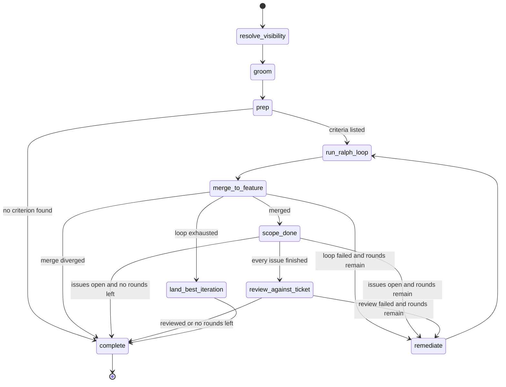

# The v0.2 and v0.3 workflows side by side

kodezart runs two workflows over one set of graph nodes. The v0.2 workflow
works one authored ticket per request. The v0.3 workflow works one approved
scope: a parent node on the board and everything below it. Both run on the
same queue and the same delivery, and v0.3 changed nothing about v0.2.

Both graphs are built in `chains/ralph_workflow.py`: v0.2 by
`RalphWorkflowEngine._build_graph`, v0.3 by
`RalphWorkflowEngine._build_scope_graph`. Both are wrapped by the same delivery
graph in `chains/authored_delivery.py`, which opens the pull request and
watches its checks.

## At a glance

| | v0.2: one authored ticket | v0.3: one approved scope |
| --- | --- | --- |
| Trigger | `POST /api/v1/agent/fire` or `/workflow` with a `prompt` and a `repoUrl` or `repoPath`; `issueKey` optionally names a tracker issue. The per-issue dispatch pass also submits an approved issue this way. | The cron (`scope_heartbeat`) submits every approved, unfinished node it finds. `POST /api/v1/agent/fire` with a `scope`, a `prompt` and a `repoUrl` does the same by hand. |
| Addressed at | One ticket: the prompt, or the issue context the dispatch pass renders. | One parent node (initiative, project, milestone or issue) and every issue below it. |
| Repositories | The one the request names. | Every repository the operation declares, checked out side by side in one working directory. |
| Where the ticket comes from | Generated in the graph: `generate_branch`, `generate_ticket`. | The board. The `groom` node runs one session that completes the bodies below the parent. |
| Where the criteria come from | Generated and checked in the graph: `generate_criteria`, `validate_criteria`. | The board. The `prep` node runs one session that creates the criterion sub-issues, then asks the board for them; their Checks are the run's criteria. |
| Who moves the board | Over HTTP, nothing. For a fire the dispatch pass started, the process moves that one issue to its in-progress state when the run starts and to its in-review state when a pull request opens, and comments the outcome on it. | The implementation session: each item moves Todo to In Progress to In Review to Done as it works. kodezart itself writes nothing to the board during a scope run. |
| The loop's exit | The evaluator grades every criterion; the loop ends when all pass, or at the iteration cap or a plateau. | The same, and then the board is asked whether every issue below the parent is completed or canceled (`scope_done`). If not, a remediation round goes back into the loop while rounds remain. |
| The review | `review_against_ticket` over the merged diff. | The same node, reached only after `scope_done` says everything is finished. |
| The pull request | One, against the requested base branch. | One per repository the deliverable branch gained commits in, each against that repository's trunk. |
| Checks | Watched on the pull request; a work-defect red goes back into the loop while rounds remain. | The same, in every repository with a pull request. |
| Merging | Never. | Never. |

## v0.2: `_build_graph`

`_build_graph(criteria=None)` builds the authored arm:

1. `resolve_visibility` reads the repository's visibility for the outbound
   gate.
2. `generate_branch` asks a session for a branch name.
3. `generate_ticket` writes the ticket. Under the default
   `KODEZART_TICKET_REVIEW_MODE`, `create_only`, one session drafts it and the
   prompt set's `draft-critic` lens reviews the draft.
4. `persist_ticket` writes the ticket under `.kodezart/` when an artifact
   persister is wired.
5. `generate_criteria` and `validate_criteria` derive the acceptance criteria
   and check them. An infeasible set is regenerated up to
   `KODEZART_CRITERIA_MAX_REGENERATION_ROUNDS` times, then the run ends
   `criteria_infeasible`.
6. `persist_artifacts` writes the criteria under `.kodezart/`.
7. `run_ralph_loop` runs the loop: an implementation session, then an
   evaluator session that grades each criterion, repeated up to
   `KODEZART_MAX_ITERATIONS` times.
8. `merge_to_feature` merges the loop branch into the deliverable branch.
9. `review_against_ticket` reviews the merged diff.
10. `remediate` drafts a remediation round after a failed loop or review,
    while `KODEZART_REMEDIATION_MAX_ROUNDS` allows; it returns to
    `generate_criteria`.
11. `land_best_iteration` keeps the best iteration when the loop never
    passed.
12. `complete` emits the terminal event.

## v0.3: `_build_scope_graph`

Before any node, the scope entry (`services/scope_entry.py`) refuses a scope
that already has a live job (`ScopeRunLiveError`) and then one that is not
approved (`ScopeNotApprovedError`). It reads the approval once, there.

- `resolve_visibility` reads every declared repository. The run is private only
  when all of them are.
- `groom` renders the `organize_session` prompt for the ticket phase and runs
  one session over the parent. The session completes the bodies below the
  parent, splits items that are too large, and escalates a choice only a
  person can make with the `decision` label. It never touches a scope label
  and never moves a workflow state.
- `prep` runs the same prompt for the criteria phase, then asks the
  `scope_done` question and keeps every criterion sub-issue it lists, with its
  Check, as the run's criteria. No criterion found ends the run
  `criteria_infeasible`.
- `run_ralph_loop` runs the implementation session over a checkout of every
  declared repository. The session reads the parent and everything below it on
  the tracker, builds in blocking order, commits in whichever repository the
  work belongs to, and keeps the board current. The evaluator grades each
  criterion's Check against what the repositories show.
- `merge_to_feature` merges the loop branch into the deliverable branch in
  every repository the loop committed in.
- `scope_done` asks the board, through one short session, whether every issue
  below the parent is completed or canceled. The issues still open become the
  feedback for the next round.
- `review_against_ticket`, `remediate`, `land_best_iteration` and `complete`
  are the same nodes as in v0.2. On the scope graph `remediate` returns to the
  loop, not to criteria generation.

The deliverable and loop branch names are minted from the scope's key
(`mint_lane_branches` in `domain/agent.py`), not asked of a session.

### Which session runs each step

The session kind decides which MCP servers a session is given
(`adapters/mcp/mapping.py`). The role decides its effort
(`prompts/sets/anthropic_v5/set.toml`).

| Step | Prompt key | Session kind | Role and effort |
| --- | --- | --- | --- |
| The cron's scan | `scope_scan` | `scheduled_pass` | question, low |
| `groom`, `prep` | `organize_session` | `organize_pass` | generative, max |
| `prep`, `scope_done` question | `scope_done` | `scheduled_pass` | question, low |
| Loop implementation | `implementation` | `organize_pass` | implementation, max |
| Loop evaluation | `evaluation` | `ticket_fire` | evaluative, max |
| `review_against_ticket` | `post_merge_review` | `ticket_fire` | evaluative, max |
| Pull request description | `pr_description` | `ticket_fire` | question, low |

`scheduled_pass` and `organize_pass` are the board session kinds: they are the
ones kodezart gives the tracker server. On a v0.2 run the implementation
session is a `ticket_fire` session, which it does not.

### What stays on the board, and where the run's own state is

A scope run keeps no tracker record of its own. `FireImplementation` hands the
loop no tracker spec on a scope run (`chains/fire_implementation.py`), so none
of the loop's tracker writers runs (`chains/ralph_loop.py`). Everything on the
board after a run is what its sessions wrote there. A run that is submitted
again after a failure starts from each trunk with new branches and reads the
board as the earlier run left it.

## Around both graphs: delivery

`AuthoredDeliveryCoordinator` runs the fire graph as one node and then:

- `open_pr` asks one session for the title and description, passes both
  through the outbound gate, and opens the pull request, or on a scope run one
  per repository that gained commits;
- `open_stalled_pr` opens a pull request for the best iteration when the loop
  never passed;
- `monitor_ci` watches the checks; a red set classed as a work defect goes to
  `delivery_remediation` and back into the fire graph while rounds remain;
- `comment_failure` posts a failure comment on an open pull request;
- `complete` emits the terminal event, whose `outcome` names how the run ended.

The router in `composition/engine.py` picks the arm. A request with a `scope`
goes to the scope entry, which then picks the same way for the scope graph.
Any other request goes to the forge arm, or to the forge-less arm when its
origin is a `file://` URL.

## What v0.3 left untouched

- **v0.2 runs unchanged beside v0.3.** A request without a `scope` runs
  `_build_graph(criteria=None)` exactly as before, and the per-issue dispatch
  passes are still scheduled beside the cron wherever a tracker, a forge token
  and the dispatch cadence are set.
- **Old operation files boot.** The loader ignores a v0.2 `[[initiatives]]`
  table, gives a file with no `[marker_prefixes]` table the markers v0.2 wrote,
  and says what it did in one `operation_file_v02_accepted` line
  (`adapters/toml_operation_config.py`).
- **A third composition is compiled and not routed.** `_build_graph` given a
  criteria source builds a tracker-native arm (`revalidate_criteria`,
  `rule_open_questions`). No route the service mounts reaches it today: every
  request with a `scope` goes to the scope graph.
